# 瑞吉外卖

# Git

git是一个分布式版本控制工具, 主要用于管理开发过程中的源代码文件(Java类、xml文件、html页面等)

在软件开发过程中被广泛应用

- 代码回溯
- 版本切换
- 多人协作
- 远程备份

通过Git仓库来存储和管理这些文件, Git仓库分为两种:

- 本地仓库: 开发人员自己电脑上的Git仓库
- 远程仓库: 远程服务器上的Git仓库

**`commit`**: 提交, 将本地文件和版本信息

**`push`**: 推送, 将本地仓库文件和版本信息上传到远程仓库

**`pull`**: 拉取, 将远程仓库文件和版本信息下载到本地仓库

## Git下载与安装

下载地址: https://git-scm.com/download

下载完成后得到安装文件

安装完成后在任意目录点击鼠标右键, 如果能看到如下菜单表示安装完成

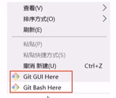

- Git GUI Here: 打开Git图形界面
- Git Bash Here: 打开Git命令行

## Git代码托管服务

### 常用的Git代码托管服务

Git中存在两种类型的仓库, 即**本地仓库**和**远程仓库**. 我们可以借助互联网上提供的一些代码托管服务来实现, 其中比较常用的有GitHub、码云、GitLab等.

- GitHub(地址: https://github.com/), 是一个面向开源及四有软件项目的托管平台, 因为只支持Git作为唯一的版本库格式进行托管, 故名GitHub
- 码云(地址: https://gitee.com/), 是国内的一个代码托管平台, 由于服务器在国内, 所以相比于GitHub, 码云速度会更快
- GitLab(地址: https://about.gitlab.com), 是一个用于仓库管理系统的开源项目, 使用Git作为代码管理工具, 并在此基础上搭建起来的web服务
- BitBucket(地址: https://bitbucket.org), 是一家源代码托管网站, 采用Mercurial和Git作为分布式版本控制系统, 同时提供商业计划和免费账户

## Git常用命令

### Git全局设置

当安装Git后首先要做的事情是设置用户名称和email地址, 这是非常重要的, 因为每次Git提交都会使用该用户信息

在Git命令行中执行下面的命令:

- 设置用户信息

  ```git
  git config --global user.name ""
  git config --global.email ""
  ```

- 查看配置信息

  ```git
  git config --list
  ```

注意: 上面设置的user.name和user.email并不是我们在注册码云账号时使用的用户名和邮箱, 此处可以任意设置

### 获取Git仓库

要使用Git对我们的代码进行版本控制, 首先需要获得Git仓库

获取Git仓库通常由两种方式:

- 在本地初始化一个Git仓库(不常用)

  - 执行步骤

    1. 在任意目录下创建一个空目录(例如repo1)作为我们的本地Git仓库
    2. 进入这个目录中, 点击右键打开Git bash窗口
    3. 执行命令**<font color='red'>`git init`</font>**

    如果在当前目录中看到.git文件夹(此文件夹为隐藏文件夹)则说明Git仓库创建成功

- 从远程仓库克隆(常用)

  可以通过Git提供的命令从远程仓库进行克隆, 将远程仓库克隆到本地

  命令形式: **<font color='red'>`git clone [远程Git仓库地址]`</font>**

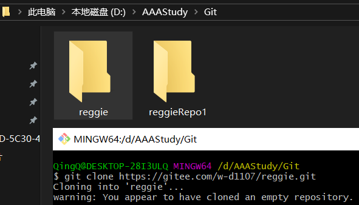

### 工作区、暂存区、版本库 概念

为了更好的学习Git, 我们需要了解Git相关的一些概念, 这些概念在后面的学习中会经常提到

**版本库**:前面看到的.git隐藏文件夹就是版本库, 版本库中存储了很多配置信息、日志信息和文件版本信息等

**工作区**: 包含.git文件夹的目录就是工作区, 也称为工作目录, 主要用于存放开发的代码

**暂存区**: .git文件夹中有很多文件, 其中有一个index文件就是暂存区, 也可以叫做stage. 暂存区是一个临时保存修改文件的地方

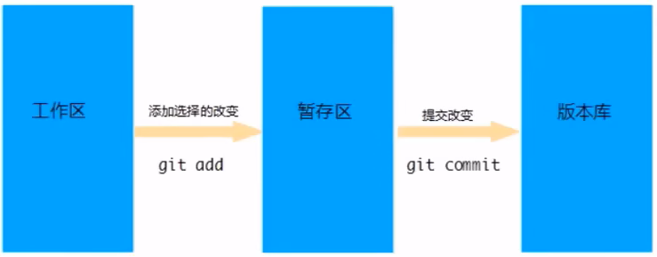

### Git工作区中文件的状态

Git工作区中的文件存在两种状态:

- untracked 未跟踪(未被纳入版本控制)
- tracked 已跟踪(被纳入版本控制)
  - Unmodified 未修改状态
  - Modified 已修改状态
  - Staged 已暂存状态

**<font color='red'>注意: 这些文件的状态会随着我们执行Git的命令发生变化</font>**

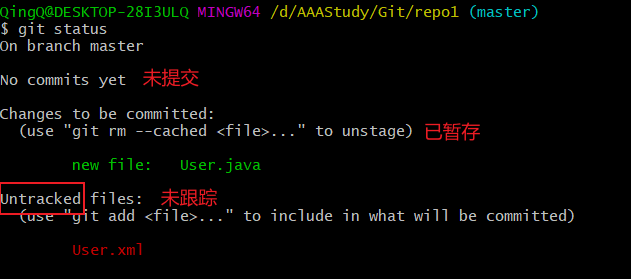

### 本地仓库操作

本地仓库常用命令如下:

- `git status`		查看文件状态

  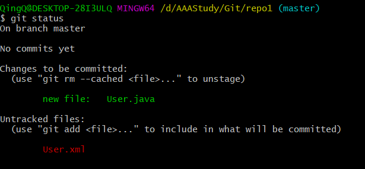

- `git add`                    将文件的修改加入暂存区

  

- `git reset`                  将暂存区的文件**取消暂存**或者是**切换到指定版本**

  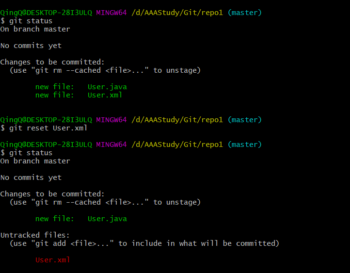

  

- `git commit`             将暂存区的文件修改提交到版本库

  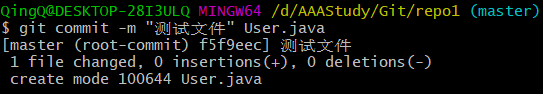

  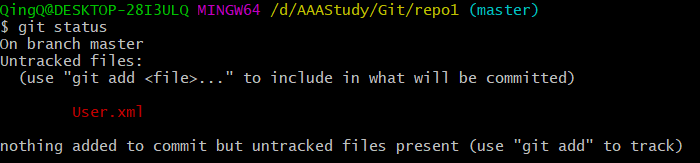

  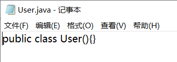

  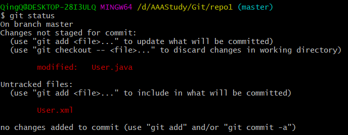

  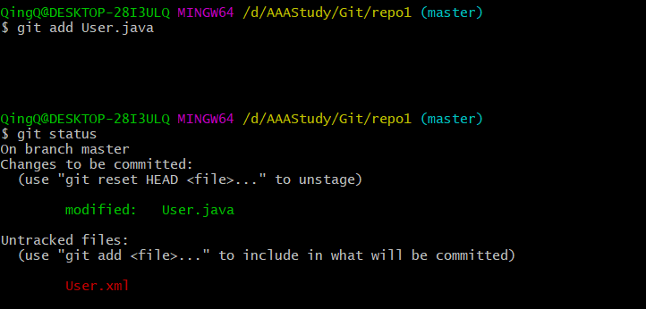

- `git log`                    查看日志

  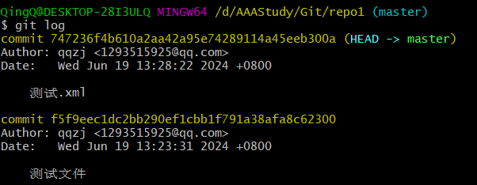

​	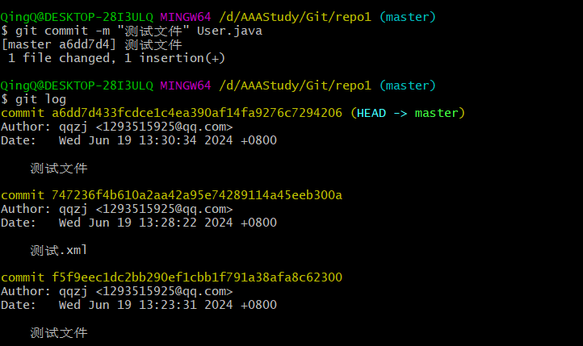

- `git reset`      **切换到指定版本**

  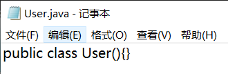

  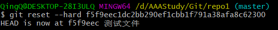

  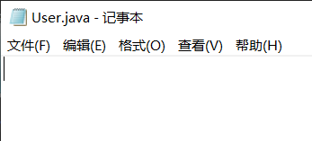

### 远程仓库操作

前面执行的命令操作都是针对的本地仓库, 远程仓库的一些操作包括:

- `git remote`		查看远程仓库

  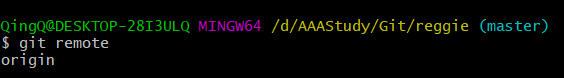

  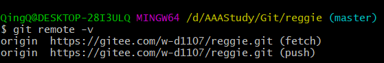

  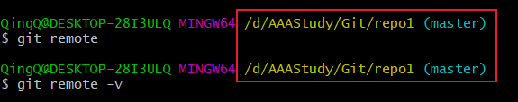

- `git remote add`         添加远程仓库

  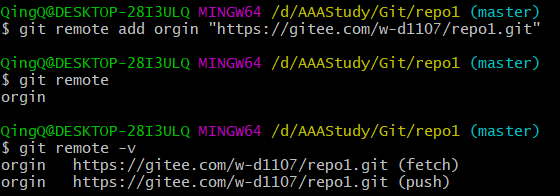

- `git clone`                   从远程仓库克隆

  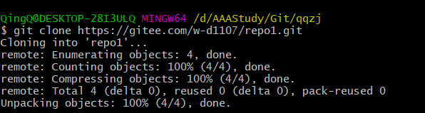

  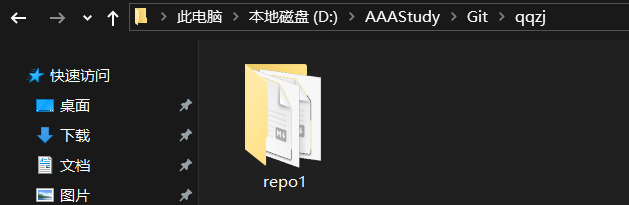

- `git pull`                      从远程仓库拉取

  ```
  git pull [short-name] [branch-name]
  ```

  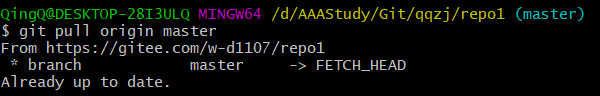

  **注意**: 如果当前本地仓库不是从远程仓库克隆, 而是本地创建的仓库, 并且仓库中存在文件, 此时再从远程仓库拉取文件的时候会报错(fatal: refusing to merge unrelated histories)

  解决此问题可以在`git pull`命令后加入参数 <font color='red'>`--allow-unrelated-histories`</font>

  

- `git push`                    推送到远程仓库

  ```
  git push [short-name] [branch-name]
  ```

  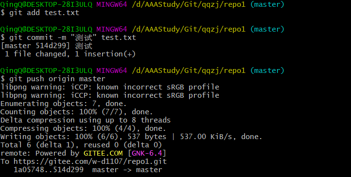

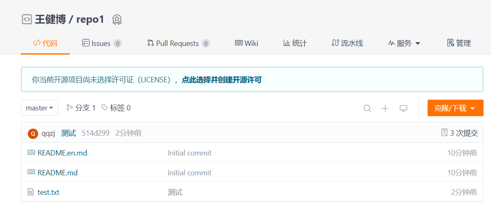

### 分支操作

分支是Git使用过程中非常重要的概念, 使用分支意味着你可以把你的工作从开发主线上分离开来, 以免影响开发主线

同一个仓库可以有多个分支, 各个分支相互独立, 互不干扰

通过`git init`命令创建本地仓库时默认会创建一个master分支

分支的相关命令:

- `git branch`		                      查看分支

  - `git branch`                               列出所有本地分支

  - `git branch -r`                           列出所有远程分支

  - `git branch -a`                          列出所有本地分支和远程分支

    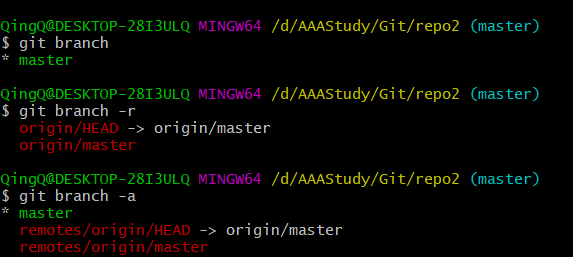

- `git branch [name]`                          创建分支

  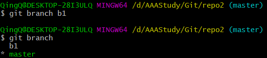

  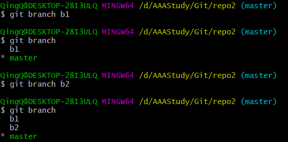

- `git checkout [name]`                       切换分支

  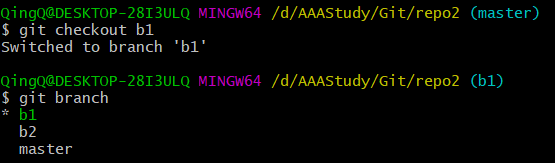

- `git push [shortName] [name]`        推送到远程仓库分支

  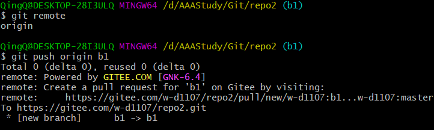

  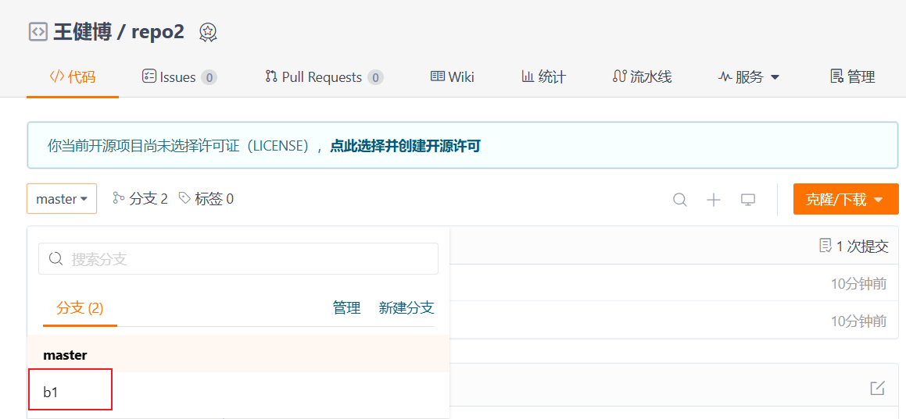

  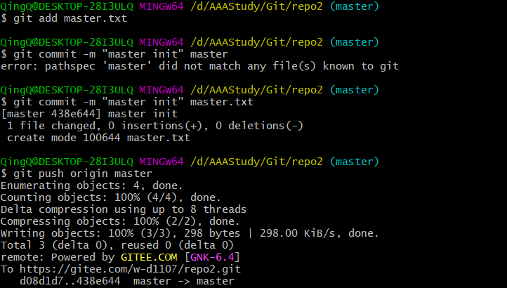

  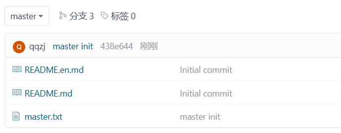

  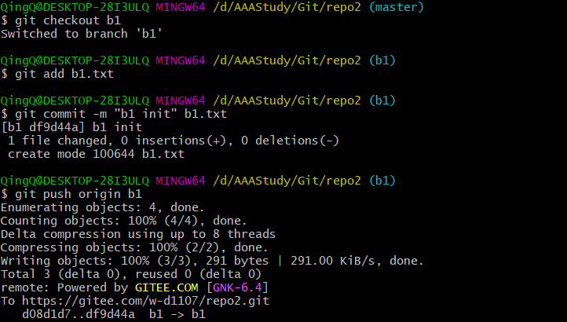

  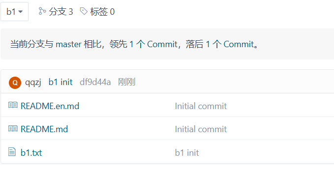

  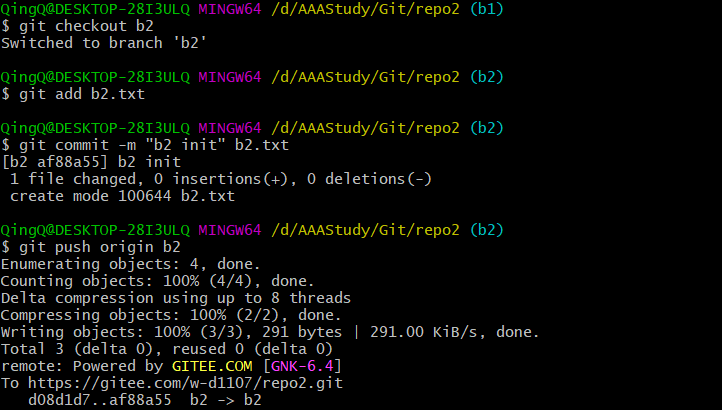

  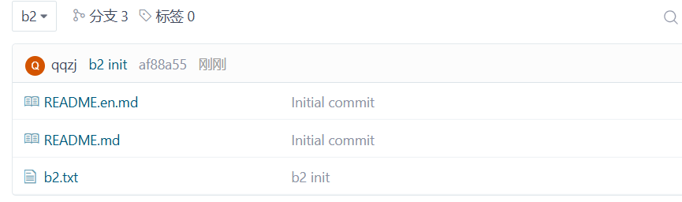

- `git merge [name]`                            合并分支     

​	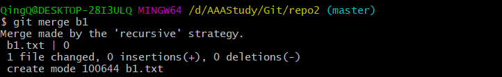

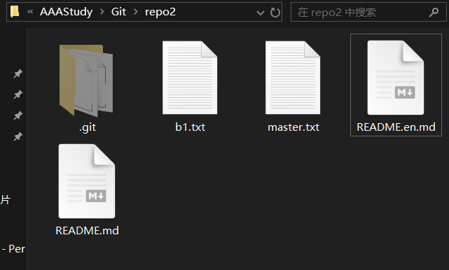

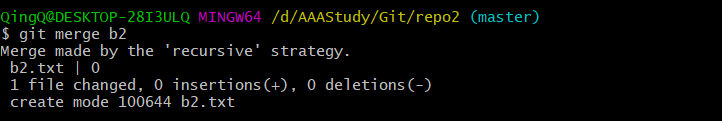

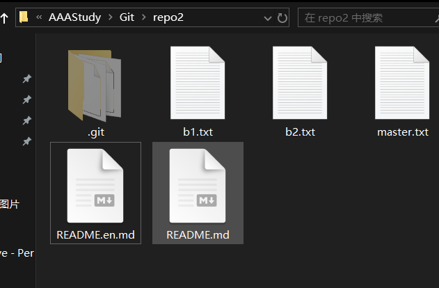

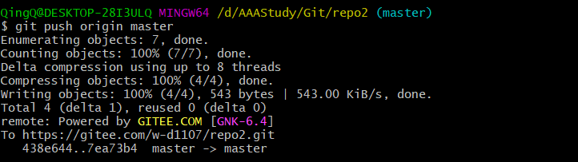

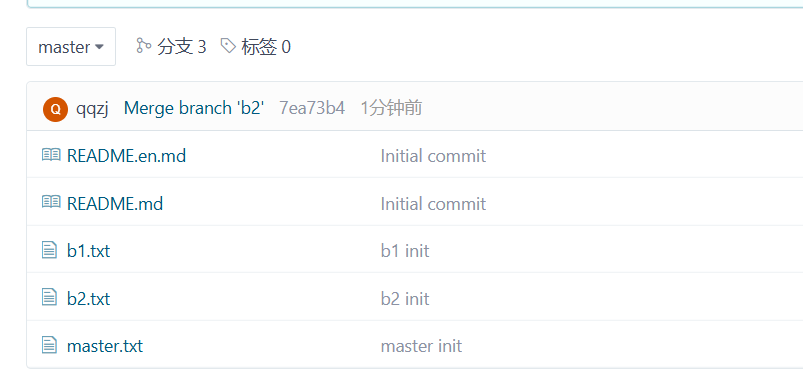

**<font color='red'>注意</font>**: 如果在两个分支下, 有相同文件, 并同时被修改, 此时合并分支会出现报错


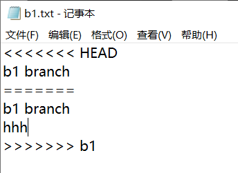

同名文件会多出三行数据

需要将要保留的文件内容之外的数据删除掉


### 标签操作

Git中的标签, 指的是某个分支某个特定时间点的状态, 通过标签, 可以很方便的切换到标记时的状态

比较有代表性的是人民会使用这个功能来标记发布节点(v1.0、v2.0等). 下面是mybatis-plus的标签:

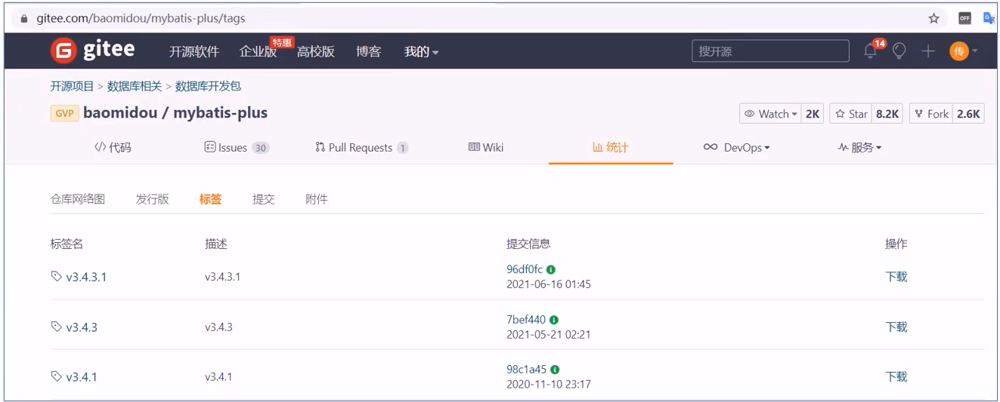

常用命令:

- `git tag`                                           列出已有的标签
- `git tag [name]`                               创建标签
- `git push [shortName] [name]`      将标签推送至远程仓库
- `git checkout -b [branch] [name]`  检出标签

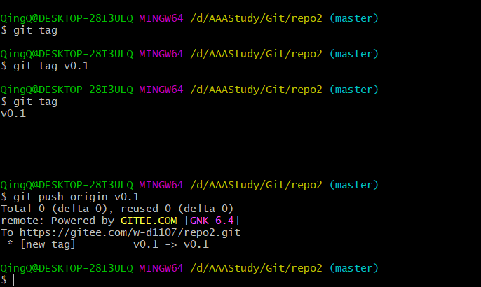

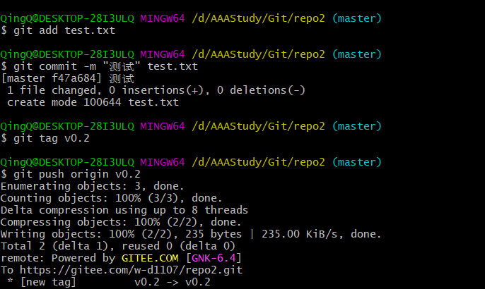


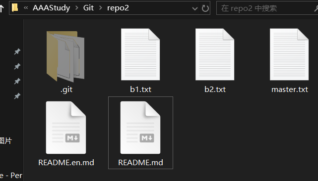


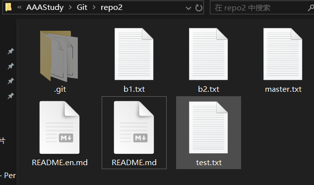

## 在IDEA中使用Git

### 获取Git仓库

在IDEA中使用Git获取仓库有两种方式

- 本地初始化仓库
- 从远程仓库克隆

### 本地仓库操作

本次仓库操作:

- 将文件加入暂存区

  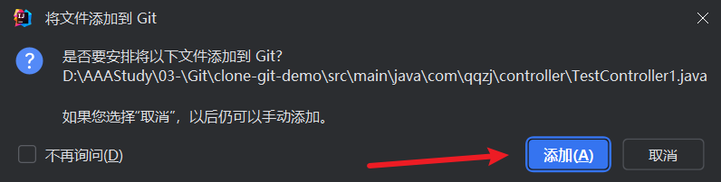

  

- 将暂存区的文件提交到版本库

  

  

  

- 查看日志

  

  

### 远程仓库操作

- 查看远程仓库

  

  

- 添加远程仓库

  

- 推送至远程仓库

  

  

- 从远程仓库拉取

  

  

### 分支操作

- 查看分支

  

  

  

  

  

- 创建分支

  

  

- 切换分支

  

- 将分支推送到远程仓库

  

  

- 合并分支

  

# Linux


## 简介

### 不同应用领域的主流操作系统

- 桌面操作系统
  - windows(用户数量最多)
  - Mac OS(操作体验好, 办公首选)
  - Linux(用户数量少)
- 服务器操作系统
  - UNIX(安全、稳定、付费)
  - Linux(安全、稳定、免费、占有率高)
  - Windows Server(付费、占有率低)
- 移动设备操作系统
  - Android(基于Linux、开源, 主要用于智能手机、平板电脑和智能电视)
  - IOS(苹果公司开发、不开源, 用于苹果公司的产品, 例如: iPhone、iPad)
- 嵌入式操作系统
  - Linux(机顶盒、路由器、交换机)

### Linux系统历史

- 时间: 1991nian 
- 地点: 芬兰赫尔辛基大学
- 人物: Linus Torvalds(21岁)
- 语言: C语言、汇编语言
- logo: 企鹅
- 特点: 免费、开源、多用户、多任务

### Linux系统版本

Linux系统分为**内核版**和**发行版**

- 内核版
  - 由Linus Torvalds及其团队开发、维护
  - 免费、开源
  - 负责控制硬件

- 发行版
  - 基于Linux内核版进行扩展
  - 由各个Linux厂商开发、维护
  - 有收费版本和免费版本

### Linux系统发行版

- Ubuntu: 以桌面应用为主
- RedHat: 应用最广泛、收费
- CentOS: RedHat的社区版、免费
- openSUSE: 对个人完全免费、图形界面华丽
- Fedora: 功能完备、快速更新、免费
- 红旗Linux: 北京中科红旗软件技术有限公司开发


## Linux安装

Linux系统的安装方式

- 物理机安装: 直接将操作系统安装到服务器硬件上
- 虚拟机安装: 通过虚拟机软件安装

**虚拟机**(Virtual Machine)指通过**软件**模拟的具有完整硬件系统功能、运行在完全隔离环境中的完整计算机系统

常用虚拟机软件

- VMWare
- VirtualBox
- VMLite WorkStation
- Qemu
- HopeddotVOS

### 网卡设置

修改网络初始化配置, 设定网卡在系统启动时初始化


ONBOOT=yes

### 安装SSH连接工具

SSH(Secure Shell), 建立在应用层基础上的安全协议

常用的SSH连接工具

- putty
- secureCRT
- xshell
- <font color='red'>finalshell</font>

通过SSH连接工具就可以实现从本地连接到远程的Linux服务器

### Linux和Windows目录结构对比

Linux系统中的目录

- /是所有目录的顶点

- 目录结构像一颗倒挂的树

  

### Linux目录介绍

- bin存放二进制可执行文件
- boot存放系统引导时使用的各种文件
- dev存放设备文件
- etc存放系统配置文件
- home存放系统用户的文件
- lib存放程序运行所需的共享库和内核模块
- opt额外安装的可选应用程序包所放置的位置
- root超级用户目录
- tmp存放临时文件
- usr存放系统应用程序
- var存放运行时需要改变数据的文件, 例如日志文件


## Linux常用命令

### Linux命令初体验-常用命令


**<font color='red'>注意事项</font>**

在执行Linux命令时, 提示信息如果显示为乱码, 如图所示


这是由于编码问题导致, 只需要修改Linux的编码即可, 命令如下:

```cmd
echo 'LANG="en_US.UTF-8"' >> /etc/profile
source /rtc/profile
```

### Linux命令使用技巧

- Tab键自动补全
- 连续两次Tab键, 给出操作提示
- 使用上下箭头快速调出曾经使用过的命令
- 使用`clear`命令或者`Ctrl+L`快捷键实现清屏

### Linux命令格式

`command [-options] [parameter]`

说明:

- `command`: 命令名
- `[-options]`: 选项, 可用来对命令进行控制, 也可以省略
- `[parameter]`: 传给命令的参数, 可以是零个、一个或者多个

注意:

[] 代表可选

命令名、选项、参数之间有空格进行分隔

### 文件目录操作命令

#### `ls`

作用: 显示指定目录下的内容

语法: `ls [-al] [dir]`

说明: 

- `-a` 显示所有文件及目录(`.`开头的隐藏文件也会列出)
- `-l`除文件名称外, 同时将文件形态(d表示目录, -表示文件)、权限、拥有者、文件大小等信息详细列出

注意:

由于我们使用`ls`命令时经常需要加入`-l`选项, 所以Linux为`ls -l`命令提供了一种简写方式, 即`ll`

#### `cd`

作用: 用于切换当前工作目录, 即进入指定目录

语法:`cd [dirName]`

特殊说明:

- ~表示用户的home目录
- . 表示目前所在的目录
- .. 表示目前目录位置的上级目录

举例:

- `cd ..` 切换到当前目录的上级目录
- `cd ~` 切换到用户的home目录
- `cd /usr./local`  切换到/usr/local目录

#### `cat`

作用: 用于显示文件内容

语法: `cat [-n] fileName`

说明:

- `-n` : 由1开始对所有输出的行数编号

举例:

- cat /etc/profile   查看/etc目录下的profile文件内容

#### `more`

作用: 以分页的形式显示文件内容

语法: `more fileName`

操作说明:

- 回车键	         向下滚动一行
- 空格键                 向下滚动一屏
- b                          返回上一屏
- q或者Ctrl+C       退出more

举例:

`more /etc/profile`			以分页方式显示/etc目录下的profile文件内容

#### `tail`

作用: 查看文件末尾的内容

语法: `tail [-f] fileName`

说明:

- `-f`: 动态读取文件末尾内容并显示, 通常用于日志文件的内容输出

举例:

`tail /etc/profile`		显示/etc目录下的profile文件末尾10行的内容

`tail -20 /etc/profile`		显示/etc目录下的profile文件末尾20行的内容

`tail -f /itcast/my.log`		动态读取/itcast目录下的my.log文件末尾的内容并展示

#### `mkdir`

作用: 创建目录

语法: `mkdir [-p] dirName`

说明:

- `-p`: 确保目录名称存在, 不存在的就创建一个, 通过此选项, 可以实现多层目录间的创建

举例:

- `mkdir itcast`在当前目录下, 创建一个名为itcast的子目录
- `mkdir -p itcast/test` 在工作目录下的itcast目录中建立一个名为test的子目录, 若itcast目录不存在, 则建立一个

#### `rmdir`

作用: 删除空目录

语法: `rmdir [-p] dirName`

说明:

- `-p`: 当子目录被删除后使父目录为空目录的话, 则一并删除

举例:

- `rmdir itcast` 		删除名为itcast的空目录
- `rmdir -p itcast/test`    删除itcast目录中名为test的子目录, 若test目录删除后itcast目录变为空目录, 则也被删除
- `rmdir itcast*`               删除名称以itcast开始的空目录 

#### `rm`

作用: 删除文件或者目录

语法: `rm [-rf] name`

说明:

- `-r`: 将目录及目录中所有文件(目录)注意删除, 即递归删除
- `-f`: 无需确认, 直接删除

举例:

- `rm -r itcast/`      删除名为itcast的目录和目录中所有文件, 删除前需要确认
- `rm -rf itcast/`     无需确认, 直接删除名为itcast的目录和目录中所有文件
- `rm -f hello.txt`    无需确认, 直接删除hello.txt文件

### 拷贝移动文件目录操作

#### `cp`

作用: 用于复制文件或目录

语法: `cp [-r] source dest`

说明:

- `-r`: 如果复制的是目录需要使用此选项, 此时将复制该目录下所有的子目录和文件

举例:

- `cp hello.txt itcast/`    将hello.txt复制到itcast目录中
- `cp hello.txt ./hi.txt`    将hello.txt复制到当前目录, 并改名为hi.txt
- `cp -r itcast/ ./itheima/`  将itcast目录和目录下所有文件复制到itheima目录下**(复制包括此目录和目录内的所有文件)**
- `cp -r itcast/* ./itheima/`   将itcast目录下所有文件复制到itheima目录下**(只复制目录下的文件, 目录本身不会复制)**

#### `mv`

作用: 为文件或目录改名, 或将文件或者目录移动到其他位置

语法: `mv source dest`

举例:

- `mv hello.txt hi.txt`    将hello.txt改名为hi.txt
- `mv h1.txt itheima/`    将文件hi.txt移动到itheima目录中
- `mv hi.txt itheima/hello.txt`    将hi.txt移动到itheima目录中, 并改名为hello.txt
- `mv itcast/ itheima/`      如果itheima目录不存在, 将itcast目录改名为itheima
- `mv itcast/ itheima/`       如果itheima目录存在, 将itcast目录移动到itheima目录中

### 打包压缩命令

#### `tar`

作用: 对文件进行打包、解包、压缩、解压

语法: `tar [-zcxvf] fileName [files]`

包文件后缀为<font color='red'>**`.tar`**</font>表示只是完成了打包, 并没有压缩

包文件后缀为<font color='red'>**`.tar.gz`**</font>表示打包的同时还进行了压缩

说明:

- `-z`: z表示的是gzip, 通过gzip命令处理文件, gzip可以对文件压缩或者解压
- `-c`: c代表的是create, 即创建新的包文件
- `-x`: x表示的是extract, 实现从包文件中还原文件
- `-v`: v表示的是verbose, 显示命令的执行过程
- `-f`: f表示的是file, 用于指定包文件的名称

举例:

- 打包
  - `tar -cvf hello.tar ./*`     将当前目录下所有文件打包, 打包后的文件名教hello.tar
  - `tar -zcvf hello.tar.gz ./*`   将当前目录下的所有文件打包并压缩, 打包后的文件名为hello.tar.gz
- 解包
  - `tar -xvf hello.tar`      将hello.tar文件进行解包, 并将解包后的文件放在当前目录
  - <font color='red'>`tar -zxvf hello.tar.gz`</font> 将hello.tar.gz文件进行解压, 并将解压后的文件放在当前目录
  - <font color='red'>`tar -zxvf hello.tar.gz -C/usr/local`</font>  将hello.tar.gz文件进行解压, 并将解压后的文件放在/usr/local目录

### 文本编辑命令

#### <font color='red'>**`vi/vim`**</font>

作用: vi命令时Linux系统提供的一个文本编辑工具, 可以对文件内容进行编辑, 类似于Windows中的记事本

语法: `vi fileName`
说明:

1. `vim`是从`vi`发展来的一个功能更加强大的文本编辑工具, 在编辑文件时可以对文件内容进行着色, 方便我们对文件进行编辑处理, 所以实际工作中`vim`更加常用

2. 要使用`vim`命令, 需要我们自己完成安装, 可以使用下面的命令来完成安装

   ```
   yum install vim
   ```

#### `vim`

作用: 对文件内容进行编辑, vim其实就是一个文本编辑器

语法: `vim fileName`

说明:

1. 在使用`vim`命令编辑文件时, 如果指定的文件存在则直接打开此文件. 如果指定的文件不存在则新建文件
2. `vim`在进行文本编辑时共分为三种模式, 分别是命令模式(Command mode), 插入模式(Insert mode)和底行模式(Last line mode). 这三种模式之间可以相互切换. 我们在使用`vim`时一定要注意我们当前所处的是哪种模式

针对`vim`中的三种模式说明如下:

1. 命令模式
   - 命令模式下可以查看文件内容、移动光标(上下左右箭头、gg、G)
   - 通过`vim`命令打开文件后, 默认进入命令模式
   - 另外两种模式需要首先进入命令模式, 才能进入其他

2. 插入模式
   - 插入模式下可以对文件内容进行编辑
   - 在命令模式下按下[<font color='red'>i, a, o</font>]任意一个, 可以进入插入模式. 进入插入模式后, 下方会出现[`insert`]字样
   - 在插入模式下按下<font color='red'>`ESC`</font>键, 回到命令模式

3. 底行模式
   - 底行模式下可以通过命令对文件内容进行查找、显示行号、退出等操作
   - 在命令模式下按下[<font color='red'>:, /</font>]任意一个, 可以进入底行模式
   - 通过`/`方式进入底行模式后, 可以对文件内容进行查找
   - 通过`:`方式进入底行模式后, 可以输入`wq`(保存并退出)、<font color='red'>`q!`</font>(不保存退出)、<font color='red'>`set nu`</font>(显示行号)

### 查找命令

#### find

作用: 在指定目录下查找文件

语法: `find dirName -option fileName`

举例:

- `find . -name "*.java"`     在当前目录及其子目录下查找.java结尾文件
- `find /itcast -name "*.java"`    在/itcast目录及其子目录下查找.java结尾的文件

#### `grep`

作用: 从指定文件中查找指定的文本内容

语法: `grep word fineName`

举例:

- `grep Hello HelloWorld.java`   查找HelloWorld.java文件中出现Hello字符串的位置
- `grep hello *.java`            查找当前目录中所有.java结尾的文件中包含Hello字符串的行

## 软件安装

### 软件安装方式

- 二进制发布包安装
  - 软件已经针对具体平台编译打包发布, 只要解压, 修改配置即可
- rpm安装
  - 软件已经按照redhat的包管理规范进行打包, 使用rpm命令进行安装, 不能自行解决库依赖问题
- yum安装
  - 一种在线软件安装方式, 本质上还是rpm安装, 自动下载安装包并安装, 安装过程中自动解决库依赖问题
- 源码编译安装
  - 软件以源码工程的形式发布, 需要自己编译打包

### 安装jdk(二进制发布包安装)

操作步骤:

1. 使用FinalShell自带的上传工具将jdk的二进制发布包上传到Linux

2. 解压安装包, 命令为

   ```
   tar -zxvf 包名 -C/usr/local
   ```

3. 配置环境变量, 使用vim命令修改/etc/profile文件, 在文件末尾加入如下配置

   ```
   JAVA_HOME=/usr/local/jdk1.8.0_171
   PATH=$JAVA_HOME/bin:$PATH
   ```

4. 重新加载profile文件, 使更改的配置立即生效, 命令为

   ```
   source /etc/profile
   ```

5. 检查安装是否成功, 命令为

   ```
   java -version
   ```

### 安装Tomcat

#### 操作步骤

1. 使用FinalShell自带的上传工具将Tomcat的二进制发布包上传到Linux

2. 解压安装包, 命令为

   ```
   tar -zxvf 包名 -C/usr/local
   ```

3. 进入Tomcat的bin目录启动服务, 命令为`sh startup.sh`或者`./startup.sh`

#### 验证Tomcat启动是否成功, 有多种方式:

- 查看启动日志

  ```
  more /usr/local/apache-tomcat-版本号/logs/catalina.out
  tail -50/usr/local/apache-tomcat-版本号/logs/catalina.out
  ```

- 查看进程 <font color='red'>**`ps -ef | gref tomcat`**</font>

  

注意:

- <font color='red'>**`ps`**</font>命令时Linux下非常强大的进程查看命令, 通过<font color='red'>**`ps -ef`**</font>可以查看当前运行的所有进程的详细信息
- “<font color='red'>**`|`**</font>”在Linux中称为管道符, 可以将前一个命令的结果输出给后一个命令作为输入
- 使用`ps`命令查看进程时, 经常配合管道符和查找命令`grep`一起使用, 来查看特定进程

#### 防火墙操作:

- 查看防火墙状态

  ```
  systemctl status firewalld
  或者
  firewall-cmd --state
  ```

- 暂时关闭防火墙

  ```
  systemctl stop firewalld
  ```

- 永久关闭防火墙

  ```
  systemctl disable firewalld
  ```

- 开启防火墙

  ```
  systemctl start firewalld
  ```

- 开放指定端口

  ```
  firewall-cmd --zone=public --add-port=8080/tcp --permanent
  ```

- 关闭指定端口

  ```
  firewall-cmd --zone=public --remove-port=8080/tcp --permanent
  ```

- 立即生效

  ```
  filewall-cmd --reload
  ```

- 查看开放的端口

  ```
  firewall-cmd --zone=public --list-ports
  ```

注意:

1. `systemctl`是管理Linux中服务的命令, 可以对服务进行启动、停止、重启、查看状态等操作
2. `firewall-cmd`是Linux中专门用于控制防火墙的命令
3. 为了保证系统安全, 服务器的防火墙不建议关闭

#### 停止Tomcat服务的方式

- 运行Tomcat的bin目录中提供的停止服务的脚本文件`shutdown.sh`

  ```
  sh shutdown.sh
  ./shutdown.sh
  ```

- 结束tomcat进程
  - 查看tomcat进程, 获得进程id
  - 执行命令结束进程`kill -9 [进程id]`

注意:

`kill`命令时Linux提供的用于结束进程的命令, -9表示强制结束

### 安装MySQL

1. 检查当前系统中是否安装MySQL数据库

   ```
   rpm -qa				   查询当前系统中安装的所有软件
   rpm -qa | grep mysql	查询当前系统中安装的名称带mysql的软件
   rpm -qa | grep mariadb	查询当前系统中安装的名称带mariadb的软件
   ```

RPM(Red-Hat Package Manager) RPM软件包管理器, 是红帽Linux用于管理和安装软件的工具

**<font color='red'>注意事项</font>**

如果当前系统中已经安装有MySQL数据库, 安装将生效. CentOS7自带mariadb, 与MySQL数据库冲突

2. 写在已经安装的冲突软件

   ```
   rpm -e --nodeps 软件名称		卸载软件
   rpm -e --nodeps mariadb-libs-版本
   ```

3. 将MySQL安装包上传到Linux并解压

   ```
   mkdir /usr/lcoal/mysql
   tar -zxvf 包名 -C/usr/local/mysql
   ```

   说明: 解压后得到6个rpm安装包文件

4. 按照顺序安装rpm软件包

   

   说明1: 安装过程中提示缺少net-tools依赖, 使用yum安装

   说明2: 可以通过指令升级现有软件及系统内核

   ```
   yum update
   ```

5. 启动MySQL

   ```
   systemctl status mysqld		查看MySQL服务状态
   systemctl start mysqld		启动MySQL服务
   ```

   说明: 可以设置开机时启动MySQL服务, 避免每次开机启动MySQL

   ```
   systemctl enable mysqld		开机启动MySQL服务
   ```

   ```
   netstat -tunlp		查看已经启动的服务
   netstat -tunlp | grep mysql		
   
   ps -ef | grep mysql		查看MySQL进程
   ```

6. 登录MySQL数据库, 查阅临时密码

   ```
   cat /var/log/mysqld.log		查看文件内容
   cat /var/log/mysqld.log | grep password		查看文件内容中包含password的行信息
   ```

   

   <font color='red'>**注意事项**</font>

   冒号后面的是密码, 注意空格

7. 登录MySQL, 修改密码, 开放访问权限

   ```
   mysql -uroot -p			登录MySQL(使用临时密码登录)
   修改密码
   set global validate_password_length=4;		设置密码长度最低位数
   set global validate_password_policy=LOW;	设置密码安全等级低, 便于密码可以修改成root
   set password=password('root');				设置密码为root
   开启访问权限
   grant all on *.* to 'root'@'%' identified by 'root';
   flush privileges;
   ```


8. 测试MySQL数据库是否正常工作

   ```sql
   show databases;
   ```

### 安装lrzsz

操作步骤:

1. 搜索lrzsz安装包, 命令为<font color='red'>`yum list lrzsz`</font>
2. 使用`yum`命令在线安装, 命令为<font color='red'>**`yum install lrzsz.x86_61`**</font>

<font color='red'>**注意事项**</font>

Yum(全称为Yellow dog Updater, Modified) 是一个在Fedora和RedHat以及CentOS中的Shell前段软件包管理器. 基于RPM包管理, 能够从指定的服务器自动下载RPM包并且安装, 可以自动处理依赖关系, 并且一次安装所有依赖的软件包, 无需繁琐的一次次下载, 安装

## 项目部署

### 手动部署项目

1. 在IDEA中开发SpringBoot项目并打成jar包

2. 将jar包上传到Linux服务器

   ```
   mkdir /usr/local/app		创建目录, 将项目jar包放到此目录
   ```

3. 改为后台运行SpringBoot程序, 并将日志输出到日志文件

   目前程序运行的问题

   - 线上程序不会采用控制台霸屏的形式运行程序, 而是将程序在后台运行
   - 线上程序不会将日志输出到控制台, 而是输出到日志文件, 方便运维查阅信息

​	nohup命令: 英文全称 no hang up(不挂起), 用于不挂断的运行指定命令, 退出终端不会影响程序的运行
​	语法格式: `nohup Command [Arg...][&]`

​	参数说明: 

​	Command: 要执行的命令

​	Arg: 一些参数, 可以指定输出文件

​	&: 让命令在后台运行

​	举例: 

​	`nohup java -jar boot工程.jar &> hello.log &`	后台运行java -jar命令, 并将日志输出到hello.log文件

4. 停止SpringBoot程序

   `kill`

### 通过Shell脚本自动部署项目

操作步骤:

1. 在Linux中安装Git

2. 在Linux中安装maven

3. 编写Shell脚本(拉取代码、编译、打包、启动)

4. 为用户授予执行Shell脚本的权限

5. 执行Shell脚本

   

1. 在Linux中安装Git

   ```
   yum list git	列出git安装包
   yum install git 	在线安装git 
   ```

2. 使用Git克隆代码

   ```
   cd /usr/local/
   git clone 地址
   ```

3. 将maven安装包上传到Linux, 在Linux中安装maven

   ```
   tar -zxvf 包名 -C/usr/local
   vim /etc/profile		修改配置文件, 加入如下内容
   exprot MAVEN_HOME=/usr/local/maven名字
   export PATH=$JAVA_HOME/bin:$MAVEN_HOME/bin:$PATH
   
   source /etc/profile
   mvn -version
   vim /usr/local/maven名字/conf/settings.xml		修改配置文件内容如下
   <localRepository>/usr/local/repo</localRepository>
   ```

4. 将Shell脚本文件复制到Linux

   Shell脚本(shell script), 是一种Linux系统中的脚本程序

   使用Shell脚本编程跟JavaScript、Java编程一样, 只要有一个能编写代码的文本编辑器和一个能解释执行的脚本编辑器就可以了

5. 为用户授权

   <font color='red'>`chmod`</font>(英文全拼: change mode)命令是控制用户对文件的权限的命令

   Linux中的权限分为: 读(r)、写(w)、执行(x)三种权限

   Linux的文件调用权限分为三级: 文件所有者(Owner)、用户组(Group)、其他用户(Other Users)

   只有文件的所有者和超级用户可以修改文件或目录的权限

   要执行Shell脚本需要有对此脚本文件的执行权限, 如果没有则不执行

   

   

   `chmod`命令可以使用八进制来指定权限

   

   举例:

   - <font color='red'>`chmod 777 bootStart.sh`</font>为所有用户授予读写执行权限
   - <font color='red'>`chmod 755 bootStart.sh`</font>为文件拥有者授予读写执行权限, 同组用户和其他用户授予读执行权限
   - <font color='red'>`chmod 210 bootStart.sh`</font>为文件所有者授予写权限, 同组用户授予执行权限, 其他用户没有任何权限

   注意: 三位数字分别表示不同用户的权限

   - 第一位表示文件拥有者的权限
   - 第二位表示同组用户的权限
   - 第三位表示其他用户的权限

6. 设置静态ip

   修改文件/etc/sysconfig/metwork-scripts/ifcfg0ens33, 内容如下

   ```
   TYPE="Ethernet"
   PROXY_METHOD="none"
   BROWSER_ONLY="no"
   
   BOOTPROTO="static"		设置静态IP地址, 默认为dhcp
   IPADDR="192.168.11.128"		设置的静态IP地址
   NETMASK="255.255.255.0"		子网掩码
   GATEWAY="192.168.11.2"		网关地址
   DNS1="192.168.11.2"			DNS服务器
   
   DEFROUTE="yes"
   IPV4_FAILURE_FATAL="no"
   IPV6INIT="yes"
   IPV6_AUTOCONF="yes"
   IPV6_DEFROUTE="yes"
   IPV6_FAILURE_FATAL="no"
   IPV6_ADDR_GEN_MODE="stable-privacy"
   NAME="ens33"
   UUID="UUID"
   DEVICE="ens33"
   ONBOOT="yes"		是否开机启动
   ```

7. 重启网络服务

   ```
   systemctl restart network
   ```

   <font color='red'>注意: 重启完网络服务后ip地址已经发生了改变, 此时FinalShell已经连接不上Linux系统, 需要创建一个新连接才能连接到Linux</font>

# Redis基础

Redis是一个基于**内存**的key-value结构数据库

- 基于内存存储, 读写性能高
- 适合存储热点数据(热点商品、资讯、新闻)
- 企业应用广泛

## Redis入门

Redis is an open source(BSD licensed), in-memory data structure store, used as a database, cache, and message broker, 翻译为: Redis是一个开源的内存中的数据结构存储系统, 他可以用作: 数据库、缓存和消息中间件. 

官网: https://redis.io

Redis是用C语言开发的一个开源的高性能键值对(key-value)数据库, 官方提供的数据是可以达到1000000+的QPS(每秒内查询次数). 它存储的value类型比较丰富, 也被称为结构化NoSql数据库

NoSql(Not Only SQL), 不仅仅是SQL, 泛指**非关系型数据库**. NoSql数据库并不是要取代关系型数据库, 而是关系型数据库的补充

- 关系型数据库(RDBMS)
  - MySQL
  - Oracle
  - DB2
  - SQLServer
- 非关系型数据库(NoSql)
  - <font color='red'>Redis</font>
  - MongoDB
  - MenCached

Redis应用场景

- 缓存
- 任务队列
- 消息队列
- 分布式锁

Redis安装包分为Windows版和Linux版:

- Windows版下载地址: https://github.com/microsoftarchive/redis/releases
- Linux版下载地址: https://download.redis.io/releases/

在Linux系统安装Redis步骤:

1. 将Redis安装包上传到Linux
2. 解压安装包, 命令: `tar -zxvf 名字 -C/usr/local`
3. 安装Redis的依赖环境gcc, 命令: `yum install gcc-c++`
4. 进入/usr/local/redis-版本号, 进行编译, 命令: `make`
5. 进入redis的src目录, 进行安装, 命令: make install

Redis的Windows版属于绿色软件, 直接解压即可使用, 解压后目录结构为


### Redis服务启动与停止

Linux中的Redis服务启动, 可以使用`redis-server`, 默认端口号为6379

启动:


远程连接:

本地客户端地址 -h 主机地址 -p 端口号 -a 密码

## Redis数据类型

### 介绍

Redis存储的是key-value结构的数据, 其中key是字符串类型, value有5种常用的数据类型:

- 字符串string
- 哈希hash
- 列表list
- 集合set
- 有序集合sorted set


## 字符串string操作命令

Redis中字符串类型常用命令:

- **SET** key value                 设置指定key的值
- **GET** key                           获取指定key的值
- **SETEX** key seconds value          设置指定key的值, 并将key的过期时间设为seconds秒
- **SETNX** key value                         只有在key不存在时设置key的值

更多命令参考Redis中文网: https://www.redis.net.cn


## 哈希hash操作命令

Redis  hash是一个string类型的field和value的映射表, hash特别适合用于存储对象, 常用命令: 

- **HSET** key field value           将哈希表key中的字段field的值设为value
- **HGET** key field                     获取存储在哈希表中指定字段的值
- **HDEL** key field                     删除存储在哈希表中的指定字段
- **HKEYS** key                            获取哈希表中所有字段
- **HVALS** key                           获取哈希表中所有值
- **HGETALL** key                      获取在哈希表中指定key的所有字段和值


## 列表list操作命令

Redis列表是简单的字符串列表, 按照插入顺序排序, 常用命令: 

- **LPUSH** key value1 [value2]      将一个或多个值插入到列表头部
- **LRANGE** key start stop              获取列表指定范围内的元素
- **RPOP** key                                     移除并获取列表最后一个元素
- **LLEN** key                                      获取列表长度
- **BRPOP** key1 [key2] timeout      移除并获取列表的最后一个元素, 如果列表没有元素会堵塞列表直到等待超时或发现可弹出元素位置


## 集合set操作命令

Redis set是string类型的无序集合. 集合成员是唯一的, 这就意味着集合中不能出现重复的数据, 常用命令: 

- **SADD** key member1 [menber2]     向集合添加一个或多个成员
- **SMEMBERS** key                                返回集合中的所有成员
- **SCARD** key                                        获取集合的成员数
- **SINTER** key1 [key2]                         返回给定所有集合的交集
- **SUNION** key1 [key2]                       返回所有给定集合的并集
- **SDIFF** key1 [key2]                            返回给定所有集合的差集
- **SREM** key member1 [member2]  移除集合中一个或多个成员


## 有序集合sorted set操作命令

Redis sorted set 有序集合是string类型元素的集合, 且不允许重复的成员. 每个元素都会关联一个double类型的分数(score). Redis正是通过分数来为集合中的成员进行从小到大排序, 有序集合的成员是唯一的, 但分数却可以重复.

常用命令: 

- **ZADD** key score1 member [score2 member2]   向有序集合添加一个或多个成员, 或者更新已存在成员的分数
- **ZRANGE** key start stop [WITHSCORES]                 通过索引区间返回有序集合中指定区间内的成员
- **ZINCRBY** key increment member                          有序集合中对指定成员的分数加上增量increment
- **ZREM** key member [member...]                              移除有序集合中的一个或多个成员


## 通用命令

- **KEYS** pattern           查找所有符合给定模式(pattern)的key
- **EXISTS** key              检查给定key是否存在
- **TYPE** key                   返回key所储存的值的类型
- **TTL** key                   返回给定key的剩余生存时间(TTL, time to live), 以秒为单位
- **DEL** key               该命令用于在key存在时删除key


## 在Java中操作Redis

### 介绍

Redis的Java客户端很多, 官方推荐的有三种:

- Jedis
- Lettuce
- Redisson

Spring对Redis客户端进行了整合, 提供了Spring Data Redis, 在SpringBoot项目中还提供了对应的Starter, 即spring-boot-starter-data-redis

### Jedis

Jedis的maven坐标:

```xml
<dependency>
    <groupId>redis.clients</groupId>
    <artifactId>jedis</artifactId>
    <version>2.8.0</version>
</dependency>
```

使用Jedis操作Redis的步骤:

1. 获取连接

   ```java
   Jedis jedis = new Jedis("192.168.11.128",6379);
    //密码
    jedis.auth("1234");
   ```

2. 执行操作

3. 关闭连接

   ```
   jedis.close();
   ```

### Spring Data Redis

在SpringBoot项目中, 可以使用Spring Data Redis来简化Redis操作, maven坐标:

```xml
<dependency>
    <groupId>org.springframework.boot</groupId>
    <artifactId>spring-boot-starter-data-redis</artifactId>
</dependency>
```

Spring Data Redis中提供了一个高度封装的类: RedisTemplate, 针对Jedis客户端中大量api进行了归类封装, 将同一类型操作封装为operation接口, 具体分类如下:

- ValueOperations: 简单K-V操作
- SetOperations: set类型数据操作
- ZSetOperations: zset类型数据操作
- HashOperations: 针对map类型的数据操作
- ListOperations: 针对list类型的数据操作

yml配置文件:

```yaml
spring:
  application:
    name: springdataredis
#redis相关配置
redis:
  host: 192.168.11.128
  port: 6379
  password: 1234
  database: 0 #操作的是0号数据库, Redis默认有16个数据库
  jedis:
#    Redis连接池配置
    pool:
      max-active: 8 # 最大连接数
      max-wait: 1ms # 最大阻塞等待时间
      max-idle: 4 # 最大空闲连接数
      min-idle: 0 # 最小空闲连接数
```

RedisConfig类: 配置key的序列化器

```java
@Configuration
public class RedisConfig extends CachingConfigurerSupport {
    @Bean
    public RedisTemplate<Object, Object> redisTemplate(RedisConnectionFactory redisConnectionFactory) {
        RedisTemplate<Object,Object> redisTemplate = new RedisTemplate<>();
        //默认的key序列化器为: JdkSerializationRedisSerializer
        redisTemplate.setKeySerializer(new StringRedisSerializer());
        redisTemplate.setHashKeySerializer(new StringRedisSerializer());

        redisTemplate.setConnectionFactory(redisConnectionFactory);

        return redisTemplate;
    }
}
```

```java
@SpringBootTest
@RunWith(SpringRunner.class)
class SpringdataredisApplicationTests {

    @Autowired
    private RedisTemplate redisTemplate;

    @Test //操作string类型数据
    public void testString() {
        ValueOperations valueOperations = redisTemplate.opsForValue();
        valueOperations.set("name", "123");
        System.out.println(valueOperations.get("name"));
    }

    @Test//操作hash类型数据
    public void testHash() {
        HashOperations hashOperations = redisTemplate.opsForHash();
        hashOperations.put("user:1", "name", "小明");
        System.out.println(hashOperations.get("user:1", "name"));
    }

    @Test //操作list类型数据
    public void testList() {
        ListOperations listOperations = redisTemplate.opsForList();
        listOperations.leftPushAll("list:1", "1", "2", "3");

        List<Object> range = listOperations.range("list:1", 0, -1);
        for (Object value : range) {
            System.out.println(value);
        }
        //获取列表长度
        Long size = listOperations.size("list:1");
        for (int i = 0; i < size; i++) {
            Object element = listOperations.rightPop("list:1");
            System.out.println((String) element);
        }
    }

    @Test//操作set类型数据
    public void testSet() {
        SetOperations setOperations = redisTemplate.opsForSet();
        setOperations.add("set:1", "1", "2", "3");

        Set<String> members = setOperations.members("set:1");
        for (String member : members) {
            System.out.println(member);
        }
        Long size = setOperations.size("set:1");
        for (Long i = 0L; i < size; i++) {
            System.out.println(setOperations.pop("set:1"));
        }

        System.out.println(redisTemplate.keys("*"));
    }

    @Test//操作zset类型数据
    public void testZSet() {
        ZSetOperations zSetOperations = redisTemplate.opsForZSet();
        zSetOperations.add("zset:1", "1", 1);
        zSetOperations.add("zset:1", "2", 2);
        zSetOperations.add("zset:1", "3", 3);

        Set<String> range = zSetOperations.range("zset:1", 0, -1);
        for (String value : range) {
            System.out.println(value + ":" + zSetOperations.score("zset:1", value));
        }
        System.out.println(zSetOperations.removeRange("zset:1", 0, -1));


        for (String value : range) {
            System.out.println(value + ":" + zSetOperations.score("zset:1", value));
        }
    }

    @Test//操作通用命令
    public void testCommands() {
        //获取redis中所有的key
        System.out.println(redisTemplate.keys("*"));
        //判断某个key是否存在
        System.out.println(redisTemplate.hasKey("name"));
        //删除指定key
        System.out.println(redisTemplate.delete("�� \u0005t \u0004name"));
        //获取指定key对应的value的数据类型
        System.out.println(redisTemplate.type("user:1"));
        System.out.println(redisTemplate.keys("*"));
    }
}
```

# 缓存优化

## 缓存短信验证码

### 实现思路

1. 在服务端UserController中注入RedisTemplate对象, 用于操作Redis
2. 在服务端UserController的sendMsg方法中, 将随机生成的验证码缓存到Redis中, 并设置有效期为五分钟
3. 在服务端UserController的login方法中, 从Redis中获取缓存的验证码, 如果登陆成功则删除Redis中的验证码

```java
package com.itheima.reggie.controller;

import com.baomidou.mybatisplus.core.conditions.query.LambdaQueryWrapper;
import com.itheima.reggie.common.R;
import com.itheima.reggie.entity.User;
import com.itheima.reggie.service.UserService;
import com.itheima.reggie.utils.ValidateCodeUtils;
import lombok.extern.slf4j.Slf4j;
import org.apache.commons.lang.StringUtils;
import org.springframework.beans.factory.annotation.Autowired;
import org.springframework.data.redis.core.RedisTemplate;
import org.springframework.web.bind.annotation.PostMapping;
import org.springframework.web.bind.annotation.RequestBody;
import org.springframework.web.bind.annotation.RequestMapping;
import org.springframework.web.bind.annotation.RestController;

import javax.servlet.http.HttpSession;
import java.util.Map;
import java.util.concurrent.TimeUnit;

@RestController
@RequestMapping("/user")
@Slf4j
public class UserController {

    @Autowired
    private UserService userService;

    @Autowired
    private RedisTemplate redisTemplate;

    /**
     * 发送手机短信验证码
     *
     * @param user
     * @return
     */
    @PostMapping("/sendMsg")
    public R<String> sendMsg(@RequestBody User user, HttpSession session) {
        //获取手机号
        String phone = user.getPhone();

        if (StringUtils.isNotEmpty(phone)) {
            //生成随机的4位验证码
            String code = ValidateCodeUtils.generateValidateCode(4).toString();
            log.info("code={}", code);

            //调用阿里云提供的短信服务API完成发送短信
            //SMSUtils.sendMessage("瑞吉外卖","",phone,code);

            //需要将生成的验证码保存到Session
            session.setAttribute(phone, code);

            //将生成的验证码缓存到Redis中,并且设置有效期
            redisTemplate.opsForValue().set("validate_code_" + phone, code, 5, TimeUnit.MINUTES);

            return R.success("手机验证码短信发送成功");
        }

        return R.error("短信发送失败");
    }

    /**
     * 移动端用户登录
     *
     * @param map
     * @param session
     * @return
     */
    @PostMapping("/login")
    public R<User> login(@RequestBody Map map, HttpSession session) {
        log.info(map.toString());

        //获取手机号
        String phone = map.get("phone").toString();

        //获取验证码
        //String code = map.get("code").toString();

        String code = "";

        //从Session中获取保存的验证码
        Object codeInSession = session.getAttribute(phone);

        //从Redis中获取缓存的验证码
        String validateCode = (String) redisTemplate.opsForValue().get("validate_code_" + phone);

        //进行验证码的比对（页面提交的验证码和Session中保存的验证码比对）
        if(codeInSession != null && codeInSession.equals(code)){
        //if (true) {
            //如果能够比对成功，说明登录成功

            LambdaQueryWrapper<User> queryWrapper = new LambdaQueryWrapper<>();
            queryWrapper.eq(User::getPhone, phone);

            User user = userService.getOne(queryWrapper);
            if (user == null) {
                //判断当前手机号对应的用户是否为新用户，如果是新用户就自动完成注册
                user = new User();
                user.setPhone(phone);
                user.setStatus(1);
                userService.save(user);
            }
            session.setAttribute("user", user.getId());
            //如果用户登录成功, 删除Redis中缓存的验证码
            redisTemplate.delete("validate_code_" + phone);
            return R.success(user);
        }
        return R.error("登录失败");
    }

}
```

## 缓存菜品数据

### 实现思路

在高并发的情况下, 频繁查询数据库会导致系统性能下降, 服务端响应时间增长, 现在需要对此方法进行缓存优化, 提高系统的性能

具体的实现思路: 

1. 改造DishController的list方法, 先从Redis中获取菜品数据, 如果有则直接返回, 无需查询数据库, 如果没有则查询数据库, 并将查询到的菜品放入Redis
2. 改造DishController的save和update方法, 加入清理缓存的逻辑

**<font color='red'>注意事项</font>**

在使用缓存过程中, 要注意保证数据库中的数据和缓存中的数据一致, 如果数据库中的数据发生变化, 需要及时清理缓存数据

## Spring Cache

### 介绍

**Spring Cache **是一个框架, 实现了基于注解的缓存功能, 只需要简单地加一个注解, 就能实现缓存功能

Spring Cache提供了一层抽象, 底层可以切换不同的Cache实现, 具体就是通过**CacheManager**接口来统一不同的缓存技术

CacheManager是Spring提供的各种缓存技术抽象接口

针对不同的缓存技术需要实现不同的CacheManager:


### Spring Cache常用注解


在SpringBoot项目中, 使用缓存技术只需在项目中导入相关缓存技术的依赖包, 并在启动类上使用`@EnableCaching`开启缓存支持即可

例如, 使用Redis作为缓存技术, 只需要导入Spring Data Redis的maven坐标即可

> 注入`CacheManager`接口

```java
    @Autowired
    private CacheManager cacheManager;
```

> `CachePut`

```java
/**
 * CachePut：将方法返回值放入缓存
 * value：缓存的名称，每个缓存名称下面可以有多个key
 * key：缓存的key
 */
@CachePut(value = "userCache",key = "#user.id"/*或者使用#result.id(#result是固定写法,代表方法返回值)*/)
@PostMapping
public User save(User user){
    userService.save(user);
    return user;
}
```

> `CacheEvict`

```java
/**
 * CacheEvict：清理指定缓存
 * value：缓存的名称，每个缓存名称下面可以有多个key
 * key：缓存的key
 */
@CacheEvict(value = "userCache",key = "#p0")
//@CacheEvict(value = "userCache",key = "#root.args[0]")
//@CacheEvict(value = "userCache",key = "#id")推荐
@DeleteMapping("/{id}")
public void delete(@PathVariable Long id){
    userService.removeById(id);
}

//@CacheEvict(value = "userCache",key = "#p0.id")
//@CacheEvict(value = "userCache",key = "#user.id")
//@CacheEvict(value = "userCache",key = "#root.args[0].id")
@CacheEvict(value = "userCache",key = "#result.id")
@PutMapping
public User update(User user){
    userService.updateById(user);
    return user;
}
```

> `Cacheable`

```java
/**
 * Cacheable：在方法执行前spring先查看缓存中是否有数据，如果有数据，则直接返回缓存数据；若没有数据，调用方法并将方法返回值放到缓存中
 * value：缓存的名称，每个缓存名称下面可以有多个key
 * key：缓存的key
 * condition：条件，满足条件时才缓存数据
 * unless：满足条件则不缓存
 */
@Cacheable(value = "userCache",key = "#id",unless = "#result == null")
@GetMapping("/{id}")
public User getById(@PathVariable Long id){
    User user = userService.getById(id);
    return user;
}

//根据不同情况缓存不同的数据
@Cacheable(value = "userCache",key = "#user.id + '_' + #user.name")
@GetMapping("/list")
public List<User> list(User user){
    LambdaQueryWrapper<User> queryWrapper = new LambdaQueryWrapper<>();
    queryWrapper.eq(user.getId() != null,User::getId,user.getId());
    queryWrapper.eq(user.getName() != null,User::getName,user.getName());
    List<User> list = userService.list(queryWrapper);
    return list;
}
```

### Spring Cache使用方式

在Spring Boot项目中使用Spring Cache的操作步骤(使用Redis缓存技术):

1. 导入maven坐标

   ```xml
   spring-boot-starter-data-redis
   spring-boot-starter-cache
   ```

2. 配置`application.yml`

   ```yaml
   spring:
   	cache: 
   		redis: 
   			time-to-live: 1800000 #设置缓存有效期
   ```

3. 在启动类上加入`@EnableCaching`注解, 开启缓存注解功能
4. 在Controller的方法上加入`Cacheable`、`@CacheEvict`等注解, 进行缓存操作

> pom.xml

```xml
<dependency>
    <groupId>org.springframework.boot</groupId>
    <artifactId>spring-boot-starter-cache</artifactId>
</dependency>

<dependency>
    <groupId>org.springframework.boot</groupId>
    <artifactId>spring-boot-starter-data-redis</artifactId>
</dependency>
```

> application.yml

```yaml
spring:
  application:
    #应用的名称，可选
    name: cache_demo
  datasource:
    druid:
      driver-class-name: com.mysql.cj.jdbc.Driver
      url: jdbc:mysql://localhost:3306/cache_demo?serverTimezone=Asia/Shanghai&useUnicode=true&characterEncoding=utf-8&zeroDateTimeBehavior=convertToNull&useSSL=false&allowPublicKeyRetrieval=true
      username: root
      password: 1234
  redis:
    host: 127.0.0.1
    port: 6379
    #password: 1234
    database: 0
  cache:
    redis:
      time-to-live: 1800000 #设置缓存过期时间，可选
```

## 缓存套餐数据

### 实现思路

1. 导入Spring Cache和Redis相关maven坐标
2. 在application.yml中配置缓存数据的过期时间
3. 在启动类上加入`@EnableCaching`注解, 开启缓存注解功能
4. 在SetmealController的`list`方法上加入`@Cacheable`注解
5. 在SetmealController的`save`和`delete`方法上加入`CacheEvict`注解

# 读写分离


## MySQL主从复制

### 介绍

MySQL主从复制是一个异步的复制过程, 底层是基于MySQL数据库自带的**二进制日志**功能. 就是一台或多台MySQL数据库(slave, 即**从库**)从另一台MySQL数据库(master, 即**主库**)进行日志的复制然后再解析日志并应用到自身, 最终实现**从库**的数据和**主库**的数据保持一致. MySQL主从复制是MySQL数据库自带功能, 无需借助第三方工具

MySQL复制过程分成三步:

1. master将改变记录到二进制日志(binary log)
2. slave将master的binary log拷贝到它的中继日志(relay log)
3. slave重做中继日志中的事件, 将改变应用到自己的数据库中


### 配置-前置条件

提前准备好两台服务器, 分别安装MySQL并启动服务成功

### 配置-主库master

第一步: 修改MySQL数据库的配置文件 /etc/my.cnf

```
[mysqld]
log-bin=mysql-bin		#[必须]启用二进制日志
server-id=100			#[必须]服务器唯一ID
```

第二步: 重启MySQL服务

```
systemctl restart mysqld
```

第三步: 登录MySQL数据库, 执行下面SQL

```sql
GRANT REPLICATION SLAVE ON *.* to 'master'@'%' identified by 'Root@123456';
```

> 注意: 上面SQL的作用是创建一个用户**xiaoming**, 密码为**root@123456**, 并且给xiaoming用户授予**REPLICATION SLAVE**权限. 常用于建立复制时所需要用到的用户权限, 也就是slave必须被master授权具有该权限的用户, 才能通过该用户复制

第四步: 登录MySQL数据库, 执行下面的SQL, 记录下结果中**File**和**Position**的值

```sql
show master status;
```

> 注意: 上面SQL的作用是查看master的状态, 执行完此SQL后不要再执行任何操作

### 配置-从库Slave

第一步: 修改MySQL数据库的配置文件/etc/my.cnf

```
[mysqld]
server-id=101 #[必须]服务器唯一ID
```

第二步: 重启MySQL服务

```
systemctl restart mysqld
```

第三步: 登录MySQL数据库, 执行下面SQL

```sql
change master to
master_host='192.168.11.128',master_user='master',master_password='Root@123456',master_log_file='mysql-bin.000001',master_log_pos=439;
start slave;
```

第四步:登录MySQL数据库, 执行下面SQL, 查看从库的状态

```sql
show slave status;
```

## 读写分离案例

### 背景

面对日益增加的系统访问量, 数据库的吞吐量面临着巨大瓶颈. 对于同一时刻有大量并发读操作和较少写操作类型的应用系统来说, 将数据库拆分为**主库**和**从库**, 主库负责处理事务性的增删改操作, 从库负责处理查询操作, 能够有效的避免由数据更新导致的行锁, 使得整个系统的查询性能得到极大地改善.


### Sharding-JDBC介绍

Sharding-JDBC定位为轻量级Java框架, 在Java的JDBC层提供的额外服务. 它使用客户端直连数据库, 以jar包形式提供服务, 无需额外部署和依赖, 可理解为增强版的JDBC驱动, 完全兼容JDBC和各种ORM框架

使用Sharing-JDBC可以在程序中轻松的视线数据库读写分离.

- 适用于任何基于JDBC的ORM框架, 如: JPA、Hibernate、Mybatis、SpringBoot JDBC Template或直接使用JDBC
- 支持任何第三方的数据库连接池, 如: DBCP、C3P0、BoneCP、Druid、HikariCP等
- 支持任意实现JDBC规范的数据库. 目前支持MySQL、Oracle、SQLServer、PostgreSQL以及任何遵循SQL92标准的数据库

> maven坐标

```xml
<dependency>
    <groupId>org.apache.shardingsphere</groupId>
    <artifactId>sharding-jdbc-spring-boot-starter</artifactId>
    <version>4.0.0-RC1</version>
</dependency>
```

### 入门案例

使用Sharding-JDBC实现读写分离步骤:

1. 导入maven坐标

2. 在配置文件中配置读写分离规则

   ```yaml
   spring:
     shardingsphere:
       datasource:
         names:
           master,slave #名字任意定义, 不过要与下面主从数据源一致
         # 主数据源
         master:
           type: com.alibaba.druid.pool.DruidDataSource
           driver-class-name: com.mysql.cj.jdbc.Driver
           url: jdbc:mysql://192.168.11.128:3306/rw?useSSL=false&characterEncoding=utf-8
           username: root
           password: root
         # 从数据源
         slave:
           type: com.alibaba.druid.pool.DruidDataSource
           driver-class-name: com.mysql.cj.jdbc.Driver
           url: jdbc:mysql://192.168.11.129:3306/rw?useSSL=false&characterEncoding=utf-8
           username: root
           password: root
       masterslave:
         # 读写分离配置  负载均衡策略  round_robin 轮询(按顺序来)
         load-balance-algorithm-type: round_robin
         # 最终的数据源名称  bean的名字
         name: dataSource
         # 主库数据源名称
         master-data-source-name: master
         # 从库数据源名称列表，多个逗号分隔
         slave-data-source-names: slave
       props:
         sql:
           show: true #开启SQL显示，默认false
   ```

3. 在配置文件中配置**允许bean定义覆盖**配置项

   ```yaml
   spring:
     main:
       allow-bean-definition-overriding: true # 允许bean定义覆盖，默认false
   ```

## 项目实现读写分离

### 数据库环境准备(主从复制)

直接使用前面在虚拟集中搭建的主从复制的数据库环境即可

在主库中创建瑞吉外卖项目的业务数据库reggie并导入相关表结构和数据

### 代码改造

在项目中加入Sharding-JDBC实现读写分离步骤

1. 导入maven坐标
2. 在配置文件中配置读写分离规则
3. 在配置文件中配置**允许bean定义覆盖**配置项

# Nginx

## Nginx概述

Nginx是一款轻量级的Web服务器/反向代理服务器及电子邮件(IMAP/POP3)代理服务器. 其特点是占用内存小, 并发能力强, 事实上Nginx的并发能力在同类型的网页服务器中表现较好, 中国大陆使用Nginx的网站有: 百度、京东、新浪、网易、腾讯、淘宝等

Nginx是由**伊戈尔·赛索耶夫**为俄罗斯访问量第二的Rambler.ru站点开发的, 第一个公开版本0.1.0发布于2004年10月4日.

官网: https://nginx.org/

## Nginx下载和安装

可以到Nginx官方网站下载Nginx的安装包, 地址为: https://nginx.org/en/download.html

安装过程:

1. 安装依赖包

   ```
   yum -y install gcc pcre-devel zlib-devel openssl openssl-devel
   ```

2. 下载Nginx安装包

   ```
   wget https://nginx.org/download/nginx-版本号.tar.gz
   ```

3. 解压 

   ```
   tar -zxvf nginx-版本号.tar.gz
   ```

4. ```
   cd nginx-版本号
   ```

5. ```
   ./configure --prefix=/usr/local/nginx
   ```

6. ```
   make && make install
   ```

## Nginx目录结构

安装完Nginx后, 熟悉一下Nginx的目录结构, 如图


重点目录/文件:

- conf/nginx.conf           Nginx配置文件
- html                      存放静态文件(html、css、js等)
- logs                      日志存放, 存放日志文件
- sbin/nginx                二进制文件, 用于启动、停止Nginx服务

## Nginx命令

### 查看版本

查看Nginx版本可以使用命令:

```
./nginx -v
```


### 检查配置文件正确性

在启动Nginx服务之前, 可以先检查一下conf/nginx.conf文件配置的是否有错误, 命令如下:

```
./nginx -t
```


### 启动和停止

启动Nginx服务使用如下命令:

```
./nginx
```

停止Nginx服务使用如下命令:

```
./nginx -s stop
```

启动完成后可以查看Nginx进程:

```
ps -ef | grep nginx
```

### 重新加载配置文件

当修改Nginx配置文件后, 需要重新加载才能生效, 可以使用下面命令重新加载配置文件:

```
./nginx -s reload
```

## Nginx配置文件结构

### 整体结构介绍

Nginx配置文件(conf/nginx.conf)整体分为三部分:

- **全局块**: 和Nginx运行相关的全局配置
- **events块**: 和网络连接相关的配置
- **http块**: 代理、缓存、日志记录、虚拟主机配置
  - http全局块
  - <font color='red'>**Server块**</font>
    - Server全局块
    - location块

**注意**: http块中可以配置多个Server块, 每个Server块中可以配置多个location块

> nginx.conf文件内容:

```yaml
#user  nobody;
worker_processes  1;

#error_log  logs/error.log;
#error_log  logs/error.log  notice;
#error_log  logs/error.log  info;

#pid        logs/nginx.pid;


events {
    worker_connections  1024;
}


http {
    include       mime.types;
    default_type  application/octet-stream;

    #log_format  main  '$remote_addr - $remote_user [$time_local] "$request" '
    #                  '$status $body_bytes_sent "$http_referer" '
    #                  '"$http_user_agent" "$http_x_forwarded_for"';

    #access_log  logs/access.log  main;

    sendfile        on;
    #tcp_nopush     on;

    #keepalive_timeout  0;
    keepalive_timeout  65;

    #gzip  on;

    server {
        listen       80;
        server_name  localhost;

        #charset koi8-r;

        #access_log  logs/host.access.log  main;

        location / {
            root   html;
            index  index.html index.htm;
        }

        #error_page  404              /404.html;

        # redirect server error pages to the static page /50x.html
        #
        error_page   500 502 503 504  /50x.html;
        location = /50x.html {
            root   html;
        }

        # proxy the PHP scripts to Apache listening on 127.0.0.1:80
        #
        #location ~ \.php$ {
        #    proxy_pass   http://127.0.0.1;
        #}

        # pass the PHP scripts to FastCGI server listening on 127.0.0.1:9000
        #
        #location ~ \.php$ {
        #    root           html;
        #    fastcgi_pass   127.0.0.1:9000;
        #    fastcgi_index  index.php;
        #    fastcgi_param  SCRIPT_FILENAME  /scripts$fastcgi_script_name;
        #    include        fastcgi_params;
        #}

        # deny access to .htaccess files, if Apache's document root
        # concurs with nginx's one
        #
        #location ~ /\.ht {
        #    deny  all;
        #}
    }


    # another virtual host using mix of IP-, name-, and port-based configuration
    #
    #server {
    #    listen       8000;
    #    listen       somename:8080;
    #    server_name  somename  alias  another.alias;

    #    location / {
    #        root   html;
    #        index  index.html index.htm;
    #    }
    #}


    # HTTPS server
    #
    #server {
    #    listen       443 ssl;
    #    server_name  localhost;

    #    ssl_certificate      cert.pem;
    #    ssl_certificate_key  cert.key;

    #    ssl_session_cache    shared:SSL:1m;
    #    ssl_session_timeout  5m;

    #    ssl_ciphers  HIGH:!aNULL:!MD5;
    #    ssl_prefer_server_ciphers  on;

    #    location / {
    #        root   html;
    #        index  index.html index.htm;
    #    }
    #}
}
```

## Nginx具体应用

### 部署静态资源

**Nginx**可以作为静态web服务器来部署静态资源. **静态资源**指在服务端真实存在并且能够直接展示的一些文件, 比如常见的html页面、css文件、js文件、图片、视频等资源.

相对于Tomcat, Nginx处理静态资源的能力更加高效, 所以在生产环境下, 一般都会将静态资源部署到Nginx中.

将静态资源部署到Nginx非常简单, 只需要将文件复制到Nginx安装目录下的html目录中即可

```yml
server{
	listen 80;					#监听端口
	server_name localhost;		#服务器名称
	location /{					#匹配客户端请求url
		root html;				#指定静态资源根目录
		index index.html;		#指定默认首页
	}
}
```

### 反向代理

- 正向代理

  是一个位于客户端和原始服务器(origin server)之间的服务器, 为了从原始服务器取得内容, 客户端向代理发送一个请求并指定目标(原始服务器), 然后代理向原始服务器转交请求并将获得的内容返回给客户端.

  正向代理的典型用途是为在防火墙内的局域网客户端提供访问Internet的途径

  正向代理一般是**在客户端设置代理服务器**, 通过代理服务器转发请求, 最终访问到目标服务器

  

- **反向代理**

  反向代理服务器位于用户与目标服务器之间, 但是对于用户而言, 反向代理服务器就相当于目标服务器, 即用户直接访问反向代理服务器就可以获得目标服务器的资源, 反向代理服务器负责将请求转发给目标服务器.

  用户不需要知道目标服务器的地址, 也无需在用户端做任何设定

  

- 配置反向代理

  ```yml
  server{
  	listen 82;
  	server_name localhost;
  	location /{
  		proxy_pass http://192.168.11.129:8080; #反向代理配置, 将请求转发到指定服务
  	}
  }
  ```

  

### 负载均衡

早期的网站流量和业务功能都比较简单, 单台服务器就可以满足基本需求, 但是随着互联网的发展, 业务流量越来越大并且业务逻辑也越来越复杂, 单台服务器的性能及单点故障问题就凸显出来了, 因此需要多台服务器组成应用集群, 进行性能的水平扩展以及避免单点故障出现.

- 应用集群: 将同一应用部署到多台机器上, 组成应用集群, 接收负载均衡器分发的请求, 进行业务处理并返回相应数据
- 负载均衡器: 将用户请求根据对应的负载均衡算法分发到应用集群中的一台服务器进行处理


> 配置负载均衡

```yml
upstream targetserver{	#upstream指令可以定义一组服务器
	server 192.168.11.129:8080;
	server 192.168.11.129:8081;
}

server{
	listen 8080;
	server_name localhost;
	location /{
		proxy_pass http://targetserver;
	}
}
```

> 负载均衡策略


```
upstream targetserver{	#upstream指令可以定义一组服务器
	server 192.168.11.129:8080 weight=10;
	server 192.168.11.129:8081 weght=5;
}

server{
	listen 8080;
	server_name localhost;
	location /{
		proxy_pass http://targetserver;
	}
}
```

# 前后端分离开发

## 前后端分离开发

### 介绍

**前后端分离开发**, 就是在项目开发过程中, 对于前端代码的开发由专门的**前端开发人员**负责, 后端代码则由**后端开发人员**负责, 这样可以做到分工明确、各司其职, 提高开发效率, 前后端代码并行开发, 可以加快项目开发进度.

目前, 前后端分离开发方式已经被越来越多的公司所采用, 称为当前项目开发的主流开发方式.

前后端分离开发后, 从工程结构上也会发生变化, 即前后端代码不再混合在同一maven工程中, 而是分为**前端工程**和**后端工程**.


### 开发流程

前后端分离开发后, 面临一个问题, 就是前端开发人员和后端开发人员如果进行配合来共同开发一个项目?

可以按照如下流程进行:


**接口(API接口)**就是一个http的请求地址, 主要就是去定义: 请求路径、请求方式、请求参数、相应数据等内容.

### 前端技术栈

开发工具:

- Visual Studio Code
- hbuilder

技术框架:

- nodejs
- VUE
- ElementUI
- mock
- webpack

## YApi

### 介绍

YApi是高效、易用、功能强大的API管理平台, 旨在为开发、产品、测试人员提供更优雅的接口管理服务. 可以帮助开发者轻松创建、发布、维护API, YApi还为用户提供了优秀的交互体验, 开发人员只需利用平台提供的接口数据写入工具以及简单的点击操作就可以实现接口的管理.

YApi让接口开发更简单高效, 让接口的管理更具可读性、可维护性、让团队协作更合理

源码地址: https://github.com/YMFE/yapi

要使用YApi, 需要自己进行部署

## Swagger

### 介绍

使用Swagger你只需要按照它的规范去定义接口及接口相关的信息, 再通过Swagger衍生出来的一系列项目和工具, 就可以做到生成各种格式的接口文档, 以及在线接口调试页面等等

官网: https://swagger.io/

knife4j是为Java MVC框架集成Swagger生成API文档的增强解决方案

> maven坐标

```xml
<dependency>
    <groupId>com.github.xiaoymin</groupId>
    <artifactId>knife4j-spring-boot-starter</artifactId>
    <version>3.0.2</version>
</dependency>
```

### 使用方式

操作步骤:

1. 导入knife4j的maven坐标

2. 导入knife4j相关配置类(WebMvcConfig)

   ```java
   @Slf4j
   @Configuration
   @EnableSwagger2
   @EnableKnife4j
   public class WebMvcConfig extends WebMvcConfigurationSupport {
       @Bean
       public Docket createRestApi(){
           return new Docket(DocumentationType.SWAGGER_2)
                   .apiInfo(apiInfo())
                   .select()
                   .apis(RequestHandlerSelectors.basePackage("com.itheima.reggie.controller"))
                   .paths(PathSelectors.any())
                   .build();
       }
   
       private ApiInfo apiInfo(){
           return new ApiInfoBuilder()
                   .title("瑞吉外卖")
                   .description("瑞吉外卖接口文档")
                   .version("1.0")
                   .build();
       }
   }
   ```

3. 设置静态资源映射(WebMvcConfig类中的addResourceHandlers方法), 否则接口文档页面无法访问

   ```java
       /**
        * 设置静态资源映射
        * @param registry
        */
       @Override
       protected void addResourceHandlers(ResourceHandlerRegistry registry) {
           log.info("开始进行静态资源映射...");
           registry.addResourceHandler("/backend/**").addResourceLocations("classpath:/backend/");
           registry.addResourceHandler("/front/**").addResourceLocations("classpath:/front/");
           //下面为Swagger配置
           registry.addResourceHandler("doc.html").addResourceLocations("classpath:/META-INF/resources/");
           registry.addResourceHandler("/webjars/**").addResourceLocations("classpath:/META-INF/resources/webjars/");
       }
   ```

4. 在LoginCheckFilter中设置不需要处理的请求路径

   ```java
           //定义不需要处理的请求路径
           String[] urls = new String[]{
                   "/employee/login",
                   "/employee/logout",
                   "/backend/**",
                   "/front/**",
                   "/common/**",
                   "/user/sendMsg",
                   "/user/login",
                   "/doc.html",
                   "/webjars/**",
                   "/swagger-resources",
                   "/v2/api-docs"
           };
   ```

### 常用注解

| **注解**             | **说明**                                                   |
| :------------------- | :--------------------------------------------------------- |
| `@Api`               | 用在请求的类上; 例如Controller, 表示对类的说明             |
| `@ApiModel`          | 用在类上, 通常是实体类, 表示一个返回响应数据的信息         |
| `@ApiModelProperty`  | 用在属性上, 描述响应类的属性                               |
| `@ApiOperation`      | 用在请求的方法上, 说明方法的用途、作用                     |
| `@ApiImplicitParams` | 用在请求的方法上, 表示一组参数说明                         |
| `@ApiImplicitParam`  | 用在`@ApiImplicitParams`注解中, 指定一个请求参数的各个方面 |

# 项目部署

## 部署架构


## 部署环境说明

服务器:

- **192.168.11.128(服务器A)**

  Nginx: 部署前端项目、配置反向代理

  MySQL: 主从复制结构中的主库

- **192.168.11.129(服务器B)**

  JDK: 运行Java项目

  git: 版本控制工具

  maven: 项目构建工具

  jar: SpringBoot项目打成jar包基于内置Tomcat运行

  MySQL: 主从复制结构中的从库

- **192.168.11.128(服务器C)**

  Redis: 缓存中间件

### 部署前端项目

第一步: 在服务器A中安装Nginx, 将dist目录上传到Nginx的html目录下


第二步: 修改Nginx配置文件nginx.conf


### 部署后端项目

第一步: 在服务器B中安装JDK、git、maven、MySQL, 使用git clone命令将git远程仓库的代码克隆下来


第二步: 将reggieStart.sh文件上传到服务器B, 通过chmod命令设置执行权限


```sh
#!/bin/sh
echo =================================
echo  自动化部署脚本启动
echo =================================

echo 停止原来运行中的工程
APP_NAME=reggie_take_out

tpid=`ps -ef|grep $APP_NAME|grep -v grep|grep -v kill|awk '{print $2}'`
if [ ${tpid} ]; then
    echo 'Stop Process...'
    kill -15 $tpid
fi
sleep 2
tpid=`ps -ef|grep $APP_NAME|grep -v grep|grep -v kill|awk '{print $2}'`
if [ ${tpid} ]; then
    echo 'Kill Process!'
    kill -9 $tpid
else
    echo 'Stop Success!'
fi

echo 准备从Git仓库拉取最新代码
cd /usr/local/javaapp/reggie_take_out

echo 开始从Git仓库拉取最新代码
git pull
echo 代码拉取完成

echo 开始打包
output=`mvn clean package -Dmaven.test.skip=true`
```

第三步: 执行脚本, 自动部署项目


修改图片路径
