# 苍穹外卖

启动项目,路径:localhost/#/login

# 软件开发整体介绍

## 软件开发流程

- 需求分析  需求规格说明书、产品原型
- 设计          UI设计、数据库设计、接口设计
- 编码          项目代码、单元测试
- 测试          测试用例、测试报告
- 上线运维  软件环境安装、配置

## 角色分工

- 项目经理: 对整个项目负责, 任务分配、把控进度
- 产品经理: 进行需求调研, 输出需求调研文档、产品原型等
- UI设计师: 根据产品原型输出界面效果图
- 架构师: 项目整体架构设计、设计选型等
- 开发工程师: 代码实现
- 测试工程师: 编写测试用例, 输出测试报告
- 运维工程师: 软件环境搭建、项目上线

## 软件环境

- 开发环境(development): 开发人员在开发阶段使用的环境, 一般外部用户无法访问
- 测试环境(testing): 专门给测试人员使用的环境, 用于测试项目, 一般外部用户无法访问
- 生产环境(production): 即线上环境, 正式提供对外服务的环境

# 苍穹外卖项目介绍

## 项目介绍

定位: 专门为餐饮企业(餐厅、饭店)定制的一款软件产品

功能架构: 体现项目中的业务功能模块

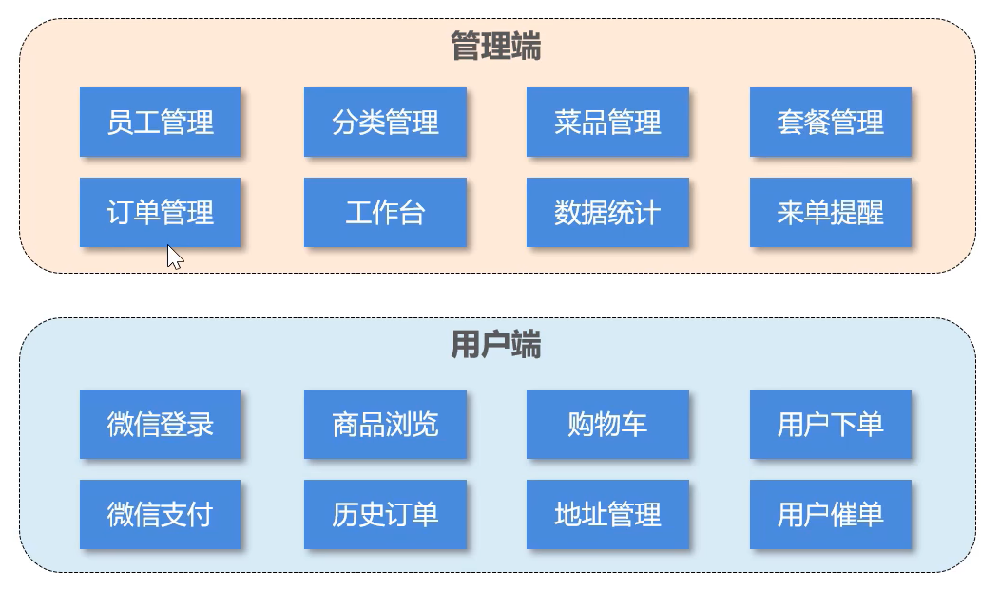

## 产品原型

用于展示项目的业务功能, 一般由产品经理进行设计

## 技术选型

展示项目中使用到的技术框架和中间件等

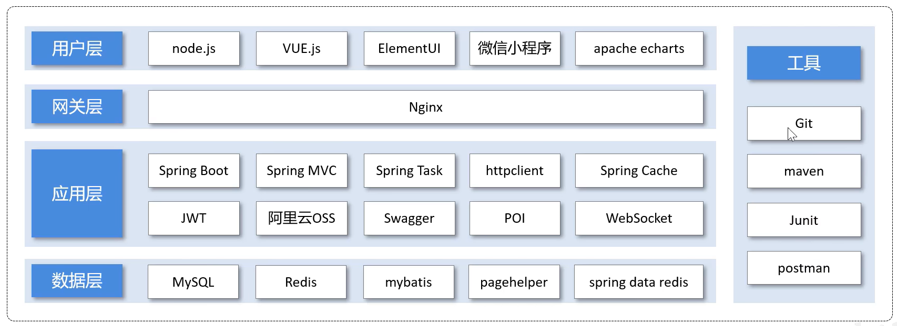

# 开发环境搭建

## 前端环境搭建

### 整体结构

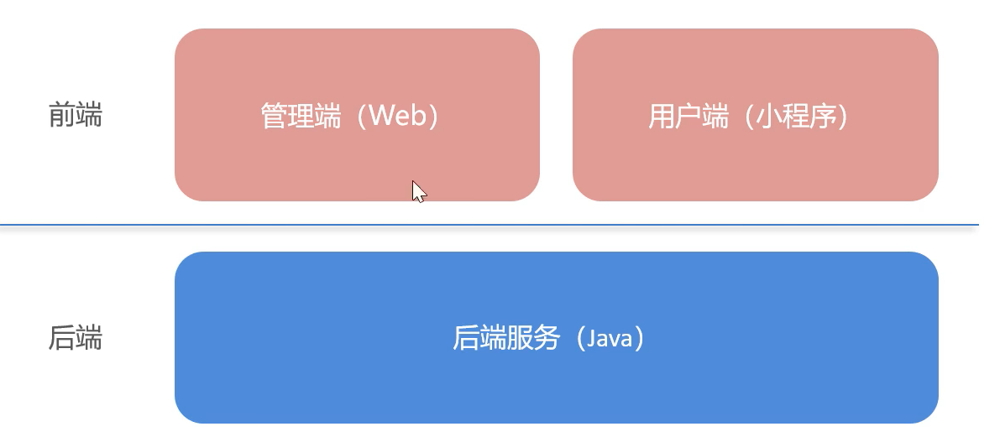

### 环境搭建

前端工程基于<font color='red'>NGINX</font>运行

启动NGINX: 双击<font color='red'>nginx.exe</font>即可启动nginx服务, 访问端口号为80

## 后端环境搭建

后端工程基于<font color='red'>maven</font>进行项目构建, 并且进行<font color='red'>分模块</font>开发

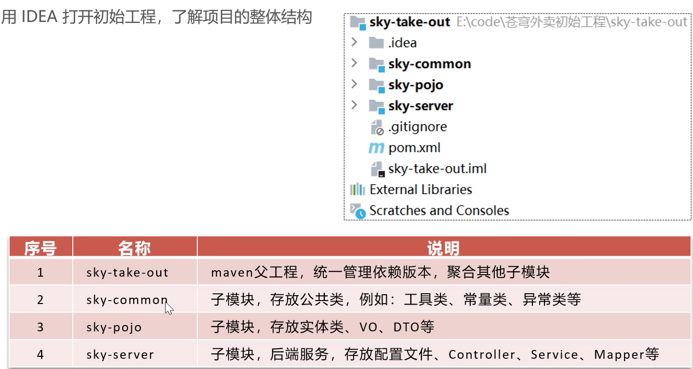

<font color='red'>sky-common</font>子模块中存放的是一些公共类, 可以供其他模块使用

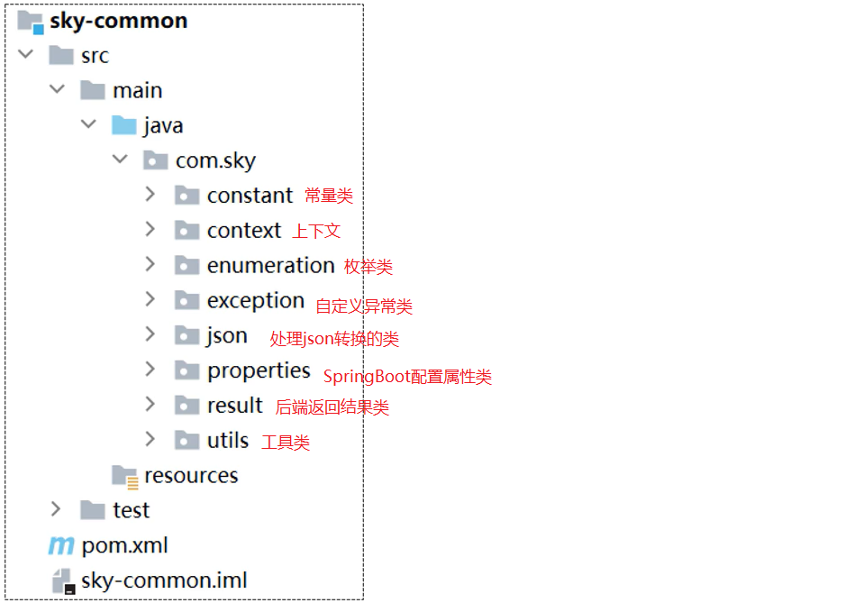

<font color='red'>sky-pojo</font>子模块中存放的是一些entity(实体)、DTO、VO

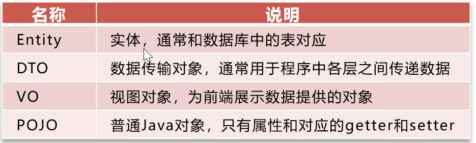

<font color='red'>sky-server</font>子模块中存放的是 配置文件、配置类、拦截器、controller、service、mapper、启动类等

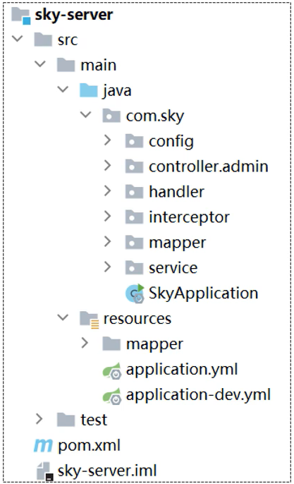

## 使用Git进行版本控制

步骤:

- 创建Git本地仓库
- 创建Git远程仓库
- 将本地文件推送到Git远程仓库

https://gitee.com/w-d1107/sky-take-out.git

## 数据库环境搭建

通过数据库建表语句创建数据库结构:

```sql
CREATE DATABASE  IF NOT EXISTS `sky_take_out` ;
USE `sky_take_out`;

DROP TABLE IF EXISTS `address_book`;
CREATE TABLE `address_book` (
  `id` bigint NOT NULL AUTO_INCREMENT COMMENT '主键',
  `user_id` bigint NOT NULL COMMENT '用户id',
  `consignee` varchar(50) COLLATE utf8_bin DEFAULT NULL COMMENT '收货人',
  `sex` varchar(2) COLLATE utf8_bin DEFAULT NULL COMMENT '性别',
  `phone` varchar(11) COLLATE utf8_bin NOT NULL COMMENT '手机号',
  `province_code` varchar(12) CHARACTER SET utf8mb4  DEFAULT NULL COMMENT '省级区划编号',
  `province_name` varchar(32) CHARACTER SET utf8mb4  DEFAULT NULL COMMENT '省级名称',
  `city_code` varchar(12) CHARACTER SET utf8mb4  DEFAULT NULL COMMENT '市级区划编号',
  `city_name` varchar(32) CHARACTER SET utf8mb4  DEFAULT NULL COMMENT '市级名称',
  `district_code` varchar(12) CHARACTER SET utf8mb4  DEFAULT NULL COMMENT '区级区划编号',
  `district_name` varchar(32) CHARACTER SET utf8mb4  DEFAULT NULL COMMENT '区级名称',
  `detail` varchar(200) CHARACTER SET utf8mb4  DEFAULT NULL COMMENT '详细地址',
  `label` varchar(100) CHARACTER SET utf8mb4  DEFAULT NULL COMMENT '标签',
  `is_default` tinyint(1) NOT NULL DEFAULT '0' COMMENT '默认 0 否 1是',
  PRIMARY KEY (`id`)
) ENGINE=InnoDB AUTO_INCREMENT=2 DEFAULT CHARSET=utf8mb3 COLLATE=utf8_bin COMMENT='地址簿';

DROP TABLE IF EXISTS `category`;
CREATE TABLE `category` (
  `id` bigint NOT NULL AUTO_INCREMENT COMMENT '主键',
  `type` int DEFAULT NULL COMMENT '类型   1 菜品分类 2 套餐分类',
  `name` varchar(32) COLLATE utf8_bin NOT NULL COMMENT '分类名称',
  `sort` int NOT NULL DEFAULT '0' COMMENT '顺序',
  `status` int DEFAULT NULL COMMENT '分类状态 0:禁用，1:启用',
  `create_time` datetime DEFAULT NULL COMMENT '创建时间',
  `update_time` datetime DEFAULT NULL COMMENT '更新时间',
  `create_user` bigint DEFAULT NULL COMMENT '创建人',
  `update_user` bigint DEFAULT NULL COMMENT '修改人',
  PRIMARY KEY (`id`),
  UNIQUE KEY `idx_category_name` (`name`)
) ENGINE=InnoDB AUTO_INCREMENT=23 DEFAULT CHARSET=utf8mb3 COLLATE=utf8_bin COMMENT='菜品及套餐分类';

INSERT INTO `category` VALUES (11,1,'酒水饮料',10,1,'2022-06-09 22:09:18','2022-06-09 22:09:18',1,1);
INSERT INTO `category` VALUES (12,1,'传统主食',9,1,'2022-06-09 22:09:32','2022-06-09 22:18:53',1,1);
INSERT INTO `category` VALUES (13,2,'人气套餐',12,1,'2022-06-09 22:11:38','2022-06-10 11:04:40',1,1);
INSERT INTO `category` VALUES (15,2,'商务套餐',13,1,'2022-06-09 22:14:10','2022-06-10 11:04:48',1,1);
INSERT INTO `category` VALUES (16,1,'蜀味烤鱼',4,1,'2022-06-09 22:15:37','2022-08-31 14:27:25',1,1);
INSERT INTO `category` VALUES (17,1,'蜀味牛蛙',5,1,'2022-06-09 22:16:14','2022-08-31 14:39:44',1,1);
INSERT INTO `category` VALUES (18,1,'特色蒸菜',6,1,'2022-06-09 22:17:42','2022-06-09 22:17:42',1,1);
INSERT INTO `category` VALUES (19,1,'新鲜时蔬',7,1,'2022-06-09 22:18:12','2022-06-09 22:18:28',1,1);
INSERT INTO `category` VALUES (20,1,'水煮鱼',8,1,'2022-06-09 22:22:29','2022-06-09 22:23:45',1,1);
INSERT INTO `category` VALUES (21,1,'汤类',11,1,'2022-06-10 10:51:47','2022-06-10 10:51:47',1,1);

DROP TABLE IF EXISTS `dish`;
CREATE TABLE `dish` (
  `id` bigint NOT NULL AUTO_INCREMENT COMMENT '主键',
  `name` varchar(32) COLLATE utf8_bin NOT NULL COMMENT '菜品名称',
  `category_id` bigint NOT NULL COMMENT '菜品分类id',
  `price` decimal(10,2) DEFAULT NULL COMMENT '菜品价格',
  `image` varchar(255) COLLATE utf8_bin DEFAULT NULL COMMENT '图片',
  `description` varchar(255) COLLATE utf8_bin DEFAULT NULL COMMENT '描述信息',
  `status` int DEFAULT '1' COMMENT '0 停售 1 起售',
  `create_time` datetime DEFAULT NULL COMMENT '创建时间',
  `update_time` datetime DEFAULT NULL COMMENT '更新时间',
  `create_user` bigint DEFAULT NULL COMMENT '创建人',
  `update_user` bigint DEFAULT NULL COMMENT '修改人',
  PRIMARY KEY (`id`),
  UNIQUE KEY `idx_dish_name` (`name`)
) ENGINE=InnoDB AUTO_INCREMENT=70 DEFAULT CHARSET=utf8mb3 COLLATE=utf8_bin COMMENT='菜品';

INSERT INTO `dish` VALUES (46,'王老吉',11,6.00,'https://sky-itcast.oss-cn-beijing.aliyuncs.com/41bfcacf-7ad4-4927-8b26-df366553a94c.png','',1,'2022-06-09 22:40:47','2022-06-09 22:40:47',1,1);
INSERT INTO `dish` VALUES (47,'北冰洋',11,4.00,'https://sky-itcast.oss-cn-beijing.aliyuncs.com/4451d4be-89a2-4939-9c69-3a87151cb979.png','还是小时候的味道',1,'2022-06-10 09:18:49','2022-06-10 09:18:49',1,1);
INSERT INTO `dish` VALUES (48,'雪花啤酒',11,4.00,'https://sky-itcast.oss-cn-beijing.aliyuncs.com/bf8cbfc1-04d2-40e8-9826-061ee41ab87c.png','',1,'2022-06-10 09:22:54','2022-06-10 09:22:54',1,1);
INSERT INTO `dish` VALUES (49,'米饭',12,2.00,'https://sky-itcast.oss-cn-beijing.aliyuncs.com/76752350-2121-44d2-b477-10791c23a8ec.png','精选五常大米',1,'2022-06-10 09:30:17','2022-06-10 09:30:17',1,1);
INSERT INTO `dish` VALUES (50,'馒头',12,1.00,'https://sky-itcast.oss-cn-beijing.aliyuncs.com/475cc599-8661-4899-8f9e-121dd8ef7d02.png','优质面粉',1,'2022-06-10 09:34:28','2022-06-10 09:34:28',1,1);
INSERT INTO `dish` VALUES (51,'老坛酸菜鱼',20,56.00,'https://sky-itcast.oss-cn-beijing.aliyuncs.com/4a9cefba-6a74-467e-9fde-6e687ea725d7.png','原料：汤，草鱼，酸菜',1,'2022-06-10 09:40:51','2022-06-10 09:40:51',1,1);
INSERT INTO `dish` VALUES (52,'经典酸菜鮰鱼',20,66.00,'https://sky-itcast.oss-cn-beijing.aliyuncs.com/5260ff39-986c-4a97-8850-2ec8c7583efc.png','原料：酸菜，江团，鮰鱼',1,'2022-06-10 09:46:02','2022-06-10 09:46:02',1,1);
INSERT INTO `dish` VALUES (53,'蜀味水煮草鱼',20,38.00,'https://sky-itcast.oss-cn-beijing.aliyuncs.com/a6953d5a-4c18-4b30-9319-4926ee77261f.png','原料：草鱼，汤',1,'2022-06-10 09:48:37','2022-06-10 09:48:37',1,1);
INSERT INTO `dish` VALUES (54,'清炒小油菜',19,18.00,'https://sky-itcast.oss-cn-beijing.aliyuncs.com/3613d38e-5614-41c2-90ed-ff175bf50716.png','原料：小油菜',1,'2022-06-10 09:51:46','2022-06-10 09:51:46',1,1);
INSERT INTO `dish` VALUES (55,'蒜蓉娃娃菜',19,18.00,'https://sky-itcast.oss-cn-beijing.aliyuncs.com/4879ed66-3860-4b28-ba14-306ac025fdec.png','原料：蒜，娃娃菜',1,'2022-06-10 09:53:37','2022-06-10 09:53:37',1,1);
INSERT INTO `dish` VALUES (56,'清炒西兰花',19,18.00,'https://sky-itcast.oss-cn-beijing.aliyuncs.com/e9ec4ba4-4b22-4fc8-9be0-4946e6aeb937.png','原料：西兰花',1,'2022-06-10 09:55:44','2022-06-10 09:55:44',1,1);
INSERT INTO `dish` VALUES (57,'炝炒圆白菜',19,18.00,'https://sky-itcast.oss-cn-beijing.aliyuncs.com/22f59feb-0d44-430e-a6cd-6a49f27453ca.png','原料：圆白菜',1,'2022-06-10 09:58:35','2022-06-10 09:58:35',1,1);
INSERT INTO `dish` VALUES (58,'清蒸鲈鱼',18,98.00,'https://sky-itcast.oss-cn-beijing.aliyuncs.com/c18b5c67-3b71-466c-a75a-e63c6449f21c.png','原料：鲈鱼',1,'2022-06-10 10:12:28','2022-06-10 10:12:28',1,1);
INSERT INTO `dish` VALUES (59,'东坡肘子',18,138.00,'https://sky-itcast.oss-cn-beijing.aliyuncs.com/a80a4b8c-c93e-4f43-ac8a-856b0d5cc451.png','原料：猪肘棒',1,'2022-06-10 10:24:03','2022-06-10 10:24:03',1,1);
INSERT INTO `dish` VALUES (60,'梅菜扣肉',18,58.00,'https://sky-itcast.oss-cn-beijing.aliyuncs.com/6080b118-e30a-4577-aab4-45042e3f88be.png','原料：猪肉，梅菜',1,'2022-06-10 10:26:03','2022-06-10 10:26:03',1,1);
INSERT INTO `dish` VALUES (61,'剁椒鱼头',18,66.00,'https://sky-itcast.oss-cn-beijing.aliyuncs.com/13da832f-ef2c-484d-8370-5934a1045a06.png','原料：鲢鱼，剁椒',1,'2022-06-10 10:28:54','2022-06-10 10:28:54',1,1);
INSERT INTO `dish` VALUES (62,'金汤酸菜牛蛙',17,88.00,'https://sky-itcast.oss-cn-beijing.aliyuncs.com/7694a5d8-7938-4e9d-8b9e-2075983a2e38.png','原料：鲜活牛蛙，酸菜',1,'2022-06-10 10:33:05','2022-06-10 10:33:05',1,1);
INSERT INTO `dish` VALUES (63,'香锅牛蛙',17,88.00,'https://sky-itcast.oss-cn-beijing.aliyuncs.com/f5ac8455-4793-450c-97ba-173795c34626.png','配料：鲜活牛蛙，莲藕，青笋',1,'2022-06-10 10:35:40','2022-06-10 10:35:40',1,1);
INSERT INTO `dish` VALUES (64,'馋嘴牛蛙',17,88.00,'https://sky-itcast.oss-cn-beijing.aliyuncs.com/7a55b845-1f2b-41fa-9486-76d187ee9ee1.png','配料：鲜活牛蛙，丝瓜，黄豆芽',1,'2022-06-10 10:37:52','2022-06-10 10:37:52',1,1);
INSERT INTO `dish` VALUES (65,'草鱼2斤',16,68.00,'https://sky-itcast.oss-cn-beijing.aliyuncs.com/b544d3ba-a1ae-4d20-a860-81cb5dec9e03.png','原料：草鱼，黄豆芽，莲藕',1,'2022-06-10 10:41:08','2022-06-10 10:41:08',1,1);
INSERT INTO `dish` VALUES (66,'江团鱼2斤',16,119.00,'https://sky-itcast.oss-cn-beijing.aliyuncs.com/a101a1e9-8f8b-47b2-afa4-1abd47ea0a87.png','配料：江团鱼，黄豆芽，莲藕',1,'2022-06-10 10:42:42','2022-06-10 10:42:42',1,1);
INSERT INTO `dish` VALUES (67,'鮰鱼2斤',16,72.00,'https://sky-itcast.oss-cn-beijing.aliyuncs.com/8cfcc576-4b66-4a09-ac68-ad5b273c2590.png','原料：鮰鱼，黄豆芽，莲藕',1,'2022-06-10 10:43:56','2022-06-10 10:43:56',1,1);
INSERT INTO `dish` VALUES (68,'鸡蛋汤',21,4.00,'https://sky-itcast.oss-cn-beijing.aliyuncs.com/c09a0ee8-9d19-428d-81b9-746221824113.png','配料：鸡蛋，紫菜',1,'2022-06-10 10:54:25','2022-06-10 10:54:25',1,1);
INSERT INTO `dish` VALUES (69,'平菇豆腐汤',21,6.00,'https://sky-itcast.oss-cn-beijing.aliyuncs.com/16d0a3d6-2253-4cfc-9b49-bf7bd9eb2ad2.png','配料：豆腐，平菇',1,'2022-06-10 10:55:02','2022-06-10 10:55:02',1,1);

DROP TABLE IF EXISTS `dish_flavor`;
CREATE TABLE `dish_flavor` (
  `id` bigint NOT NULL AUTO_INCREMENT COMMENT '主键',
  `dish_id` bigint NOT NULL COMMENT '菜品',
  `name` varchar(32) COLLATE utf8_bin DEFAULT NULL COMMENT '口味名称',
  `value` varchar(255) COLLATE utf8_bin DEFAULT NULL COMMENT '口味数据list',
  PRIMARY KEY (`id`)
) ENGINE=InnoDB AUTO_INCREMENT=104 DEFAULT CHARSET=utf8mb3 COLLATE=utf8_bin COMMENT='菜品口味关系表';

INSERT INTO `dish_flavor` VALUES (40,10,'甜味','[\"无糖\",\"少糖\",\"半糖\",\"多糖\",\"全糖\"]');
INSERT INTO `dish_flavor` VALUES (41,7,'忌口','[\"不要葱\",\"不要蒜\",\"不要香菜\",\"不要辣\"]');
INSERT INTO `dish_flavor` VALUES (42,7,'温度','[\"热饮\",\"常温\",\"去冰\",\"少冰\",\"多冰\"]');
INSERT INTO `dish_flavor` VALUES (45,6,'忌口','[\"不要葱\",\"不要蒜\",\"不要香菜\",\"不要辣\"]');
INSERT INTO `dish_flavor` VALUES (46,6,'辣度','[\"不辣\",\"微辣\",\"中辣\",\"重辣\"]');
INSERT INTO `dish_flavor` VALUES (47,5,'辣度','[\"不辣\",\"微辣\",\"中辣\",\"重辣\"]');
INSERT INTO `dish_flavor` VALUES (48,5,'甜味','[\"无糖\",\"少糖\",\"半糖\",\"多糖\",\"全糖\"]');
INSERT INTO `dish_flavor` VALUES (49,2,'甜味','[\"无糖\",\"少糖\",\"半糖\",\"多糖\",\"全糖\"]');
INSERT INTO `dish_flavor` VALUES (50,4,'甜味','[\"无糖\",\"少糖\",\"半糖\",\"多糖\",\"全糖\"]');
INSERT INTO `dish_flavor` VALUES (51,3,'甜味','[\"无糖\",\"少糖\",\"半糖\",\"多糖\",\"全糖\"]');
INSERT INTO `dish_flavor` VALUES (52,3,'忌口','[\"不要葱\",\"不要蒜\",\"不要香菜\",\"不要辣\"]');
INSERT INTO `dish_flavor` VALUES (86,52,'忌口','[\"不要葱\",\"不要蒜\",\"不要香菜\",\"不要辣\"]');
INSERT INTO `dish_flavor` VALUES (87,52,'辣度','[\"不辣\",\"微辣\",\"中辣\",\"重辣\"]');
INSERT INTO `dish_flavor` VALUES (88,51,'忌口','[\"不要葱\",\"不要蒜\",\"不要香菜\",\"不要辣\"]');
INSERT INTO `dish_flavor` VALUES (89,51,'辣度','[\"不辣\",\"微辣\",\"中辣\",\"重辣\"]');
INSERT INTO `dish_flavor` VALUES (92,53,'忌口','[\"不要葱\",\"不要蒜\",\"不要香菜\",\"不要辣\"]');
INSERT INTO `dish_flavor` VALUES (93,53,'辣度','[\"不辣\",\"微辣\",\"中辣\",\"重辣\"]');
INSERT INTO `dish_flavor` VALUES (94,54,'忌口','[\"不要葱\",\"不要蒜\",\"不要香菜\"]');
INSERT INTO `dish_flavor` VALUES (95,56,'忌口','[\"不要葱\",\"不要蒜\",\"不要香菜\",\"不要辣\"]');
INSERT INTO `dish_flavor` VALUES (96,57,'忌口','[\"不要葱\",\"不要蒜\",\"不要香菜\",\"不要辣\"]');
INSERT INTO `dish_flavor` VALUES (97,60,'忌口','[\"不要葱\",\"不要蒜\",\"不要香菜\",\"不要辣\"]');
INSERT INTO `dish_flavor` VALUES (101,66,'辣度','[\"不辣\",\"微辣\",\"中辣\",\"重辣\"]');
INSERT INTO `dish_flavor` VALUES (102,67,'辣度','[\"不辣\",\"微辣\",\"中辣\",\"重辣\"]');
INSERT INTO `dish_flavor` VALUES (103,65,'辣度','[\"不辣\",\"微辣\",\"中辣\",\"重辣\"]');

DROP TABLE IF EXISTS `employee`;
CREATE TABLE `employee` (
  `id` bigint NOT NULL AUTO_INCREMENT COMMENT '主键',
  `name` varchar(32) COLLATE utf8_bin NOT NULL COMMENT '姓名',
  `username` varchar(32) COLLATE utf8_bin NOT NULL COMMENT '用户名',
  `password` varchar(64) COLLATE utf8_bin NOT NULL COMMENT '密码',
  `phone` varchar(11) COLLATE utf8_bin NOT NULL COMMENT '手机号',
  `sex` varchar(2) COLLATE utf8_bin NOT NULL COMMENT '性别',
  `id_number` varchar(18) COLLATE utf8_bin NOT NULL COMMENT '身份证号',
  `status` int NOT NULL DEFAULT '1' COMMENT '状态 0:禁用，1:启用',
  `create_time` datetime DEFAULT NULL COMMENT '创建时间',
  `update_time` datetime DEFAULT NULL COMMENT '更新时间',
  `create_user` bigint DEFAULT NULL COMMENT '创建人',
  `update_user` bigint DEFAULT NULL COMMENT '修改人',
  PRIMARY KEY (`id`),
  UNIQUE KEY `idx_username` (`username`)
) ENGINE=InnoDB AUTO_INCREMENT=2 DEFAULT CHARSET=utf8mb3 COLLATE=utf8_bin COMMENT='员工信息';

INSERT INTO `employee` VALUES (1,'管理员','admin','123456','13812312312','1','110101199001010047',1,'2022-02-15 15:51:20','2022-02-17 09:16:20',10,1);

DROP TABLE IF EXISTS `order_detail`;
CREATE TABLE `order_detail` (
  `id` bigint NOT NULL AUTO_INCREMENT COMMENT '主键',
  `name` varchar(32) COLLATE utf8_bin DEFAULT NULL COMMENT '名字',
  `image` varchar(255) COLLATE utf8_bin DEFAULT NULL COMMENT '图片',
  `order_id` bigint NOT NULL COMMENT '订单id',
  `dish_id` bigint DEFAULT NULL COMMENT '菜品id',
  `setmeal_id` bigint DEFAULT NULL COMMENT '套餐id',
  `dish_flavor` varchar(50) COLLATE utf8_bin DEFAULT NULL COMMENT '口味',
  `number` int NOT NULL DEFAULT '1' COMMENT '数量',
  `amount` decimal(10,2) NOT NULL COMMENT '金额',
  PRIMARY KEY (`id`)
) ENGINE=InnoDB AUTO_INCREMENT=5 DEFAULT CHARSET=utf8mb3 COLLATE=utf8_bin COMMENT='订单明细表';

DROP TABLE IF EXISTS `orders`;
CREATE TABLE `orders` (
  `id` bigint NOT NULL AUTO_INCREMENT COMMENT '主键',
  `number` varchar(50) COLLATE utf8_bin DEFAULT NULL COMMENT '订单号',
  `status` int NOT NULL DEFAULT '1' COMMENT '订单状态 1待付款 2待接单 3已接单 4派送中 5已完成 6已取消 7退款',
  `user_id` bigint NOT NULL COMMENT '下单用户',
  `address_book_id` bigint NOT NULL COMMENT '地址id',
  `order_time` datetime NOT NULL COMMENT '下单时间',
  `checkout_time` datetime DEFAULT NULL COMMENT '结账时间',
  `pay_method` int NOT NULL DEFAULT '1' COMMENT '支付方式 1微信,2支付宝',
  `pay_status` tinyint NOT NULL DEFAULT '0' COMMENT '支付状态 0未支付 1已支付 2退款',
  `amount` decimal(10,2) NOT NULL COMMENT '实收金额',
  `remark` varchar(100) COLLATE utf8_bin DEFAULT NULL COMMENT '备注',
  `phone` varchar(11) COLLATE utf8_bin DEFAULT NULL COMMENT '手机号',
  `address` varchar(255) COLLATE utf8_bin DEFAULT NULL COMMENT '地址',
  `user_name` varchar(32) COLLATE utf8_bin DEFAULT NULL COMMENT '用户名称',
  `consignee` varchar(32) COLLATE utf8_bin DEFAULT NULL COMMENT '收货人',
  `cancel_reason` varchar(255) COLLATE utf8_bin DEFAULT NULL COMMENT '订单取消原因',
  `rejection_reason` varchar(255) COLLATE utf8_bin DEFAULT NULL COMMENT '订单拒绝原因',
  `cancel_time` datetime DEFAULT NULL COMMENT '订单取消时间',
  `estimated_delivery_time` datetime DEFAULT NULL COMMENT '预计送达时间',
  `delivery_status` tinyint(1) NOT NULL DEFAULT '1' COMMENT '配送状态  1立即送出  0选择具体时间',
  `delivery_time` datetime DEFAULT NULL COMMENT '送达时间',
  `pack_amount` int DEFAULT NULL COMMENT '打包费',
  `tableware_number` int DEFAULT NULL COMMENT '餐具数量',
  `tableware_status` tinyint(1) NOT NULL DEFAULT '1' COMMENT '餐具数量状态  1按餐量提供  0选择具体数量',
  PRIMARY KEY (`id`)
) ENGINE=InnoDB AUTO_INCREMENT=4 DEFAULT CHARSET=utf8mb3 COLLATE=utf8_bin COMMENT='订单表';

DROP TABLE IF EXISTS `setmeal`;
CREATE TABLE `setmeal` (
  `id` bigint NOT NULL AUTO_INCREMENT COMMENT '主键',
  `category_id` bigint NOT NULL COMMENT '菜品分类id',
  `name` varchar(32) COLLATE utf8_bin NOT NULL COMMENT '套餐名称',
  `price` decimal(10,2) NOT NULL COMMENT '套餐价格',
  `status` int DEFAULT '1' COMMENT '售卖状态 0:停售 1:起售',
  `description` varchar(255) COLLATE utf8_bin DEFAULT NULL COMMENT '描述信息',
  `image` varchar(255) COLLATE utf8_bin DEFAULT NULL COMMENT '图片',
  `create_time` datetime DEFAULT NULL COMMENT '创建时间',
  `update_time` datetime DEFAULT NULL COMMENT '更新时间',
  `create_user` bigint DEFAULT NULL COMMENT '创建人',
  `update_user` bigint DEFAULT NULL COMMENT '修改人',
  PRIMARY KEY (`id`),
  UNIQUE KEY `idx_setmeal_name` (`name`)
) ENGINE=InnoDB AUTO_INCREMENT=32 DEFAULT CHARSET=utf8mb3 COLLATE=utf8_bin COMMENT='套餐';

DROP TABLE IF EXISTS `setmeal_dish`;
CREATE TABLE `setmeal_dish` (
  `id` bigint NOT NULL AUTO_INCREMENT COMMENT '主键',
  `setmeal_id` bigint DEFAULT NULL COMMENT '套餐id',
  `dish_id` bigint DEFAULT NULL COMMENT '菜品id',
  `name` varchar(32) COLLATE utf8_bin DEFAULT NULL COMMENT '菜品名称 （冗余字段）',
  `price` decimal(10,2) DEFAULT NULL COMMENT '菜品单价（冗余字段）',
  `copies` int DEFAULT NULL COMMENT '菜品份数',
  PRIMARY KEY (`id`)
) ENGINE=InnoDB AUTO_INCREMENT=47 DEFAULT CHARSET=utf8mb3 COLLATE=utf8_bin COMMENT='套餐菜品关系';

DROP TABLE IF EXISTS `shopping_cart`;
CREATE TABLE `shopping_cart` (
  `id` bigint NOT NULL AUTO_INCREMENT COMMENT '主键',
  `name` varchar(32) COLLATE utf8_bin DEFAULT NULL COMMENT '商品名称',
  `image` varchar(255) COLLATE utf8_bin DEFAULT NULL COMMENT '图片',
  `user_id` bigint NOT NULL COMMENT '主键',
  `dish_id` bigint DEFAULT NULL COMMENT '菜品id',
  `setmeal_id` bigint DEFAULT NULL COMMENT '套餐id',
  `dish_flavor` varchar(50) COLLATE utf8_bin DEFAULT NULL COMMENT '口味',
  `number` int NOT NULL DEFAULT '1' COMMENT '数量',
  `amount` decimal(10,2) NOT NULL COMMENT '金额',
  `create_time` datetime DEFAULT NULL COMMENT '创建时间',
  PRIMARY KEY (`id`)
) ENGINE=InnoDB AUTO_INCREMENT=9 DEFAULT CHARSET=utf8mb3 COLLATE=utf8_bin COMMENT='购物车';

DROP TABLE IF EXISTS `user`;
CREATE TABLE `user` (
  `id` bigint NOT NULL AUTO_INCREMENT COMMENT '主键',
  `openid` varchar(45) COLLATE utf8_bin DEFAULT NULL COMMENT '微信用户唯一标识',
  `name` varchar(32) COLLATE utf8_bin DEFAULT NULL COMMENT '姓名',
  `phone` varchar(11) COLLATE utf8_bin DEFAULT NULL COMMENT '手机号',
  `sex` varchar(2) COLLATE utf8_bin DEFAULT NULL COMMENT '性别',
  `id_number` varchar(18) COLLATE utf8_bin DEFAULT NULL COMMENT '身份证号',
  `avatar` varchar(500) COLLATE utf8_bin DEFAULT NULL COMMENT '头像',
  `create_time` datetime DEFAULT NULL,
  PRIMARY KEY (`id`)
) ENGINE=InnoDB AUTO_INCREMENT=4 DEFAULT CHARSET=utf8mb3 COLLATE=utf8_bin COMMENT='用户信息';
```

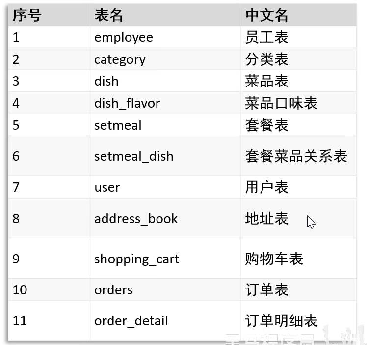

## 前后端联调

后端的初始工程中已经实现了登录功能, 直接进行前后端联调测试即可

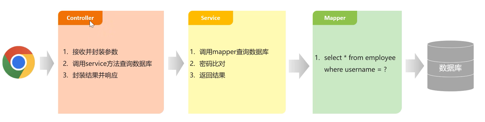

> 后端初始代码:[./图片/backendCode]

前端发送的请求, 是如何请求到后端服务的?

前端请求地址: http://localhost/api/employee/login

后端接口地址: http://localhost:8080/dimin/employee/login

Nginx反向代理, 就是将前端发送的动态请求由Nginx转发到后端服务器

```yaml
#负载均衡权重设置
upstream webservers{
  server 127.0.0.1:8080 weight=90 ;
  #server 127.0.0.1:8088 weight=10 ;
}

server {
	listen       80;
	server_name  localhost;
	# 反向代理,处理管理端发送的请求
	location /api/ {
		proxy_pass   http://localhost:8080/admin/;
    	#proxy_pass   http://webservers/admin/; #负载均衡
	}
		
	# 反向代理,处理用户端发送的请求
	location /user/ {
		proxy_pass   http://webservers/user/;
	}
		
	# WebSocket
	location /ws/ {
		proxy_pass   http://webservers/ws/;
		proxy_http_version 1.1;
		proxy_read_timeout 3600s;
		proxy_set_header Upgrade $http_upgrade;
		proxy_set_header Connection "$connection_upgrade";
	}
}
```

Nginx反向代理的好处:

- 提高访问速度
- 进行负载均衡
- 保证后端服务安全

所谓<font color='red'>负载均衡</font>, 就是把大量的请求按照我们指定的方式均衡的分配给集群中的每台服务器

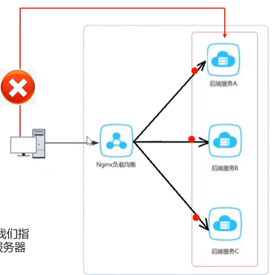

> Nginx负载均衡策略

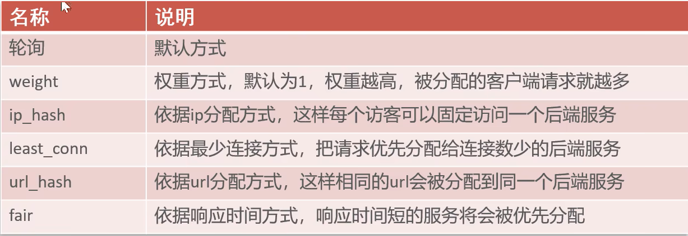

## 完善登录功能

1. 将密码加密后存储, 提高安全性
2. 使用MD5加密方式对明文密码加密

**MD5信息摘要算法**(MD5 Message-Digest Algorithm), 一种被广泛使用的**密码散列函数**, 可以产生出一个128位(16字节)的散列值(hash value),用于确保信息传输完整一致. MD5由美国密码学家**罗纳德·李维斯特**(Ronald Linn Rivest)设计, 于1992年公开, 用以取代MD4算法. 这套算法的程序在RFC 1321标准中被加以规范. 1996年后该算法被证实存在弱电, 可以被加以破解, 对于需要高度安全性的数据, 专家一般建议改用其他算法, 如SHA-2. 2004年, 证实MD5算法无法碰撞(collision), 因此不适用于安全性认证, 如SSL公开密钥认证或是数字签名等用途

步骤:

1. 修改数据库中明文密码, 改为MD5加密后的密文
2. 修改Java代码, 前端提交的密码进行MD5加密后再跟数据库中密码比对

```java
//进行MD5加密, 然后再进行比对
password = DigestUtils.md5DigestAsHex(password.getBytes());
if(!password.equals(employee.getPassword())){
    //密码错误
    throw new PasswordErrorException(MessageConstant.PASSWORD_ERROR);
}
```

## Swagger

### 介绍

使用Swagger只需要按照它的规范去定义接口及接口相关的信息, 就可以做到生成接口文档, 以及**在线接口调试**页面.

官网: https://swagger.io/

Knife4j是为Java MVC框架集成Swagger生成API文档的增强解决方案

> maven坐标

```xml
<dependency>
    <groupId>com.github.xiaoymin</groupId>
    <artifactId>knife4j-spring-boot-starter</artifactId>
    <version>3.0.2</version>
</dependency>
```

### 使用方式

1. 导入knife4j的maven坐标
2. 在配置类中加入knife4j相关配置
3. 设置静态资源映射, 否则接口文档页面无法访问

```java
/**
 * 通过knife4j生成接口文档
 * @return
 */
@Bean
public Docket docket() {
    ApiInfo apiInfo = new ApiInfoBuilder()
            .title("苍穹外卖项目接口文档")
            .version("2.0")
            .description("苍穹外卖项目接口文档")
            .build();
    Docket docket = new Docket(DocumentationType.SWAGGER_2)
            .apiInfo(apiInfo)
            .select()
            .apis(RequestHandlerSelectors.basePackage("com.sky.controller"))
            .paths(PathSelectors.any())
            .build();
    return docket;
}

/**
 * 设置静态资源映射
 * @param registry
 */
protected void addResourceHandlers(ResourceHandlerRegistry registry) {
    registry.addResourceHandler("/doc.html").addResourceLocations("classpath:/META-INF/resources/");
    registry.addResourceHandler("/webjars/**").addResourceLocations("classpath:/META-INF/resources/webjars/");
}
```

1. YApi是设计阶段使用的工具, 管理和维护接口
2. Swagger在开发阶段使用的框架, 帮助后端开发人员做后端的接口测试

### 常用注解

通过注解可以控制生成的接口文档, 使接口文档拥有更好的可读性, 常用注释如下:

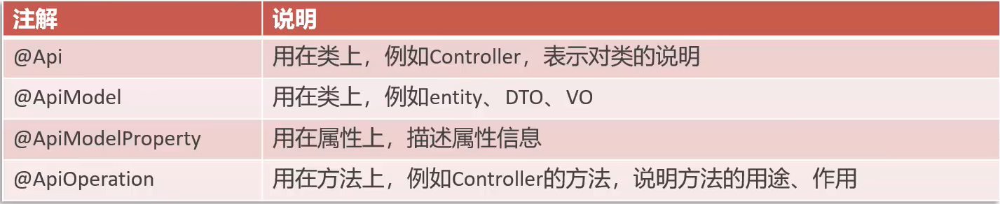

# jwt验证流程

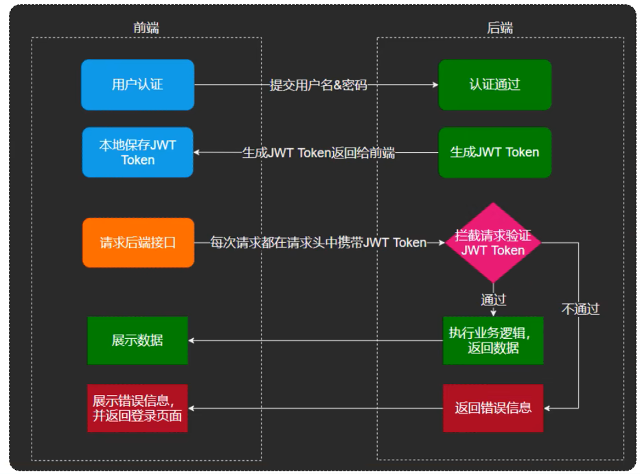

## 代码完善

完善登录功能中更新操作人ID的方法

将前端的请求拦截, 获取请求头, 从请求头中获取用户ID, 并传给Server层

用到工具:

**`ThreadLocal`**并不是一个Thread, 而是Thread的局部变量

ThreadLocal为每个线程提供单独一份存储空间, 具有线程隔离的效果, 只有在线程内才能获取到对应的值, 线程外则不能访问

ThreadLocal常用方法

- `public void set(T value)`	设置当前线程的线程局部变量的值
- `public T get()`                  返回当前线程所对应的线程局部变量的值
- `public void remove`              移除当前线程的线程局部变量

# 返回数据格式化

方式一: 在属性上加入注解, 对日期进行格式化

```java
@JsonFormat(pattern = "yyyy-MM-dd HH:mm:ss")
private LocalDateTime updateTime;
```

方式二: 在WebMvcConfiguration中扩展Spring MVC的消息转换器, 统一对日期类型进行格式化处理

```java
/**
 * 扩展Spring的消息转换器
 * @param converters
 */
protected void extendMessageConverters(List<HttpMessageConverter<?>> converters) {
    log.info("开启消息转换器");
    //创建消息转换器对象
    MappingJackson2HttpMessageConverter converter = new MappingJackson2HttpMessageConverter();
    //设置消息转换器,可以将Java对象转为Json字符串
    converter.setObjectMapper(new JacksonObjectMapper());
    //将我们自己的消息转换器放入Spring MVC框架的容器中
    converters.add(0,converter);
}
```

> 自定义消息转换器类

```java
package com.sky.json;

import com.fasterxml.jackson.databind.DeserializationFeature;
import com.fasterxml.jackson.databind.ObjectMapper;
import com.fasterxml.jackson.databind.module.SimpleModule;
import com.fasterxml.jackson.datatype.jsr310.deser.LocalDateDeserializer;
import com.fasterxml.jackson.datatype.jsr310.deser.LocalDateTimeDeserializer;
import com.fasterxml.jackson.datatype.jsr310.deser.LocalTimeDeserializer;
import com.fasterxml.jackson.datatype.jsr310.ser.LocalDateSerializer;
import com.fasterxml.jackson.datatype.jsr310.ser.LocalDateTimeSerializer;
import com.fasterxml.jackson.datatype.jsr310.ser.LocalTimeSerializer;

import java.time.LocalDate;
import java.time.LocalDateTime;
import java.time.LocalTime;
import java.time.format.DateTimeFormatter;

import static com.fasterxml.jackson.databind.DeserializationFeature.FAIL_ON_UNKNOWN_PROPERTIES;

/**
 * 对象映射器:基于jackson将Java对象转为json，或者将json转为Java对象
 * 将JSON解析为Java对象的过程称为 [从JSON反序列化Java对象]
 * 从Java对象生成JSON的过程称为 [序列化Java对象到JSON]
 */
public class JacksonObjectMapper extends ObjectMapper {

    public static final String DEFAULT_DATE_FORMAT = "yyyy-MM-dd";
    //public static final String DEFAULT_DATE_TIME_FORMAT = "yyyy-MM-dd HH:mm:ss";
    public static final String DEFAULT_DATE_TIME_FORMAT = "yyyy-MM-dd HH:mm";
    public static final String DEFAULT_TIME_FORMAT = "HH:mm:ss";

    public JacksonObjectMapper() {
        super();
        //收到未知属性时不报异常
        this.configure(FAIL_ON_UNKNOWN_PROPERTIES, false);

        //反序列化时，属性不存在的兼容处理
        this.getDeserializationConfig().withoutFeatures(DeserializationFeature.FAIL_ON_UNKNOWN_PROPERTIES);

        SimpleModule simpleModule = new SimpleModule()
                .addDeserializer(LocalDateTime.class, new LocalDateTimeDeserializer(DateTimeFormatter.ofPattern(DEFAULT_DATE_TIME_FORMAT)))
                .addDeserializer(LocalDate.class, new LocalDateDeserializer(DateTimeFormatter.ofPattern(DEFAULT_DATE_FORMAT)))
                .addDeserializer(LocalTime.class, new LocalTimeDeserializer(DateTimeFormatter.ofPattern(DEFAULT_TIME_FORMAT)))
                .addSerializer(LocalDateTime.class, new LocalDateTimeSerializer(DateTimeFormatter.ofPattern(DEFAULT_DATE_TIME_FORMAT)))
                .addSerializer(LocalDate.class, new LocalDateSerializer(DateTimeFormatter.ofPattern(DEFAULT_DATE_FORMAT)))
                .addSerializer(LocalTime.class, new LocalTimeSerializer(DateTimeFormatter.ofPattern(DEFAULT_TIME_FORMAT)));

        //注册功能模块 例如，可以添加自定义序列化器和反序列化器
        this.registerModule(simpleModule);
    }
}
```

# HttpClient

## 介绍

HttpClient是Apache Jakarta Common下的子项目, 可以用来提供高效的、最新的、功能丰富的支持HTTP协议的客户端编程工具包, 并且它支持HTTP协议最新的版本和建议

> maven坐标

```xml
<dependency>
    <groupId>org.apache.httpcomponents</groupId>
    <artifactId>httpclient</artifactId>
    <version>版本号</version>
</dependency>
```

> 核心API:

- HttpClient: 发送Http请求
- HttpClients: 创建HttpClient对象
- CloseableHttpClient: HttpClient实现类
- HttpGet: Get请求
- HttpPost: Post请求

> 发送请求步骤:

- 创建HttpClient对象
- 创建Http对象
- 调用HttpClient的execute方法发送请求

# 微信小程序开发

## 介绍

一种新的开放能力, 可以在微信内被便捷的获取和传播, 同时具有出色的使用体验

官网: https://mp.weixin.qq.com/cgi-bin/wx?token=&lang=zh_CN

## 入门案例

- 了解小程序目录结构

  小程序包含一个描述整体程序的app和多个描述各自页面的page.

  一个小程序主体部分由三个文件组成, 必须放在项目的根目录

  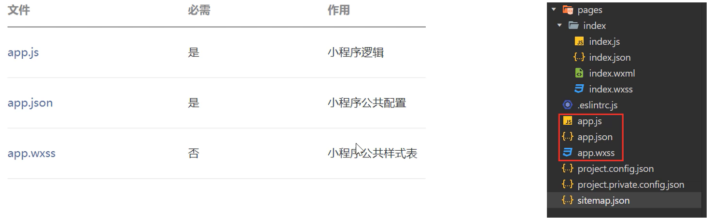

  一个小程序页面由四个文件组成:

  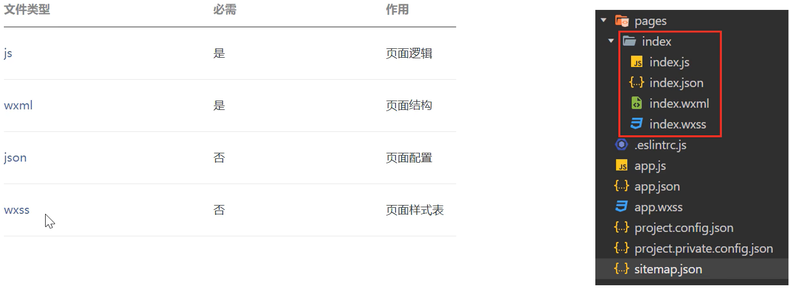

## 微信登录

微信登录: https://developers.weixin.qq.com/miniprogram/dev/framework/open-ability/login.html

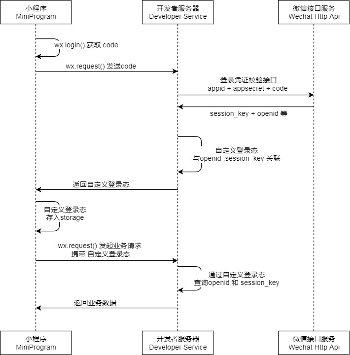

## 说明

1. 调用 [wx.login()](https://developers.weixin.qq.com/miniprogram/dev/api/open-api/login/wx.login.html) 获取 **临时登录凭证code** ，并回传到开发者服务器。
2. 调用 [auth.code2Session](https://developers.weixin.qq.com/miniprogram/dev/OpenApiDoc/user-login/code2Session.html) 接口，换取 **用户唯一标识 OpenID** 、 用户在微信开放平台账号下的**唯一标识UnionID**（若当前小程序已绑定到微信开放平台账号） 和 **会话密钥 session_key**。

之后开发者服务器可以根据用户标识来生成自定义登录态，用于后续业务逻辑中前后端交互时识别用户身份。

## 注意事项

1. 会话密钥 `session_key` 是对用户数据进行 [加密签名](https://developers.weixin.qq.com/miniprogram/dev/framework/open-ability/signature.html) 的密钥。为了应用自身的数据安全，开发者服务器**不应该把会话密钥下发到小程序，也不应该对外提供这个密钥**。
2. 临时登录凭证 code 只能使用一次

**<font color='red'>注意: 可以使用Postman测试登录凭证校验接口</font>**

## 代码开发

> WeChatProperties.java

```java
@Component
@ConfigurationProperties(prefix = "sky.wechat")
@Data
public class WeChatProperties {

    private String appid; //小程序的appid
    private String secret; //小程序的秘钥
    private String mchid; //商户号
    private String mchSerialNo; //商户API证书的证书序列号
    private String privateKeyFilePath; //商户私钥文件
    private String apiV3Key; //证书解密的密钥
    private String weChatPayCertFilePath; //平台证书
    private String notifyUrl; //支付成功的回调地址
    private String refundNotifyUrl; //退款成功的回调地址

}
```

> application.yml

```yaml
sky:
  wechat:
    appid: ${sky.wechat.appid}
    appsecret: ${sky.wechat.appsecret}
```

> application-dev.yml

```yaml
sky:
  wechat:
    appid: 
    secret: 
```

> 配置为微信用户生成jwt令牌时使用的配置项

```yml
sky:
  jwt:
  	# (管理端)
    # 设置jwt签名加密时使用的秘钥
    admin-secret-key: qqzj
    # 设置jwt过期时间
    admin-ttl: 7200000
    # 设置前端传递过来的令牌名称
    admin-token-name: token
    # (微信)
    # 设置jwt签名加密时使用的秘钥
    user-secret-key: qqzj
    # 设置jwt过期时间
    user-ttl: 7200000
    # 设置前端传递过来的令牌名称
    user-token-name: authentication
```

> JwtProperties.java

```java
@Component
@ConfigurationProperties(prefix = "sky.jwt")
@Data
public class JwtProperties {

    /**
     * 管理端员工生成jwt令牌相关配置
     */
    private String adminSecretKey;
    private long adminTtl;
    private String adminTokenName;

    /**
     * 用户端微信用户生成jwt令牌相关配置
     */
    private String userSecretKey;
    private long userTtl;
    private String userTokenName;

}
```

# Spring Cache

## 介绍

**Spring Cache **是一个框架, 实现了基于注解的缓存功能, 只需要简单地加一个注解, 就能实现缓存功能

Spring Cache提供了一层抽象, 底层可以切换不同的Cache实现, 具体就是通过**CacheManager**接口来统一不同的缓存技术

CacheManager是Spring提供的各种缓存技术抽象接口

针对不同的缓存技术需要实现不同的CacheManager:


## Spring Cache常用注解


在SpringBoot项目中, 使用缓存技术只需在项目中导入相关缓存技术的依赖包, 并在启动类上使用`@EnableCaching`开启缓存支持即可

例如, 使用Redis作为缓存技术, 只需要导入Spring Data Redis的maven坐标即可

> 注入`CacheManager`接口

```java
    @Autowired
    private CacheManager cacheManager;
```

# 微信支付

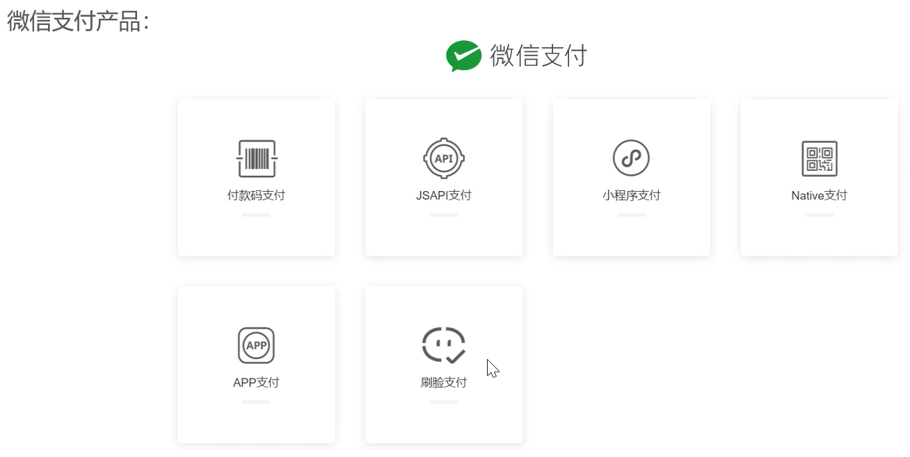

参考: https://pay.weixin.qq.com/static/product/product_index.shtml

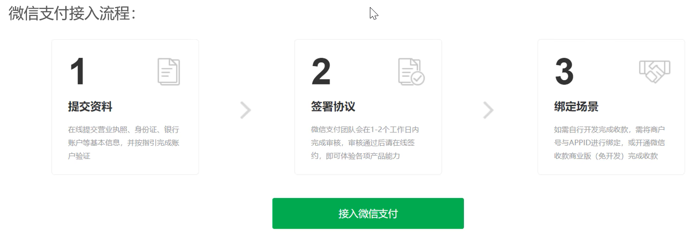

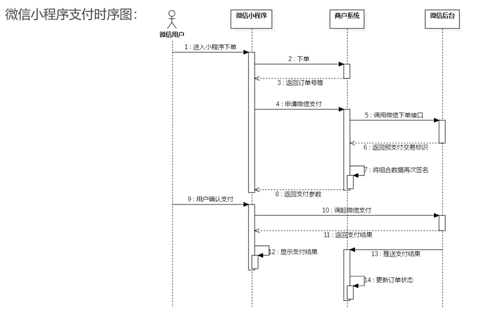

> 预支付请求

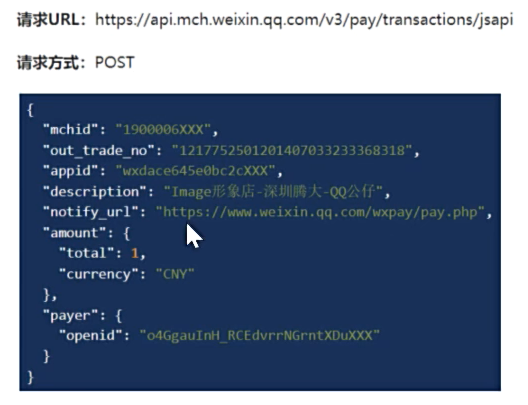

> 调起微信支付

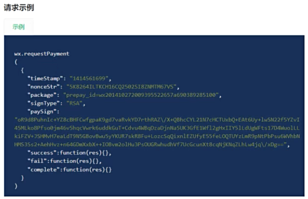


## 微信支付介绍

[JSAPI下单](https://pay.weixin.qq.com/wiki/doc/apiv3/apis/chapter3_5_1.shtml):商户系统调用该接口在微信支付服务后台生成预支付交易单

适用对象: 直连商户

请求URL: https://api.mch.weixin.qq.com/v3/pay/transactions/jsapi

请求方式: POST

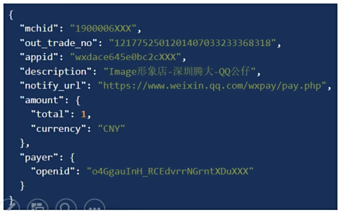

返回参数

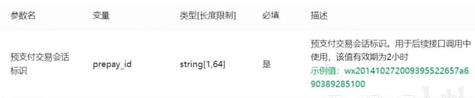

[微信小程序调起支付](https://pay.weixin.qq.com/wiki/doc/apiv3/apis/chapter3_5_4.shtml):通过JSAPI下单接口获取到发起支付的必要参数prepay_id,然后使用微信支付提供的小程序方法调起小程序支付

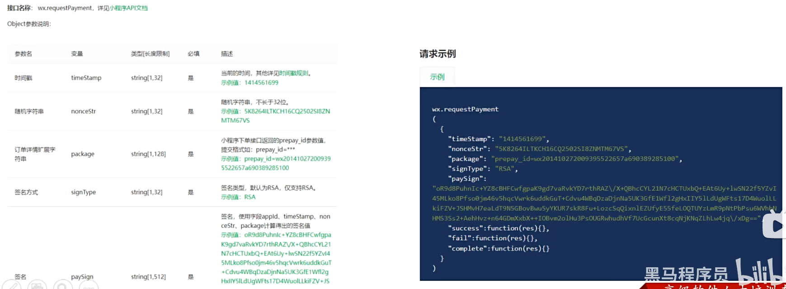

## 微信支付准备工作

[获取临时域名](https://dashboard.cpolar.com/login):支付成功后微信服务通过该域名回调我们的程序

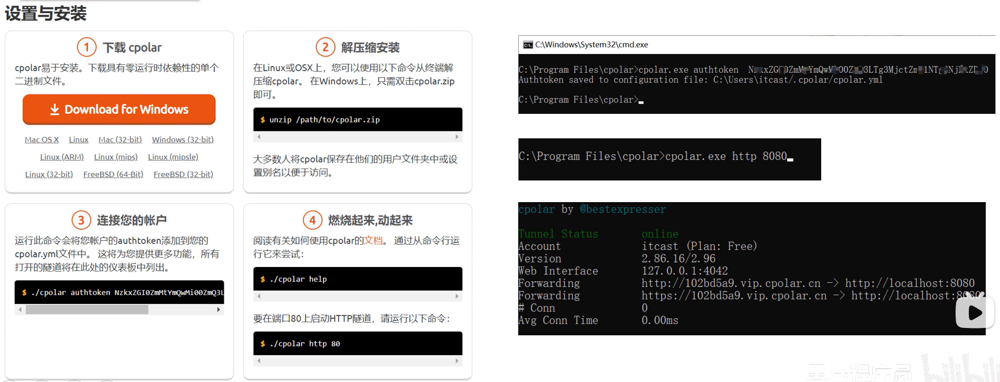

# Spring Task

## 介绍

Spring Task是Spring框架提供的任务调度工具, 可以按照约定的时间自动执行某个代码逻辑

定位: 定时任务框架

作用: 定时自动执行某段java代码

应用场景:

- 信用卡每月还款提醒
- 银行贷款每月还款提醒
- 火车票售票系统处理未支付订单
- 入职纪念日为用户发送通知
- <font color='red'>只要是需要定时处理的场景都可以使用Spring Task</font>

## cron表达式

cron表达式其实就是一个字符串, 通过cron表达式可以**定义任务触发的时间**

构成规则: 分为6或7个域, 由空格分隔开, 每个域代表一个含义

每个域的含义分别为: 秒、分钟、小时、日、月、周、年(可选)

2022年10月12日上午9点整  对应的cron表达式为:<font color='red'>0 0 9 12 10 ? 2022</font>

| 秒   | 分钟 | 小时 | 日   | 月   | 周   | 年   |
| ---- | ---- | ---- | ---- | ---- | ---- | ---- |
| 0    | 0    | 9    | 12   | 10   | ?    | 2022 |

**其中 日和周 通常只能出现一个**

cron表达式在线生成器: [Cron - 在线Cron表达式生成器 (ciding.cc)](https://cron.ciding.cc/)

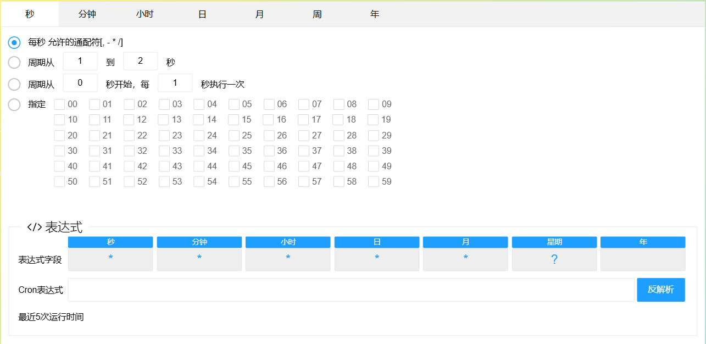

## 入门案例

Spring Task使用步骤:

- 导入maven坐标spring-context(已存在)

  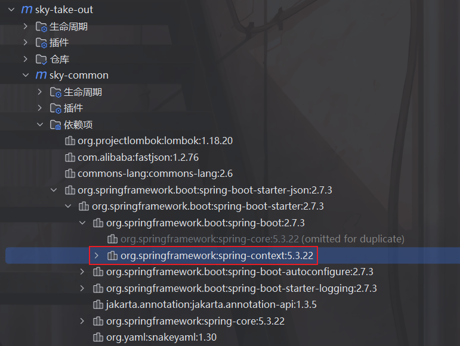

- 启动类添加注解`@EnableScheduling`开启任务调度

- 自定义定时任务类

```java
/**
 * 自定义定时任务类
 */
@Component
@Slf4j
public class MyTask {
    
    /**
     * 定时任务方法
     * 从第0秒开始，每5秒执行一次
     */
    @Scheduled(cron = "0/5 * * * * ?")
    public void executeTask(){
       log.info("定时任务执行了,当前时间:{}", new Date());
    }
}
```

## 订单状态定时处理

用户下单后可能存在的情况:

- 下单后未支付, 订单一直处于“**<font color='red'>待支付</font>**”状态
- 用户收货后管理端未点击完成按钮, 订单一直处于“<font color='red'>**派送中**</font>”状态

对于上面两种情况需要通过<font color='red'>定时任务</font>来修改订单状态, 具体逻辑为:

- 通过定时任务**每分钟检查一次**是否存在支付超时订单(下单后超过十五分钟仍未支付则判定为支付超时订单), 如果存在则修改订单状态为“已取消”
- 通过定时任务**每天凌晨一点检查一次**是否存在“派送中”的订单, 如果存在则修改订单状态为“已完成”

# WebSocket

## 介绍

WebSocket是基于TCP的一种新的<font color='red'>网络协议</font>.它实现了浏览器与服务器全双工通信——浏览器和服务器只需要一次握手, 两者就可以创建<font color='red'>持久性</font>的连接, 并进行<font color='red'>双向</font>数据传输

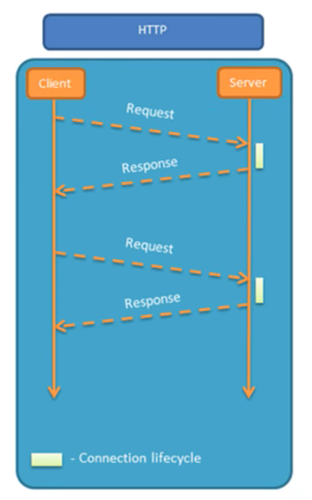

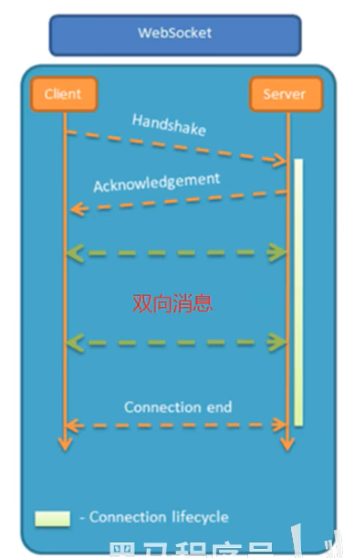

HTTP协议和WebSocket协议对比

- HTTP是<font color='red'>短连接</font>
- WebSocket是<font color='red'>长连接</font>
- HTTP通信的<font color='red'>单向</font>的, 基于请求响应模式
- WebSocket支持<font color='red'>双向</font>通信
- HTTP和WebSocket底层都是TCP连接

应用场景:

- 视频弹幕
- 网页聊天
- 体育实况更新
- 股票基金报价实时更新

## 入门案例

实现步骤:

- 准备前端页面

  ```html
  <!DOCTYPE HTML>
  <html>
  <head>
      <meta charset="UTF-8">
      <title>WebSocket Demo</title>
  </head>
  <body>
      <input id="text" type="text" />
      <button onclick="send()">发送消息</button>
      <button onclick="closeWebSocket()">关闭连接</button>
      <div id="message">
      </div>
  </body>
  <script type="text/javascript">
      var websocket = null;
      var clientId = Math.random().toString(36).substr(2);
  
      //判断当前浏览器是否支持WebSocket
      if('WebSocket' in window){
          //连接WebSocket节点
          websocket = new WebSocket("ws://localhost:8080/ws/"+clientId);
      }
      else{
          alert('Not support websocket')
      }
  
      //连接发生错误的回调方法
      websocket.onerror = function(){
          setMessageInnerHTML("error");
      };
  
      //连接成功建立的回调方法
      websocket.onopen = function(){
          setMessageInnerHTML("连接成功");
      }
  
      //接收到消息的回调方法
      websocket.onmessage = function(event){
          setMessageInnerHTML(event.data);
      }
  
      //连接关闭的回调方法
      websocket.onclose = function(){
          setMessageInnerHTML("close");
      }
  
      //监听窗口关闭事件，当窗口关闭时，主动去关闭websocket连接，防止连接还没断开就关闭窗口，server端会抛异常。
      window.onbeforeunload = function(){
          websocket.close();
      }
  
      //将消息显示在网页上
      function setMessageInnerHTML(innerHTML){
          document.getElementById('message').innerHTML += innerHTML + '<br/>';
      }
  
      //发送消息
      function send(){
          var message = document.getElementById('text').value;
          websocket.send(message);
      }
  	
  	//关闭连接
      function closeWebSocket() {
          websocket.close();
      }
  </script>
  </html>
  ```

- 导入WebSocket的maven坐标

  ```xml
  <dependency>
  	<groupId>org.springframework.boot</groupId>
  	<artifactId>spring-boot-starter-websocket</artifactId>
  </dependency>
  ```

- 导入WebSocket服务端组件WebSocketServer, 用于和客户端通信

  ```java
  package com.qqzj.server;
  
  import jakarta.websocket.OnClose;
  import jakarta.websocket.OnMessage;
  import jakarta.websocket.OnOpen;
  import jakarta.websocket.Session;
  import jakarta.websocket.server.PathParam;
  import jakarta.websocket.server.ServerEndpoint;
  import org.springframework.stereotype.Component;
  
  import java.util.Collection;
  import java.util.HashMap;
  import java.util.Map;
  
  /**
   * WebSocket服务
   */
  @Component
  @ServerEndpoint("/ws/{sid}")
  public class WebSocketServer {
  	//存放会话对象
  	private static Map<String, Session> sessionMap = new HashMap();
  	
  	/**
  	 * 连接建立成功调用的方法
  	 */
  	@OnOpen
  	public void onOpen(Session session, @PathParam("sid") String sid) {
  		System.out.println("客户端：" + sid + "建立连接");
  		sessionMap.put(sid, session);
  	}
  	
  	/**
  	 * 收到客户端消息后调用的方法
  	 *
  	 * @param message 客户端发送过来的消息
  	 */
  	@OnMessage
  	public void onMessage(String message, @PathParam("sid") String sid) {
  		System.out.println("收到来自客户端：" + sid + "的信息:" + message);
  	}
  	
  	/**
  	 * 连接关闭调用的方法
  	 *
  	 * @param sid
  	 */
  	@OnClose
  	public void onClose(@PathParam("sid") String sid) {
  		System.out.println("连接断开:" + sid);
  		sessionMap.remove(sid);
  	}
  	
  	/**
  	 * 群发
  	 *
  	 * @param message
  	 */
  	public void sendToAllClient(String message) {
  		Collection<Session> sessions = sessionMap.values();
  		for (Session session : sessions) {
  			try {
  				//服务器向客户端发送消息
  				session.getBasicRemote().sendText(message);
  			} catch (Exception e) {
  				e.printStackTrace();
  			}
  		}
  	}
  }
  
  ```

- 导入配置类WebSocketConfiguration, 注册WebSocket的服务端组件

  ```java
  package com.qqzj.config;
  
  import org.springframework.context.annotation.Bean;
  import org.springframework.context.annotation.Configuration;
  import org.springframework.web.socket.server.standard.ServerEndpointExporter;
  
  /**
   * WebSocket配置类，用于注册WebSocket的Bean
   */
  @Configuration
  public class WebSocketConfiguration {
  	@Bean
  	public ServerEndpointExporter serverEndpointExporter() {
  		return new ServerEndpointExporter();
  	}
  }
  
  ```

- 导入定时任务类WebSocketTask, 定时向客户端推送数据

  ```java
  package com.qqzj.task;
  
  import com.qqzj.server.WebSocketServer;
  import org.springframework.beans.factory.annotation.Autowired;
  import org.springframework.scheduling.annotation.Scheduled;
  import org.springframework.stereotype.Component;
  
  import java.time.LocalDateTime;
  import java.time.format.DateTimeFormatter;
  
  @Component
  public class WebSocketTask {
  	@Autowired
  	private WebSocketServer webSocketServer;
  	
  	@Scheduled(cron = "0/5 * * * * ?")
  	public void sendMessageToClient() {
  		webSocketServer.sendToAllClient("这是来自服务端的消息：" + DateTimeFormatter.ofPattern("HH:mm:ss").format(LocalDateTime.now()));
  	}
  }
  ```

# Apache ECharts

## 介绍

Apache ECharts是一款基于JavaScript的数据可视化图表库, 提供直观, 生动, 可交互, 可个性化定制的数据可视化图表

官网地址:https://echarts.apache.org/zh/index.html

# Apache POI

## 介绍

Apache POI是一个处理Miscrosoft Office各种文件格式的开源项目. 简单来说就是, 我们可以使用POI在java程序中对Miscrosoft Office各种文件进行读写操作.

一般情况下, POI都是用于操作Excel文件

Apache POI的应用场景:

- 银行网银系统导出交易明细
- 各种业务系统导出Excel报表
- 批量导入业务数据

## 入门案例

> Apache POI的Maven坐标

```xml
<dependency>
    <groupId>org.apache.poi</groupId>
    <artifactId>poi</artifactId>
    <version>3.16</version>
</dependency>
<dependency>
    <groupId>org.apache.poi</groupId>
    <artifactId>poi-ooxml</artifactId>
    <version>3.16</version>
</dependency>
```

> 写入

```java
	/**
	 * 通过POI创建Excel文件并写入内容
	 */
	public static void write() throws IOException {
		//在内存中创建一个Excel文件
		XSSFWorkbook excel = new XSSFWorkbook();
		//在Excel文件中创建一个sheet页
		XSSFSheet sheet1 = excel.createSheet("info");
		//在sheet页中创建行对象, rownum编号从0开始
		XSSFRow row = sheet1.createRow(0);
		//在行中创建单元格对象, columnindex编号从0开始
		//写入文件内容
		row.createCell(0).setCellValue("姓名");
		row.createCell(1).setCellValue("城市");
		//创建一个新行
		row = sheet1.createRow(1);
		row.createCell(0).setCellValue("张三");
		row.createCell(1).setCellValue("北京市");
		//创建一个新行
		row = sheet1.createRow(2);
		row.createCell(0).setCellValue("李四");
		row.createCell(1).setCellValue("上海市");
		//通过输出流将内存中的Excel文件写入到磁盘
		FileOutputStream fileOutputStream = new FileOutputStream("D:\\AAAStudy\\03-SkyTakeaway\\info.xlsx");
		excel.write(fileOutputStream);
		
		excel.close();
		fileOutputStream.close();
	}
```

> 写入

```java
	/**
	 * 通过POI读取Excel文件内容
	 */
	public static void read() throws IOException {
		BufferedInputStream bis = new BufferedInputStream(Files.newInputStream(Paths.get("D:\\AAAStudy\\03-SkyTakeaway\\info.xlsx")));
		
		long createWorkbookStart = System.currentTimeMillis();
		XSSFWorkbook excel = new XSSFWorkbook(bis);
		long createWorkbookEnd = System.currentTimeMillis();
		System.out.println("创建工作簿耗时: " + (createWorkbookEnd - createWorkbookStart) + "毫秒");
		
		XSSFSheet info = excel.getSheetAt(0);
		//获取sheet页中最后一行的行号
		int lastRowNum = info.getLastRowNum();
		for (int i = 0; i <= lastRowNum; i++) {
			XSSFRow row = info.getRow(i);
			int lastCellNum = row.getLastCellNum();
			for (int j = 0; j < lastCellNum; j++) {
				System.out.print(row.getCell(j).getStringCellValue() + "\t");
			}
			System.out.println();
		}
		excel.close();
		bis.close();
	}
```
