# 项目介绍

## 项目背景介绍

### 项目概述

类似于今日头条, 是一个新闻资讯类项目

### 业务说明

功能架构图

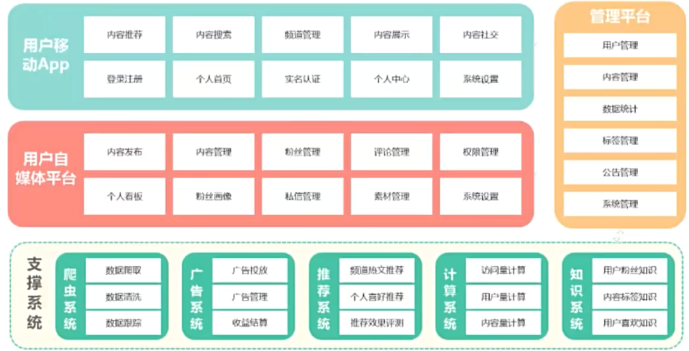

### 项目术语

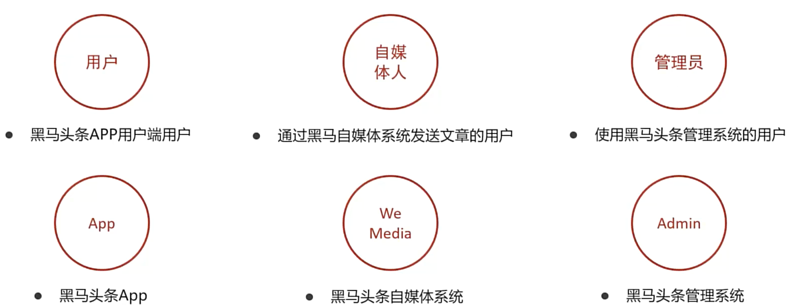

## 技术栈说明

### 基础层

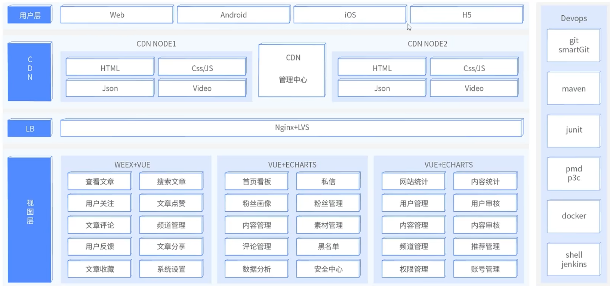

### 服务层

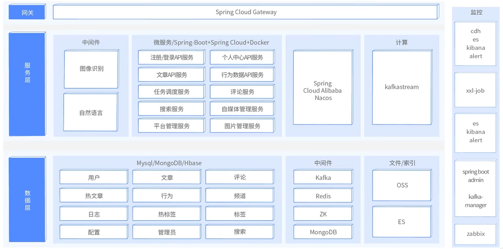

## docker安装

### nacos

1. docker拉取镜像

   ```shell
   docker pull nacos/nacos-server:1.2.0
   ```

2. 创建容器

   ```shell
   docker run --env MODE=standalone --name nacos --restart=always -d -p 8848:8848 nacos/nacos-server:1.2.0
   ```

   命令说明

   `–-env MODE-standalone`: 当前Nacos是单机版

   `restart=always`: 一直开机启动

   `-p 8848:8848`: 端口映射

   `-d`: 创建一个守护式容器在后台运行

访问地址: 192.168.31.128:8848/nacos

### nginx

```shell
docker run \
-p 80:80 \
-p 8801:8801 \
-p 8802:8802 \
-p 8803:8803 \
--name nginx \
-v /root/nginx/conf/nginx.conf:/etc/nginx/nginx.conf \
-v /root/nginx/conf/conf.d:/etc/nginx/conf.d \
-v /root/nginx/log:/var/log/nginx \
-v /root/nginx/html:/usr/share/nginx/html \
--network qqzj-news \
-d nginx
```


## 手动加密(md5 + 随机字符串)

md5是不可逆加密, md5相同的密码每次加密都一样, 不太安全. 在md5的基础上手动加盐(salt)处理

注册: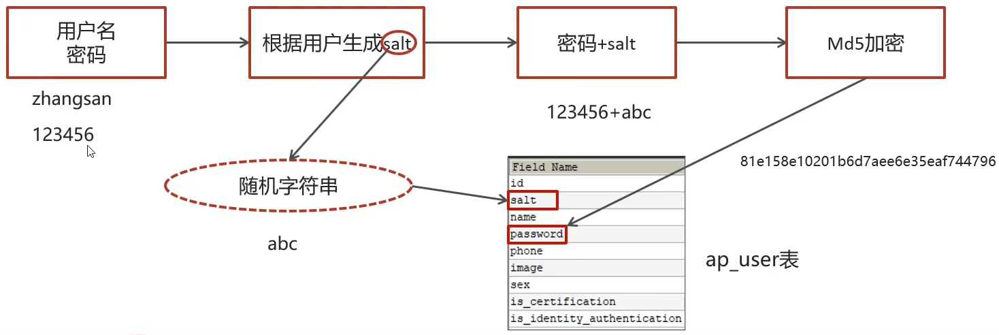

登录: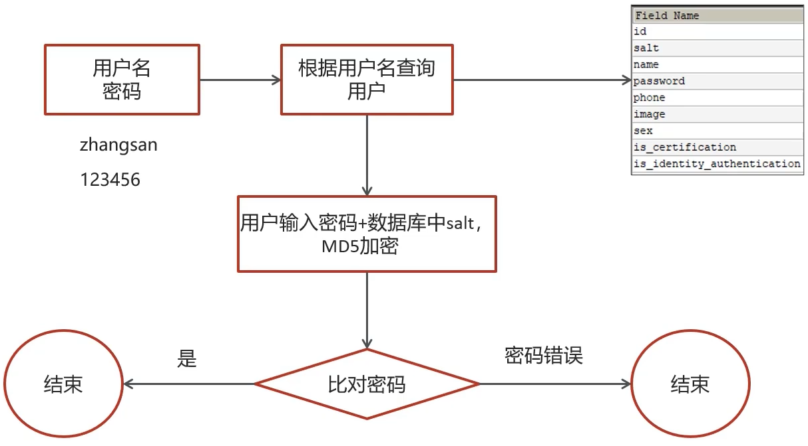


## App端文章列表

### 表的拆分-垂直分表

垂直分表: 讲一个表的字段分散到多个表中, 每个表存储其中一部分字段

优势:

1. 减少IO争抢, 减少锁表的几率, 查看文章概述与文章详情互不影响
2. 充分发挥高频数据的操作效率, 对文章概述数据操作的高效率不会被操作文章详情数据的低效率所拖累

拆分规则:

1. 把不常用的字段单独放在一张表
2. 把text, blob等大字段拆分出来单独放在一张表
3. 经常组合查询的字段单独放在一张表

# Freemarker

## Freemarker概述

### 模板引擎

FreeMarker是一款模板引擎: 即一种基于模板和要改变的数据, 并用来生成输出文本(HTML网页, 电子邮件, 配置文件, 源代码等)的通用工具. 它不是面向最终用户的, 而是一个Java类库, 是一款程序员可以嵌入他们所开发产品的组件

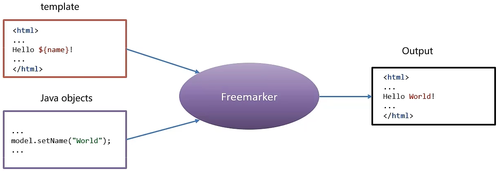

### 技术选型对比

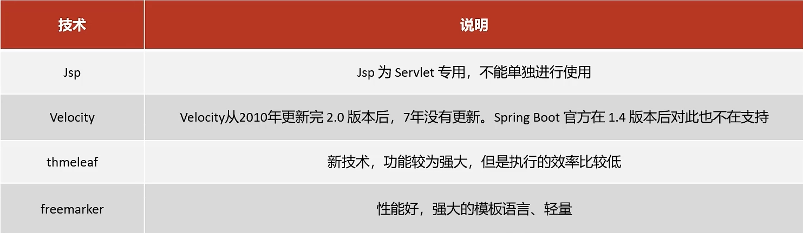

## 环境搭建&快速入门

### 测试工程搭建

创建一个freemarker-demo的测试工程专门用于freemarker的功能测试与模板的测试.

> POM文件

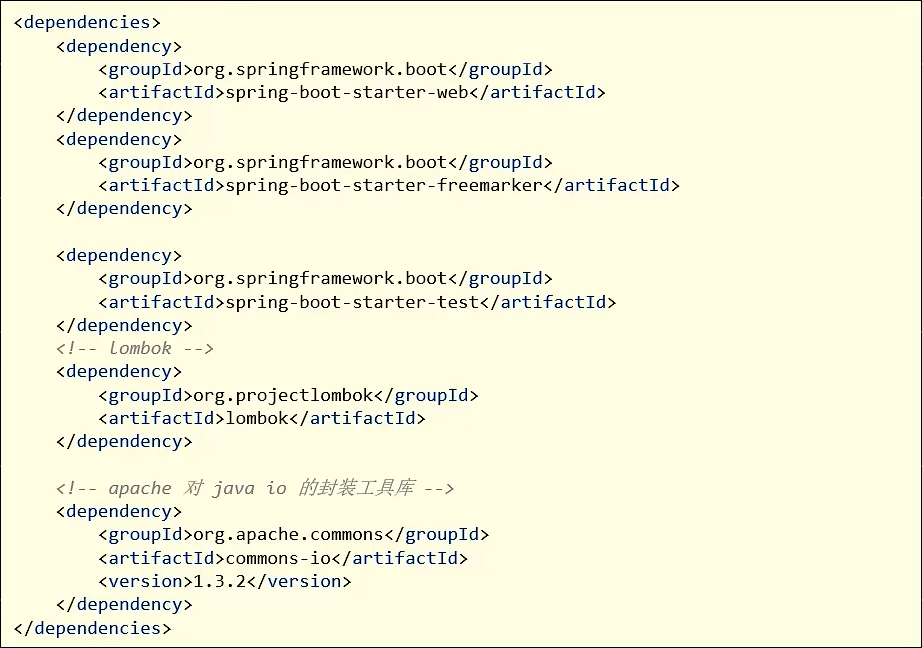

```xml
<dependencies>
    <dependency>
        <groupId>org.springframework.boot</groupId>
        <artifactId>spring-boot-starter-freemarker</artifactId>
    </dependency>
    <dependency>
        <groupId>org.springframework.boot</groupId>
        <artifactId>spring-boot-starter-web</artifactId>
    </dependency>

    <dependency>
        <groupId>org.projectlombok</groupId>
        <artifactId>lombok</artifactId>
        <optional>true</optional>
    </dependency>
    <dependency>
        <groupId>org.springframework.boot</groupId>
        <artifactId>spring-boot-starter-test</artifactId>
        <scope>test</scope>
    </dependency>
    <dependency>
        <groupId>org.apache.commons</groupId>
        <artifactId>commons-io</artifactId>
        <version>1.3.2</version>
    </dependency>
</dependencies>
```

> application.yml

```yaml
server:
	port: 8881 # 服务端口
spring:
	application:
		name: test-freemarker # 指定微服务
	freemarker:
		cache: false # 关闭模板缓存, 方便测试
		settings:
			template_update_delay: 0 # 检查模板更新延迟时间, 设置为0表示立即检查, 如果时间大于0会有缓存不方便进行模板测试
		suffix: .ftl # 指定FreeMarker模板文件的后缀名
```

**<font color='red'>注意事项</font>**: **FreeMarker模板文件通常都是以`ftl`作为后缀名, 也可以为`html`、`xml`、`jsp`等**

### 快速入门

在resources下创建templates, 此目录为<font color='red'>FreeMarker的默认模板存放目录</font>

在templates下创建模板文件01.basic.ftl, 模板中的<font color='red'>插值表达式</font>最终会被FreeMarker替换成具体的数据.

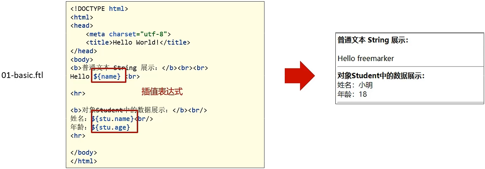

```html
<!DOCTYPE html>
<html lang="">
<head>
    <meta charset="utf-8">
    <title>Hello World!</title>
</head>
<body>
<b>普通文本 String 展示：</b><br><br>
Hello ${name} <br>
<hr>
<b>对象Student中的数据展示：</b><br/>
姓名：${stu.name}<br/>
年龄：${stu.age}
<hr>
</body>
</html>
```

FreeMarker作为SpringMVC一种视图格式, 默认情况下SpringMVC支持FreeMarker视图格式.

```java
@GetMapping("basic")
public String test(Model model) {
    // 1.纯文本形式的参数
    model.addAttribute("name", "freemarker");
    // 2.实体类相关的参数
    Student student = new Student();
    student.setName("小明");
    student.setAge(18);
    model.addAttribute("stu", student);
    
    return "01-basic";
}
```

## FreeMarker指令语法

### 基础语法种类

1. 注释, 即`<#-- -->`, 介于其之间的内容会被FreeMarker忽略

   ```ftl
   <#--我是一个FreeMarker注释-->
   ```

2. 插值(Interpolation): 即`${...}`部分, FreeMarker会用真实的值代替`${...}`

   ```ftl
   Htllo ${name}
   ```

3. FTL指令: 和HTML标记类似, 名字前加`#`予以区分, FreeMarker会解析标签中的表达式或逻辑

   ```ftl
   <# >FTL指令</#>
   ```

4. 文本, 仅文本信息, 这些不是FreeMarker的注释、插值、FTL指令的内容会被FreeMarker忽略解析, 直接输出内容.

   ```ftl
   <#--FreeMarker中的普通文本-->
   我是一个普通的文本
   ```

### 集合指令-`List`

指令格式: 

```ftl
<#list></#list>
```

> 代码示例

```java
@GetMapping("list")
public String testList(Model model){
    //------------------------------------
    Student stu1 = new Student();
    stu1.setName("小强");
    stu1.setAge(18);
    stu1.setMoney(1000.86f);
    stu1.setBirthday(new Date());

    //小红对象模型数据
    Student stu2 = new Student();
    stu2.setName("小红");
    stu2.setMoney(200.1f);
    stu2.setAge(19);

    //将两个对象模型数据存放到List集合中
    List<Student> stus = new ArrayList<>();
    stus.add(stu1);
    stus.add(stu2);

    //向model中存放List集合数据
    model.addAttribute("stus",stus);

    //------------------------------------

    //创建Map数据
    HashMap<String,Student> stuMap = new HashMap<>();
    stuMap.put("stu1",stu1);
    stuMap.put("stu2",stu2);
    // 3.1 向model中存放Map数据
    model.addAttribute("stuMap", stuMap);

    return "02-list";
}
```

> 02-list.ftl

```ftl
<!DOCTYPE html>
<html>
<head>
    <meta charset="utf-8">
    <title>Hello World!</title>
</head>
<body>

<#-- list 数据的展示 -->
<b>展示list中的stu数据:</b>
<br>
<br>
<table>
    <tr>
        <td>序号</td>
        <td>姓名</td>
        <td>年龄</td>
        <td>钱包</td>
    </tr>
    <#list stus as stu>
        <tr>
            <td>${stu_index + 1}</td>
            <td>${stu.name}</td>
            <td>${stu.age}</td>
            <td>${stu.money}</td>
        </tr>
    </#list>
</table>
<hr>

<#-- Map 数据的展示 -->
<b>map数据的展示：</b>
<br/><br/>
<a href="###">方式一：通过map['keyname'].property</a><br/>
输出stu1的学生信息：<br/>
姓名：<br/>
年龄：<br/>
<br/>
<a href="###">方式二：通过map.keyname.property</a><br/>
输出stu2的学生信息：<br/>
姓名：<br/>
年龄：<br/>

<br/>
<a href="###">遍历map中两个学生信息：</a><br/>
<table>
    <tr>
        <td>序号</td>
        <td>姓名</td>
        <td>年龄</td>
        <td>钱包</td>
    </tr>
</table>
<hr>

</body>
</html>
```

### 集合指令-`Map`

1. 获取Map中的值

   ```ftl
   map['keyName'].property
   ||
   map.keyName.property
   ```

2. 遍历Map

   ```ftl
   <#list userMap?keys as key>
   	key:${key}
   	value:${userMap["${key}"]}
   </#list>
   ```

> 示例

```ftl
<#-- Map 数据的展示 -->
<b>map数据的展示：</b>
<br/><br/>
<a href="###">方式一：通过map['keyname'].property</a><br/>
输出stu1的学生信息：<br/>
姓名：${stuMap['stu1'].name} <br/>
年龄：${stuMap['stu1'].age}<br/>
<br/>
<a href="###">方式二：通过map.keyname.property</a><br/>
输出stu2的学生信息：<br/>
姓名：${stuMap.stu2.name}<br/>
年龄：${stuMap.stu2.age}<br/>

<br/>
<a href="###">遍历map中两个学生信息：</a><br/>
<table>
    <tr>
        <td>序号</td>
        <td>姓名</td>
        <td>年龄</td>
        <td>钱包</td>
    </tr>
    <#list stuMap?keys as key>
        <tr>
            <td>${key_index + 1}</td>
            <td>${stuMap[key].name}</td>
            <td>${stuMap[key].age}</td>
            <td>${stuMap[key].money}</td>
        </tr>
    </#list>
</table>
<hr>
```

### `if`指令

指令:

```ftl
<#if expression>
<#else>
</#if>
```

案例: 在list集合中判断学生为小红的数据字体显示为红色

```ftl
<#list stus as stu>
    <#if stu.name == "小红">
        <tr style="color: red">
            <td>${stu_index + 1}</td>
            <td>${stu.name}</td>
            <td>${stu.age}</td>
            <td>${stu.money}</td>
        </tr>
    <#else>
        <tr>
            <td>${stu_index + 1}</td>
            <td>${stu.name}</td>
            <td>${stu.age}</td>
            <td>${stu.money}</td>
        </tr>
    </#if>
</#list>
```

**<font color='red'>注意事项</font>: 在FreeMarker中, 判断是否相等, `=`与`==`是一样的**

### 运算符-数学运算

FreeMarker表达式中完全支持算术运算, FreeMarker支持的算术运算符包括:

1. 加法: `+`
2. 减法: `-`
3. 乘法: `*`
4. 除法: `/`
5. 求模(取余): `%`

例子:

```java
100 + 5 运算: ${100 + 5}
```

### 运算符-比较运算符

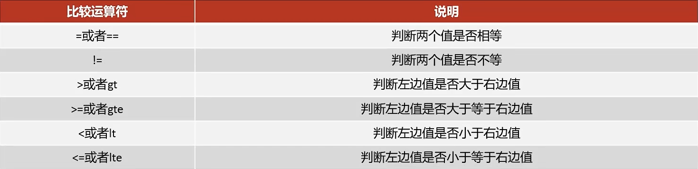

**<font color='red'>注意事项</font>**

- `=` 和 `!=` 可以用于字符串、数值和日期来比较是否相等
- `=` 和 `!=` 两边必须是相同类型的值, 否则会产生错误
- 字符串“x”、“x ”、“X”比较是不等的. 因为FreeMarker是精确比较
- `gt` 代替 `>` , FreeMarker会把 `>` 解释称`FTL`标签的结束字符, 可使用括号避免这种情况, 如: `<#if(x>y)>`

### 运算符-逻辑运算符

1. 逻辑与: `&&`
2. 逻辑或: `||`
3. 逻辑非: `!`

### 空值处理

1. 判断某变量是否存在使用“`??`”

   用法为: `variable??`, 如果该变量存在, 返回`true`, 否则返回`false`

   例子: 为防止`stus`为空报错可以加上判断如下:

   ```flt
   <#if stus??>
   	<#list stus as stu>
   		...
   	</#list>
   </#if>
   ```

2. 缺失变量默认值使用“`!`”

   - 使用 `!` 要以指定一个默认值, 当变量为空时显示默认值

     例: `${name!''}`表示如果`name`为空显示空字符串

   - 如果是嵌套对象则建议使用`()`括起来

     例: `${(stu.name)!''}$`表示, 如果`stu`或`name`为空默认显示空字符串

### 内建函数

内建函数语法格式: `变量`+`?`+`函数名称`

1. 集合的大小

   `${集合名?size}`

2. 日期格式化

   显示年月日: `${today?date}`

   显示时分秒: `${today?time}`

   显示日期+时间: `${today?datetime}`

   自定义格式化: `${today?string("yyyy年MM月")}`

   ```ftl
   today: ${today?date}<br/>
   today: ${today?time}<br/>
   today: ${today?datetime}<br/>
   today: ${today?string("yyyy年MM月")}<br/>
   ```

3. 内建函数c

   `model.addAttribute("point", 102920122)`

   `point`是数字型, 使用`${point}`会显示这个数字的值, 每三位使用逗号分隔.

   如果不想显示为每三位分割的数字, 可以使用c函数将数字型转成字符串输出

   `${point?c}`

4. 将json字符串转成对象

   `对象名?eval`

   一个例子:

   其中用到了`assign`标签, `assign`的作用是定义一个变量

   ```ftl
   <#assign text="{'bank':'工商银行','account':'16546516164'}" />
   <#assign data=text?eval />
   开户行: ${data.bank} 账号: ${data.account}
   ```

## 输出静态化文件

使用FreeMarker原生API将页面生成html文件

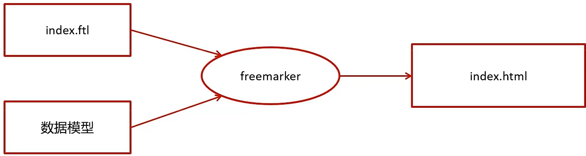

> 代码示例

```java
@SpringBootTest()
public class FreeMarkerTest {
    @Autowired
    private Configuration configuration;


    @Test
    public void test() throws Exception {
        Template template = configuration.getTemplate("02-list.ftl");
        /*
        * 合成方法
        *
        * 两个参数
        * 第一个参数: 模板数据
        * 第二个参数: 输出流
        * */
        template.process(getData(), new FileWriter("D:/AAAStudy/05-toutiao/test/list.html"));
    }

    public Map getData(){
        Map<String, Object> map = new HashMap<>();
        //------------------------------------
        Student stu1 = new Student();
        stu1.setName("小强");
        stu1.setAge(18);
        stu1.setMoney(1000.86f);
        stu1.setBirthday(new Date());

        //小红对象模型数据
        Student stu2 = new Student();
        stu2.setName("小红");
        stu2.setMoney(200.1f);
        stu2.setAge(19);

        //将两个对象模型数据存放到List集合中
        List<Student> stus = new ArrayList<>();
        stus.add(stu1);
        stus.add(stu2);

        //向model中存放List集合数据
        map.put("stus",stus);

        //------------------------------------

        //创建Map数据
        HashMap<String,Student> stuMap = new HashMap<>();
        stuMap.put("stu1",stu1);
        stuMap.put("stu2",stu2);
        // 3.1 向model中存放Map数据
        map.put("stuMap", stuMap);

        map.put("today", new Date());

        map.put("point", 1654654641);
        return map;
    }
}
```

# MinIO

## MinIOn简介

### 对象存储的方式对比

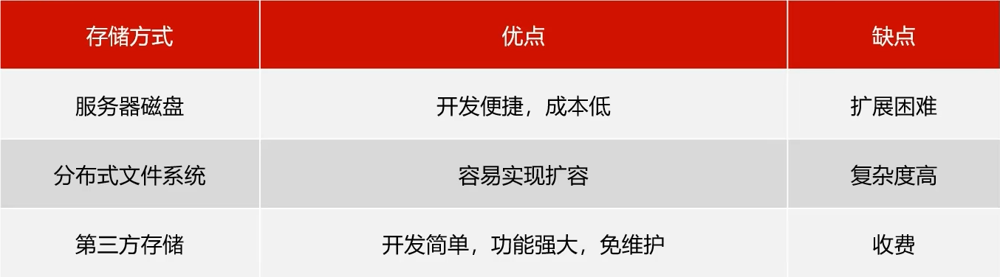

### 分布式文件系统

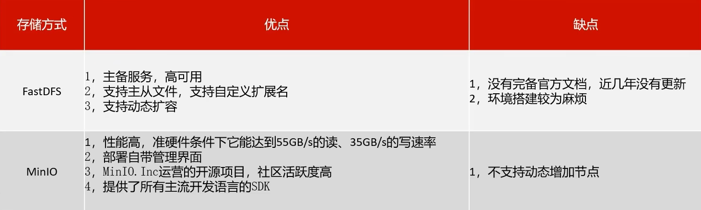

### MinIO概述

MinIO基于Apache License v2.0开源协议的对象存储服务, 可以作为云存储的解决方案用来保存海量的图片, 视频, 文档

- Golang语言实现, 配置简单, 单行命令可以运行起来
- MinIO兼容亚马逊S3云存储服务接口, 适合于存储大容量非结构化的数据, 一个对象文件可以是任意大小, 从kb到最大5tb不等
- 官方文档: https://docs.minio.org.cn/docs/

## 使用

### Docker安装MinIO

1. 拉取镜像

   ```shell
   docker pull minio/minio
   ```

2. 创建容器

   ```shell
   docker run -p 9000:9000 -p 9001:9001 --name minio -d --restart=always -e "MINIO_ROOT_USER=minio" -e "MINIO_ROOT_PASSWORD=minio123" -v /home/data:/data -v /home/config:/root/.minio minio/minio server /data --console-address ":9001"
   ```

3. 访问minio系统

   http://192.168.31.128:9000

### 基本概念

- `bucket` - 类比于文件系统的目录
- `Object` - 类比文件系统的文件
- `Keys` - 类比文件名

## 快速入门

### 上传文件进行静态访问

目标: 把list.html文件上传到minio中, 并且可以在浏览器中访问

```java
public class MinIOTest {
    /**
     * 把list.html文件上传到minio中, 并且可以在浏览器中访问
     * @param args
     */
    public static void main(String[] args) {
        try {
            FileInputStream fis = new FileInputStream("D:/AAAStudy/05-toutiao/test/list.html");
            // 1.获取minio的链接信息, 创建一个minioClient对象
            MinioClient minioClient = MinioClient.builder().credentials("minio", "minio123")
                    .endpoint("http://192.168.31.128:9000")
                    .build();
            // 2.上传
            PutObjectArgs putObjectArgs = PutObjectArgs.builder()
                    .object("list.html")// 文件名称
                    .contentType("text/html")// 文件类型
                    .bucket("leadnews")// 桶名称 与minio管理界面创建的桶名称一致
                    .stream(fis,fis.available(),-1)
                    .build();
            minioClient.putObject(putObjectArgs);

            // 访问路径
            System.out.println("http://192.168.31.128:9000/leadnews/list.html");
        } catch (Exception e) {
            throw new RuntimeException(e);
        }
    }
}
```

**<font color='red'>如果访问不了, 需要将桶的权限改为`public`</font>**

### 封装MinIO为starter

[(./黑马头条项目/qqzj-leadnews-basic)]

# 分布式ID

## 分布式ID

随着业务的增长, 文章表可能要占用很大的物理存储空间, 为了解决该问题, 后期使用数据库分片技术. 将一个数据库进行拆分, 通过数据库中间件连接. 如果数据库中该表选用ID自增策略, 则可能产生重复的ID, 此时应该使用分布式ID生成策略来生成ID

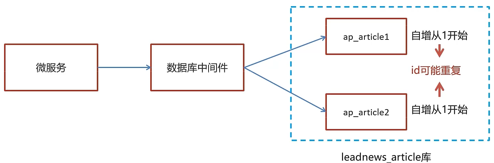

## 分布式ID-技术选型

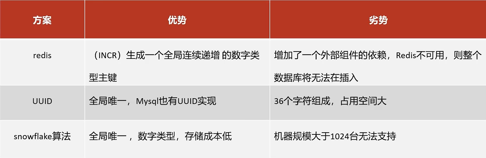

## 分布式ID-雪花算法

snowflake是Twitter开源的分布式ID生成算法, 结果是一个long型的ID. 其核心思想是: 使用41bit作为毫秒数, 10bit作为机器的ID(5bit是数据中心, 5bit的机器ID), 12bit作为毫秒内的流水号(意味着每个节点在每毫秒可以产生4096个ID), 最后还有一个符号位, 永远是0

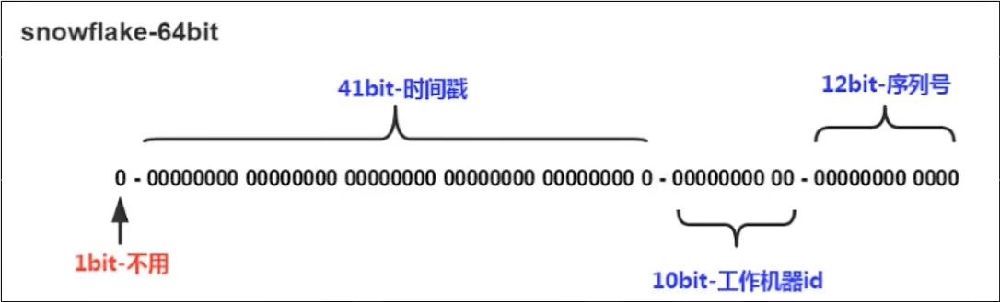

文章端相关的表都使用雪花算法生成ID, 包括ap_article、ap_article_config、ap_article_content

# 自管理敏感词过滤

## 敏感词-过滤

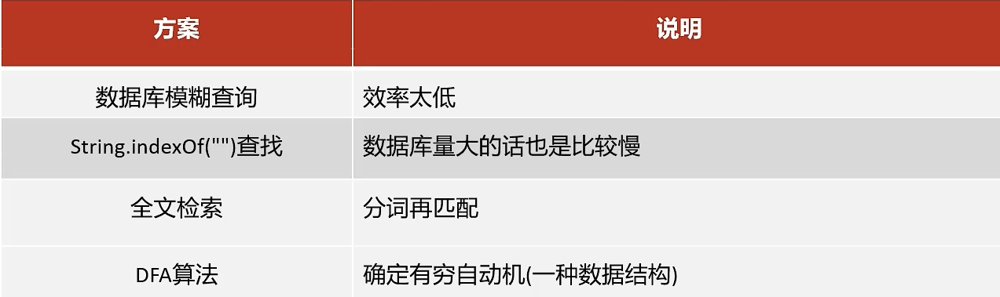

## DFA实现原理

DFA全称为: Deterministic Finite Automaton, 即确定有穷自动机.

存储: 一次性的把所有的敏感词存储到了多个map中, 就是下图表示这种结构

敏感词: 冰毒、大麻、大坏蛋

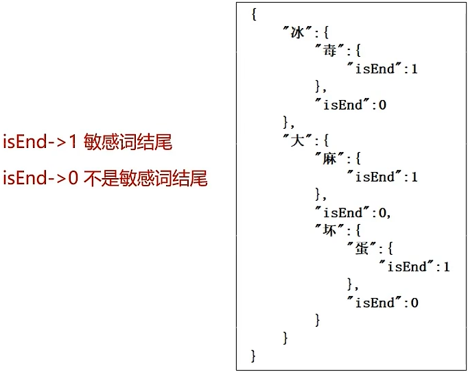

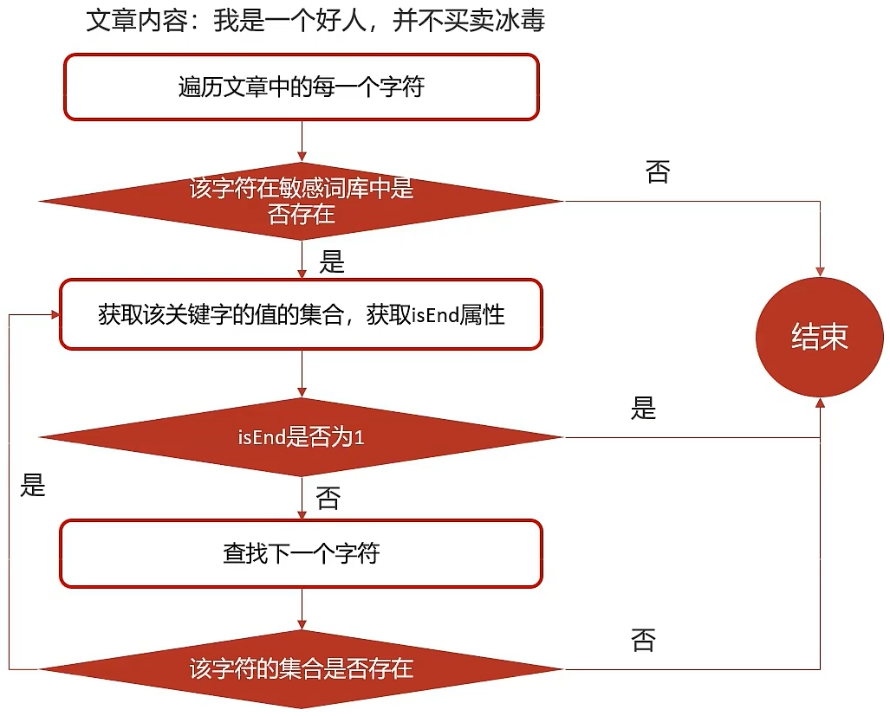

# 图片文字-敏感词过滤

## 图片文字识别

什么是OCR?

OCR(Optical Character Recognition, 光学字符识别) 是指电子设备(例如扫描仪或数码相机) 检查纸上打印的字符, 通过检测暗、亮的模式确定其形状, 然后用字符识别方法将形状翻译成计算机文字的过程.

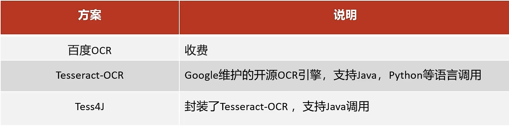

## Tesseract-OCR

Tesseract-OCR特点:

- Tesseract支持UTF-8编码格式, 并且可以“开箱即用”地识别100多种语言.
- Tesseract支持多种输出格式, 纯文本, hOCR(HTML), PDF等
- 官方建议, 为了获得更好的OCR结果, 最好提供给高质量的图像
- Tesseract进行识别其他语言的训练
  - 具体的训练方式, 请参考官方提供的文档: https://tesseract-ocr.girhub.io/tessdoc/

```java
@Slf4j
public class Application {
    
    /**
     * 识别图片中的文字
     * @param args
     */
    public static void main(String[] args) {
       // 1.创建实例
       ITesseract tesseracts = new Tesseract();
       // 2.设置字体库路径
       tesseracts.setDatapath("D:\\AAAStudy\\05-toutiao\\tess4j\\tessdata_fast-master");
       // 3.设置语言 --> 简体中文
       tesseracts.setLanguage("chi_sim");
       
       // 4.识别图片
       File file = new File("D:\\AAAStudy\\05-toutiao\\tess4j\\image","Snipaste_2024-08-11_15-13-36.png");
       if (!file.exists()){
          log.error("文件不存在");
          return;
       }
       try {
          String ocr = tesseracts.doOCR(file).replaceAll("\\r|\\n", "-");
          System.out.println(ocr);
       } catch (TesseractException e) {
          throw new RuntimeException(e);
       }
    }
}
```

> 导入依赖

```xml
<dependency>
    <groupId>net.sourceforge.tess4j</groupId>
    <artifactId>tess4j</artifactId>
    <version>4.5.0</version>
</dependency>
```

# 延迟任务

## 什么是延迟任务

- 定时任务: 有固定周期的, 有明确的触发时间
- 延迟任务: 没有固定的开始时间, 它常常是由一个时间触发的, 而在这个事件触发之后的一段时间内触发另一个事件, 任务可以立即执行, 也可以延迟


场景一: 订单下单之后30分钟后, 如果用户没有付钱, 则系统自动取消订单; 如果期间下单成功, 任务取消

场景二: 接口对接出现网络问题, 1分钟后重试, 如果失败, 2分钟重试, 直到出现阈值终止

## 技术对比

- ### DelayQueue

  JDK自带DelayQueue是一个支持延时获取元素的阻塞队列, 内部采用优先队列PriorityQueue存储元素, 同时元素必须实现Delayed接口; 在创建元素时可以指定多久才可以从队列中获取当前元素, 只有在延迟期满时才能从队列中提取元素

  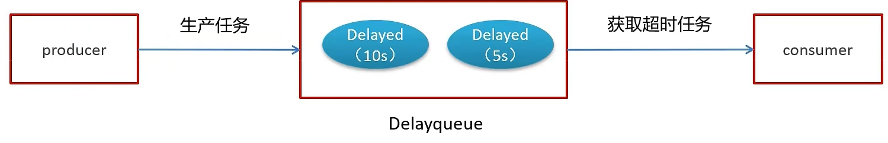

  使用DelayQueue作为延迟任务, 如果程序挂掉之后, 任务都是放在内存, 消息会丢失, 如何保证数据不丢失

- ### RabbitMQ实现延迟任务

  - TTL: Time To Live(消息存活时间)
  - 死信队列: Dead Letter Exchange(死信交换机), 当消息成为Dead message后, 可以重新发送另一个交换机(死信交换机)

  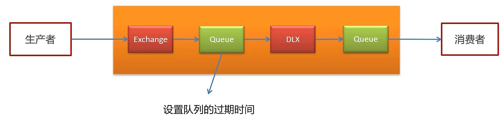

- ### Redis实现

  zset数据类型的去重有序(分数排序)特点进行延迟, 例如: 时间戳(毫秒值)作为score进行排序

  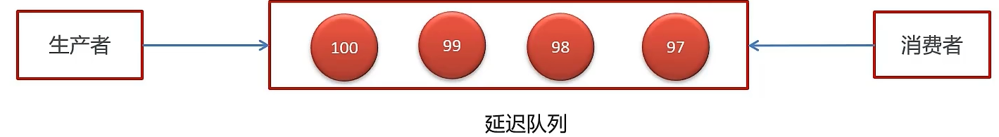

  例如:

  生产者添加4个任务到延迟队列中, 时间毫秒值分别是97、98、99、100. 当前时间的毫秒值为90

  消费者端进行监听, 如果当前时间的毫秒值匹配到延迟队列中的毫秒值就立即消费

## Redis实现延迟任务

### 实现思路

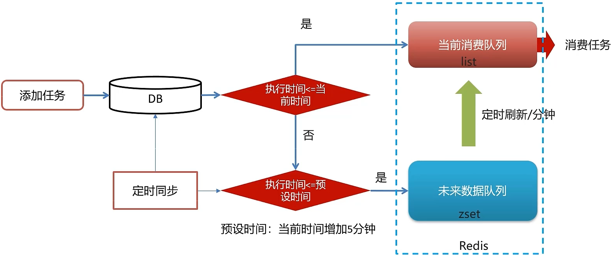

### 思考

1. 为什么任务需要存储在数据库中?

   延迟任务是一个通用的服务, 任何有延迟需求的任务都可以调用该服务, 内存数据库的存储是有限的, 需要考虑数据持久化的问题, 存储数据库中是一种数据安全的考虑

2. 为什么使用Redis中的两种数据类型, list和zset?

   原因一: list存储立即执行的任务, zset存储未来的数据

   原因二: 任务量过大以后, zset的性能会下降

   时间复杂度: 执行时间(次数)随着数据规模增长的变化趋势

   - 操作Redis中的list命令`LPUSH`: 时间复杂度: O(1)
   - 操作Redis中的zset命令`zadd`: 时间复杂度: O(M*log(n))

   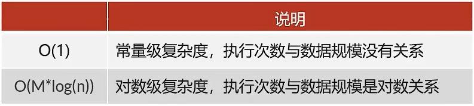

3. 在添加zset数据的时候, 为什么需要预加载?

   如果任务数据特别大, 为了防止阻塞, 只需要把未来几分钟要执行的数据存入缓存即可, 是一种优化的形式

## 延迟队列服务

### 数据库准备

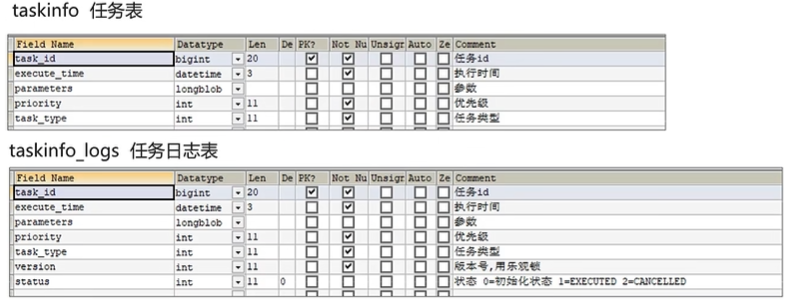

<font color='red'>注意事项:</font>MySQL中, BLOB是一个二进制大型对象, 是一个可以存储大量数据的容器; LongBlob最大存储4G

### 数据库准备-数据库自身解决并发两种策略

- #### 悲观锁(Pessimistic Lock)

  每次去拿数据的时候都认为别人会修改, 所以每次在拿数据的时候都会上锁

- #### 乐观锁(Optimistic Lock)

  每次去拿数据的时候都认为别人不会修改, 所以不会上锁, 但是在更新到时候会判断一下在此期间别人有没有去更新这个数据, 可以使用版本号等机制

### 数据库准备-Mybatis-plus集成乐观锁的使用

1. 在实体类中使用`@Version`标明是一个版本的字段

   ```java
   /**
    * 版本号, 用乐观锁
    */
   @Version
   private Integer version;
   ```

2. Mybatis-plus对乐观锁的支持, 在启动类中向容器中放入乐观锁的拦截器

   ```java
   /**
        * mybatis-plus乐观锁支持
        * @return
        */
   @Bean
   public MybatisPlusInterceptor optimisticLockerInterceptor(){
       MybatisPlusInterceptor interceptor = new MybatisPlusInterceptor();
       interceptor.addInnerInterceptor(new OptimisticLockerInnerInterceptor());
       return interceptor;
   }
   ```


### 未来数据定时刷新-Redis管道

Pipeline请求模型

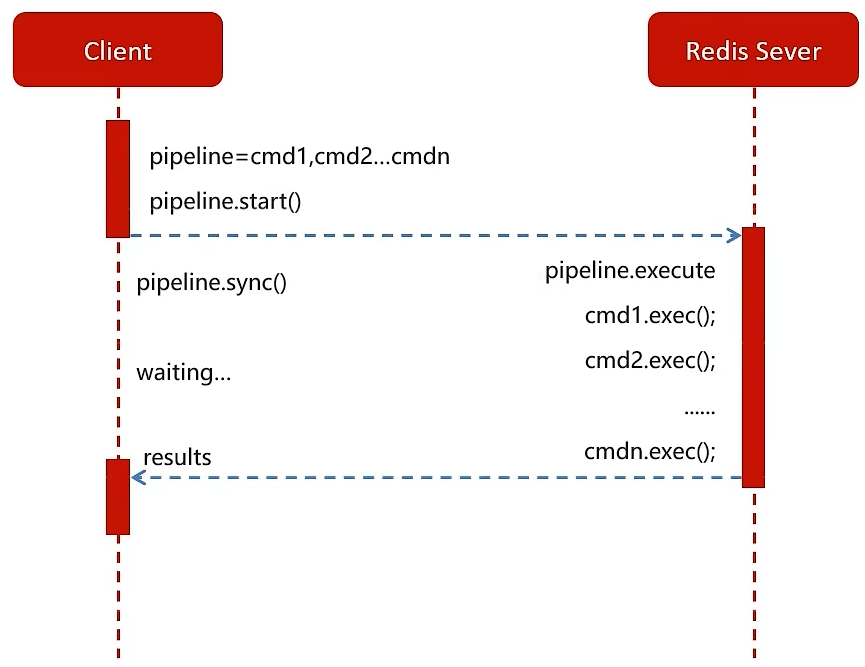

### 分布式锁解决集群下的方法抢占执行

问题描述

在schedule服务中, 有这样一个方法:

```java
/**
	 * 未来数据定时刷新
	 */
@Scheduled(cron = "0 0/1 * * * ? ")
public void refresh() {
    log.info("未来数据定时刷新----定时任务");
    // 获取所有未来数据的key集合
    String pattern = ScheduleConstants.FUTURE + "*";
    Set<String> futureKeys = cacheService.scan(pattern);

    // 按照key和分值查询查询符合条件的数据
    long now = System.currentTimeMillis();
    for (String futureKey : futureKeys) {
        String topicKey = futureKey.replace(ScheduleConstants.FUTURE, ScheduleConstants.TOPIC);

        Set<String> tasks = cacheService.zRangeByScore(futureKey, 0, now);

        // 同步数据
        if (CollectionUtil.isNotEmpty(tasks)) {
            cacheService.refreshWithPipeline(futureKey, topicKey, tasks);
            log.info("成功的将{}刷新到了{}", futureKey, topicKey);
        }
    }
}
```

如果此时启动两台schedule服务, 那么每台服务都回去执行这个定时任务方法

### 分布式锁

分布式锁: 控制分布式系统有序地去对共享资源进行操作, 通过互斥来保证数据的一致性

分布式锁的解决方案:

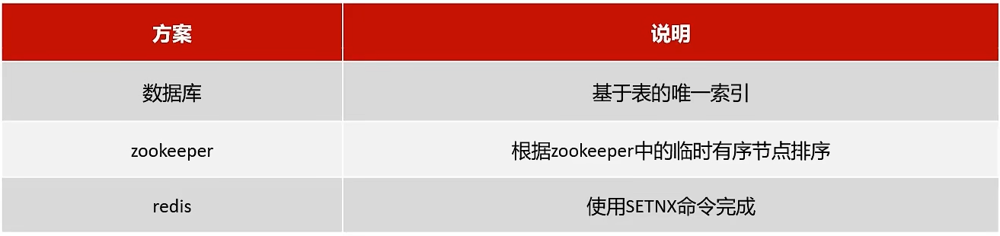

### Redis分布式锁

setnx(SET if Not eXists) 命令在指定的key不存在时, 为key设置指定的值

加锁的思路

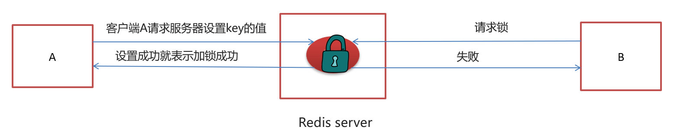

这种加锁的思路是，如果 key 不存在则为 key 设置 value，如果 key 已存在则 SETNX 命令不做任何操作

- 客户端A请求服务器设置key的值，如果设置成功就表示加锁成功
- 客户端B也去请求服务器设置key的值，如果返回失败，那么就代表加锁失败
- 客户端A执行代码完成，删除锁
- 客户端B在等待一段时间后再去请求设置key的值，设置成功
- 客户端B执行代码完成，删除锁

### 总结

1. 在分布式系统环境下, 一个方法在同一时间只能被一个机器的一个线程执行

2. 主要是通过redis的setnx特性完成分布式锁的功能

   A获取到锁以后其他客户端不能操作, 只能等待A释放锁以后, 其他客户端才能操作

# Kafka

## 消息中间件

### 对比

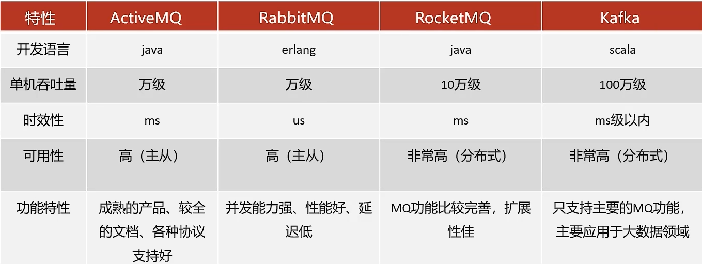

### 选择建议

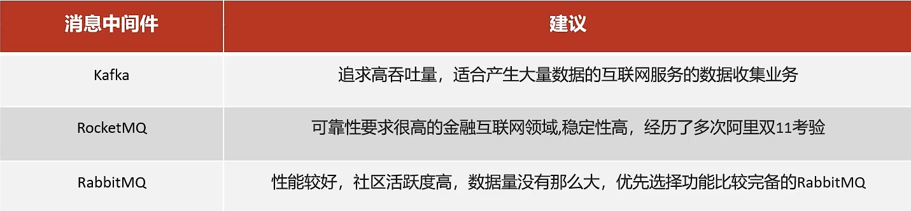

## Kafka

### 介绍

Kafka是一个分布式流媒体平台

类似于消息队列或企业消息传递系统

Kafka官网: http://kafka.apache.org/

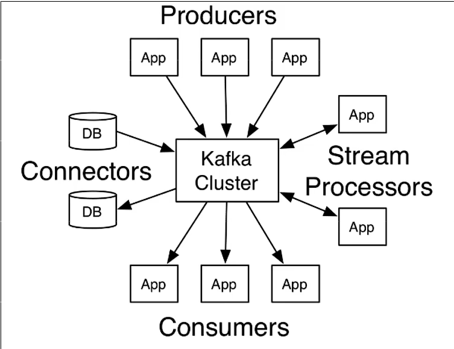

### 名词解释

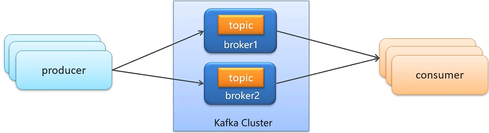

- `producer`: 发布消息的对象称之为主题生产者(`Kafka topic producer`)
- `topic`: Kafka将消息分门别类, 每一类的消息称之为一个主题(`Topic`)
- `consumer`: 订阅消息并处理发布的消息的对象称之为主题消费者(`consumer`)
- `broker`: 已发布的消息保存在一组服务器中, 称之为Kafka集群. 集群中的每一个服务器都是一个代理(`Broker`). 消费者可以订阅一个或多个主题(`Topic`), 并从`Broker`拉数据, 从而消费这些已发布的消息.

### Kafka安装和配置

Kafka对于zookeeper是强依赖, 保存kafka相关的节点数据, 所以安装Kafka之前必须先安装zookeeper

- Docker安装zookeeper

  下载镜像

  ```shell
  docker pull zookeeper:3.4.14
  ```

  创建容器

  ```shell
  docker run -d --name zookeeper -p 2181:2181 zookeeper:3.4.14
  ```

- Docker安装kafka

  下载镜像

  ```shell
  docker pull wurstmeister/kafka:2.12-2.3.1
  ```

  创建容器

  ```shell
  docker run -d --name kafka \
  --env KAFKA_ADVERTISED_HOST_NAME=192.168.31.128 \
  --env KAFKA_ZOOKEEPER_CONNECT=192.168.31.128:2181 \
  --env KAFKA_ADVERTISED_LISTENERS=PLAINTEXT://192.168.31.128:9092 \
  --env KAFKA_LISTENERS=PLAINTEXT://0.0.0.0:9092 \
  --env KAFKA_HEAP_OPTS="-Xmx256M -Xms256M" \
  --net=host wurstmeister/kafka:2.12-2.3.1
  ```

  <font color='red'>注意事项</font>: `--net=host`, 直接使用容器宿主机的网络命名空间, 即没有独立的网络环境, 它使用宿主机的ip和端口

  也可以不使用这个命令, 换为:

  ```shell
  docker run -d --name kafka \
  --env KAFKA_ADVERTISED_HOST_NAME=192.168.31.128 \
  --env KAFKA_ZOOKEEPER_CONNECT=192.168.31.128:2181 \
  --env KAFKA_ADVERTISED_LISTENERS=PLAINTEXT://192.168.31.128:9092 \
  --env KAFKA_LISTENERS=PLAINTEXT://0.0.0.0:9092 \
  --env KAFKA_HEAP_OPTS="-Xmx256M -Xms256M" \
  --network qqzj-news \
  -p 9092:9092 \
  wurstmeister/kafka:2.12-2.3.1
  ```

## Kafka入门

### Kafka入门案例

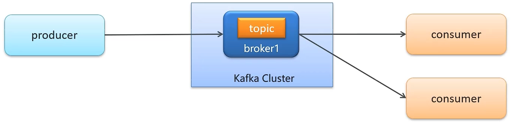

- 生产者发送消息, 多个消费者只能有一个消费者接收到消息
- 生产者发送消息, 多个消费者都可以接收到消息

### 步骤: 生产者发送消息

1. 导入Kafka客户端依赖

   ```xml
   <dependency>
       <groupId>org.apache.kafka</groupId>
       <artifactId>kafka-Clients</artifactId>
   </dependency>
   ```

2. 编写消息<font color='red'>生产者</font>类`ProducerQuickstart`

   1. 设置Kafka的配置信息

      ```java
      // kafka的配置信息
      Properties properties = new Properties();
      // kafka的连接地址
      properties.put(ProducerConfig.BOOTSTRAP_SERVERS_CONFIG,"192.168.31.128:9092");
      // 发送失败，失败的重试次数
      properties.put(ProducerConfig.RETRIES_CONFIG,5);
      // 消息key的序列化器
      properties.put(ProducerConfig.KEY_SERIALIZER_CLASS_CONFIG,"org.apache.kafka.common.serialization.StringSerializer");
      // 消息value的序列化器
      properties.put(ProducerConfig.VALUE_SERIALIZER_CLASS_CONFIG,"org.apache.kafka.common.serialization.StringSerializer");
      ```

   2. 创建生产者对象

      ```java
      KafkaProducer<String,String> producer = new KafkaProducer<String, String>(properties);
      ```

   3. 发送消息

      ```java
      // 封装发送的消息
      ProducerRecord<String,String> record = new ProducerRecord<String, String>("qqzj-topic","100001","hello kafka");
      //发送消息
      producer.send(record);
      ```

   4. 关闭消息通道

      ```java
      // 关闭消息通道，必须关闭，否则消息发送不成功
      producer.close();
      ```

> 整体代码

```java
package com.qqzj.kafka.sample;

import org.apache.kafka.clients.producer.KafkaProducer;
import org.apache.kafka.clients.producer.ProducerConfig;
import org.apache.kafka.clients.producer.ProducerRecord;

import java.util.Properties;

public class ProducerQuickstart {
    public static void main(String[] args) {
        // 1.kafka的连接配置信息
        Properties properties = new Properties();
        // kafka的连接地址
        properties.put(ProducerConfig.BOOTSTRAP_SERVERS_CONFIG, "192.168.31.128:9092");
        // 发送失败，失败的重试次数
        properties.put(ProducerConfig.RETRIES_CONFIG, 5);
        // 消息key的序列化器
        properties.put(ProducerConfig.KEY_SERIALIZER_CLASS_CONFIG, "org.apache.kafka.common.serialization.StringSerializer");
        // 消息value的序列化器
        properties.put(ProducerConfig.VALUE_SERIALIZER_CLASS_CONFIG, "org.apache.kafka.common.serialization.StringSerializer");

        // 2.Kafka生产者对象
        KafkaProducer<String, String> producer = new KafkaProducer<>(properties);

        // 封装发送的消息
        /**
		 * 参数1：topic 主题
		 * 参数2：key 消息的键
		 * 参数3：value 消息的值
		 */
        ProducerRecord<String, String> record = new ProducerRecord<>("qqzj-topic-first", "key-101", "hello kafka");
        // 发送消息
        producer.send(record);

        // 关闭消息通道，必须关闭，否则消息发送不成功
        producer.close();
    }
}
```

### 步骤: 消费者接收消息

创建`ConsumerQuickStart`消费者类

1. 设置Kafka的配置信息

   ```java
   // 添加kafka的配置信息
   Properties properties = new Properties();
   // kafka的连接地址
   properties.put(ConsumerConfig.BOOTSTRAP_SERVERS_CONFIG, "192.168.31.128:9092");
   //消费者组
   properties.put(ConsumerConfig.GROUP_ID_CONFIG, "group2");
   // 消息的反序列化器
   properties.put(ConsumerConfig.KEY_DESERIALIZER_CLASS_CONFIG, "org.apache.kafka.common.serialization.StringDeserializer");
   properties.put(ConsumerConfig.VALUE_DESERIALIZER_CLASS_CONFIG, "org.apache.kafka.common.serialization.StringDeserializer");
   ```

2. 创建消费者对象

   ```java
   KafkaConsumer<String, String> consumer = new KafkaConsumer<String, String>(properties);
   ```

3. 订阅主题

   ```java
   consumer.subscribe(Collections.singletonList("itheima-topic"));
   ```

4. 获取消息

   ```java
   //当前线程一直处于监听状态
   while (true) {
       //4.获取消息
       ConsumerRecords<String, String> consumerRecords = consumer.poll(Duration.ofMillis(1000));
       for (ConsumerRecord<String, String> consumerRecord : consumerRecords) {
           System.out.println(consumerRecord.key());
           System.out.println(consumerRecord.value());
       }
   }
   ```

> 整体代码

```java
package com.qqzj.kafka.sample;

import org.apache.kafka.clients.consumer.ConsumerConfig;
import org.apache.kafka.clients.consumer.ConsumerRecord;
import org.apache.kafka.clients.consumer.ConsumerRecords;
import org.apache.kafka.clients.consumer.KafkaConsumer;

import java.time.Duration;
import java.util.Collections;
import java.util.Properties;

public class ConsumerQuickstart {
    public static void main(String[] args) {
        // 1.kafka的配置信息
        Properties prop = new Properties();
        // 连接地址
        prop.put(ConsumerConfig.BOOTSTRAP_SERVERS_CONFIG, "192.168.31.128:9092");
        // 指定消费者组
        prop.put(ConsumerConfig.GROUP_ID_CONFIG, "group1");
        // 指定key和value的反序列化器
        prop.put(ConsumerConfig.KEY_DESERIALIZER_CLASS_CONFIG, "org.apache.kafka.common.serialization.StringDeserializer");
        prop.put(ConsumerConfig.VALUE_DESERIALIZER_CLASS_CONFIG, "org.apache.kafka.common.serialization.StringDeserializer");
        // 2.创建消费者对象
        KafkaConsumer<String, String> consumer = new KafkaConsumer<>(prop);
        // 3.订阅主题
        consumer.subscribe(Collections.singletonList("qqzj-topic-first"));
        // 4.获取消息
        while (true){
            ConsumerRecords<String, String> poll = consumer.poll(Duration.ofMillis(1000));
            for (ConsumerRecord<String, String> record : poll) {
                System.out.println(record.key());
                System.out.println(record.value());
            }
        }
    }
}
```

### 总结

- 生产者发送消息, 多个消费者订阅同一个主题, 只能有一个消费者收到消息(一对一)

  <font color='red'>只需要将多个消费者放入同一个消费者组中即可</font>

- 生产者发送消息, 多个消费者订阅同一个主题, 所有消费者都能收到消息(一对多)

  <font color='red'>将多个消费者放入不同的消费者组中</font>

## 分区

### 分区机制

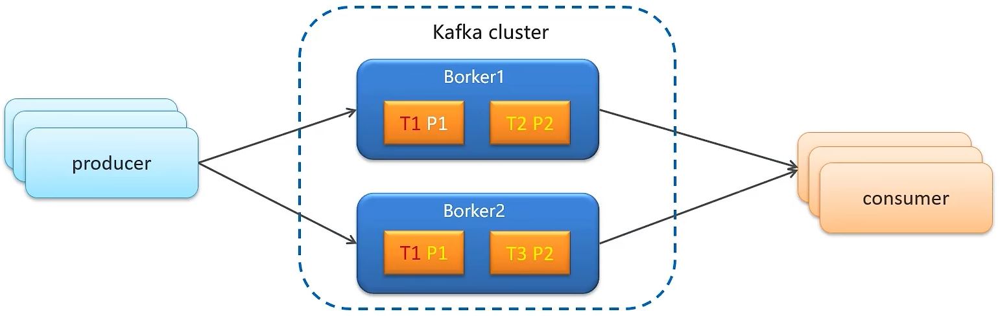

Kafka中的分区机制指的是将每个主题划分成多个分区(`Partition`)

可以处理更多的消息, 不受单台服务器的限制, 可以不受限的处理更多的数据

### topic剖析

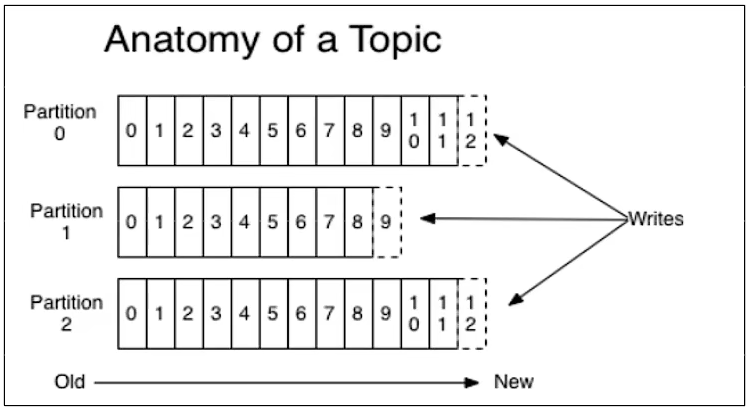

每一个分区都是一个顺序的、不可变的消息队列, 并且可以持续的添加. 分区中的消息都被分了一个序列号, 称之为<font color='red'>偏移量(offset)</font>, 在每个分区中此偏移量都是唯一的.

### 分区策略

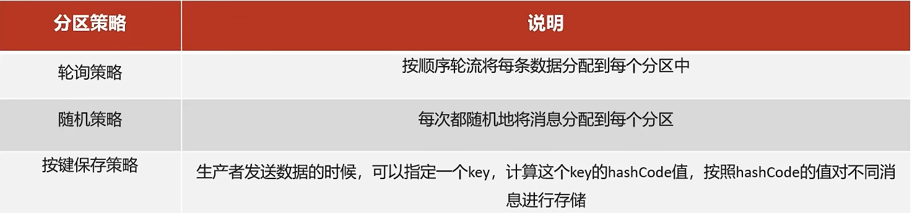

## Kafka高可用设计

### 集群

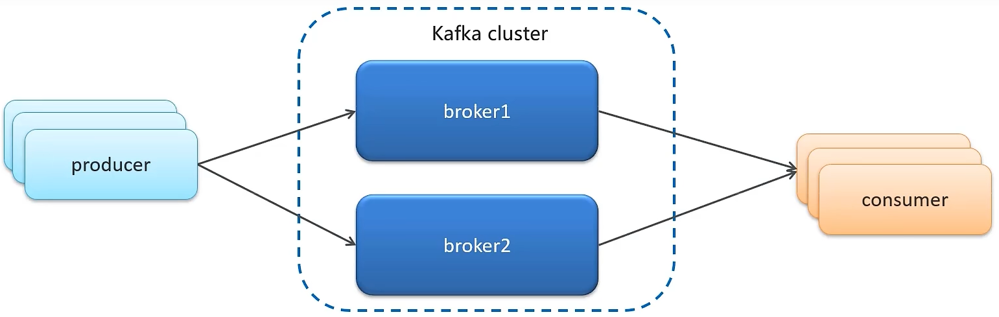

- Kafka的服务器端由被称为`Broker`的服务进程构成, 即一个Kafka集群由多个`Broker`组成
- 这样如果集群中某一台机器宕机, 其他机器上的`Broker`也依然能够对外提供服务. 这其实就是Kafka提供高可用的手段之一

### 备份机制(Replication)

#### 介绍

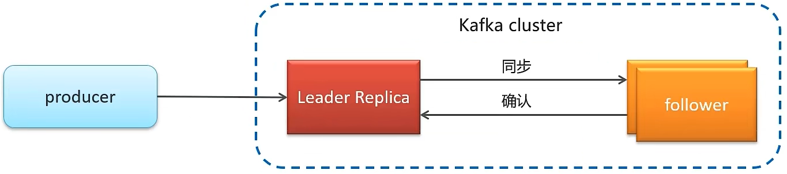

Kafka中消息的备份又叫做 副本(`Replica`)

Kafka定义了两类副本:

- 领导者副本(`Leader Replica`)
- 追随者副本(`Follower Replica`)

#### 同步方式

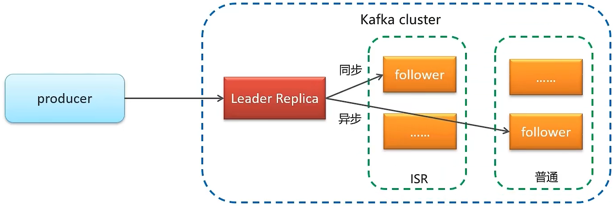

ISR(in-sync replica) 需要同步复制保存的follower


如果leader失效后, 需要选出新的leader, 选举的原则如下:

第一: 选举时优先从ISR中选定, 因为这个列表中follower的数据是与leader同步的

第二: 如果ISR列表中的follower都不行了, 就只能从其他follower中选取


极端情况, 就是所有副本都失效了, 这时有两种方案

第一: 等待ISR中的一个活过来, 选为Leader, 数据可靠, 但活过来的时间不确定

第二: 选择第一个活过来的Replication, 不一定是ISR中的, 选为Leader, 以最快速度恢复可用性, 但数据不一定完整

## Kafka生产者详解

### 发送类型

- 同步发送

  使用`send()`方法发送, 它会返回一个`Future`对象, 调用`get()`方法进行等待, 就可以知道消息是否发送成功

  ```java
  // 发送消息
  try{
      RecordMetadata recordMetadata = producer.send(record).get();
      System.out.println(recordMetadata.offset());// 获取偏移量
  }catch (Exception e){
      e.printStackTrace();
  }
  ```

- 异步发送

  调用`send()`方法, 并指定一个回调函数, 服务器在返回响应时调用函数

  ```java
  //异步消息发送
  producer.send(kvProducerRecord, new Callback() {
      @Override
      public void onCompletion(RecordMetadata recordMetadata, Exception e) {
          if(e != null){
              System.out.println("记录异常信息到日志表中");
          }
          System.out.println(recordMetadata.offset());
      }
  });
  ```

### 参数详解

#### ack

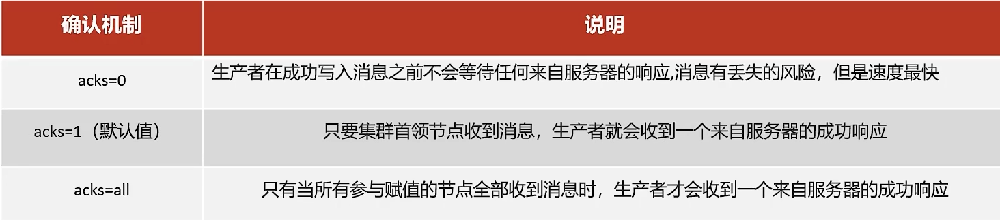

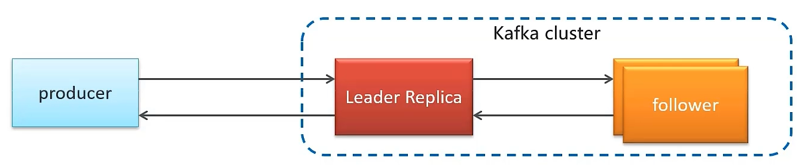

#### retries


```java
// 设置重试次数
prop.put(ProducerConfig.RETRIES_CONFIG, 10);
```

生产者从服务器收到错误有可能是临时性错误, 在这种情况下, `retries`参数的值决定了生产者可以重发消息的次数, 如果达到这个次数, 生产者会放弃重试返回错误, 默认情况下, <font color='red'>生产者会在每次重试之间等待100ms</font>

#### 消息压缩

默认情况下, 消息发送时不会被压缩

```java
// 消息压缩
prop.put(ProducerConfig.COMPESSION_TYPE_CONFIG, "gzip");
```

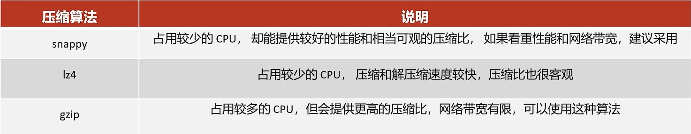

使用压缩可以降低网络传输开销和存储开销, 而这往往是向Kafka发送消息的瓶颈所在

| NAME                                       | DESCRIPTION                                                  | TYPE     | DEFAULT                                                      | VALID VALUES       | IMPORTANCE |
| ------------------------------------------ | ------------------------------------------------------------ | -------- | ------------------------------------------------------------ | ------------------ | ---------- |
| `bootstrap.servers`                        | host/port列表，用于初始化建立和Kafka集群的连接。列表格式为host1:port1,host2:port2,....，无需添加所有的集群地址，kafka会根据提供的地址发现其他的地址（你可以多提供几个，以防提供的服务器关闭） | list     |                                                              |                    | high       |
| `key.serializer`                           | 实现 org.apache.kafka.common.serialization.Serializer 接口的 key 的 Serializer  类。 | class    |                                                              |                    | high       |
| `value.serializer`                         | 实现 org.apache.kafka.common.serialization.Serializer 接口的value 的 Serializer  类。 | class    |                                                              |                    | high       |
| `acks`                                     | 生产者需要leader确认请求完成之前接收的应答数。此配置控制了发送消息的耐用性，支持以下配置： | string   | 1                                                            | [all, -1, 0, 1]    | high       |
|                                            | acks=0  如果设置为0，那么生产者将不等待任何消息确认。消息将立刻添加到socket缓冲区并考虑发送。在这种情况下不能保障消息被服务器接收到。并且重试机制不会生效（因为客户端不知道故障了没有）。每个消息返回的offset始终设置为-1。 |          |                                                              |                    |            |
|                                            | acks=1，这意味着leader写入消息到本地日志就立即响应，而不等待所有follower应答。在这种情况下，如果响应消息之后但follower还未复制之前leader立即故障，那么消息将会丢失。 |          |                                                              |                    |            |
|                                            | acks=all  这意味着leader将等待所有副本同步后应答消息。此配置保障消息不会丢失（只要至少有一个同步的副本或者）。这是最强壮的可用性保障。等价于acks=-1。 |          |                                                              |                    |            |
| `buffer.memory`                            | 生产者用来缓存等待发送到服务器的消息的内存总字节数。如果消息发送比可传递到服务器的快，生产者将阻塞max.block.ms之后，抛出异常。 | long     | 33554432                                                     | [0,...]            | high       |
|                                            | 此设置应该大致的对应生产者将要使用的总内存，但不是硬约束，因为生产者所使用的所有内存都用于缓冲。一些额外的内存将用于压缩（如果启动压缩），以及用于保持发送中的请求。 |          |                                                              |                    |            |
| `compression.type`                         | 数据压缩的类型。默认为空（就是不压缩）。有效的值有 none，gzip，snappy, 或  lz4。压缩全部的数据批，因此批的效果也将影响压缩的比率（更多的批次意味着更好的压缩）。 | string   | none                                                         |                    | high       |
| `retries`                                  | 设置一个比零大的值，客户端如果发送失败则会重新发送。注意，这个重试功能和客户端在接到错误之后重新发送没什么不同。如果max.in.flight.requests.per.connection没有设置为1，有可能改变消息发送的顺序，因为如果2个批次发送到一个分区中，并第一个失败了并重试，但是第二个成功了，那么第二个批次将超过第一个。 | int      | 0                                                            | [0,...,2147483647] | high       |
| `ssl.key.password`                         | 密钥仓库文件中的私钥的密码。                                 | password | null                                                         |                    | high       |
| `ssl.keystore.location`                    | 密钥仓库文件的位置。可用于客户端的双向认证。                 | string   | null                                                         |                    | high       |
| `ssl.keystore.password`                    | 密钥仓库文件的仓库密码。只有配置了ssl.keystore.location时才需要。 | password | null                                                         |                    | high       |
| `ssl.truststore.location`                  | 信任仓库的位置                                               | string   | null                                                         |                    | high       |
| `ssl.truststore.password`                  | 信任仓库文件的密码                                           | password | null                                                         |                    | high       |
| `batch.size`                               | 当多个消息要发送到相同分区的时，生产者尝试将消息批量打包在一起，以减少请求交互。这样有助于客户端和服务端的性能提升。该配置的默认批次大小（以字节为单位）： | int      | 16384                                                        | [0,...]            | medium     |
|                                            | 不会打包大于此配置大小的消息。                               |          |                                                              |                    |            |
|                                            | 发送到broker的请求将包含多个批次，每个分区一个，用于发送数据。 |          |                                                              |                    |            |
|                                            | 较小的批次大小有可能降低吞吐量（批次大小为0则完全禁用批处理）。一个非常大的批次大小可能更浪费内存。因为我们会预先分配这个资源。 |          |                                                              |                    |            |
| `client.id`                                | 当发出请求时传递给服务器的id字符串。这样做的目的是允许服务器请求记录记录这个【逻辑应用名】，这样能够追踪请求的源，而不仅仅只是ip/prot。 | string   | ""                                                           |                    | medium     |
| `connections.max.idle.ms`                  | 多少毫秒之后关闭闲置的连接。                                 | long     | 540000                                                       |                    | medium     |
| `linger.ms`                                | 生产者组将发送的消息组合成单个批量请求。正常情况下，只有消息到达的速度比发送速度快的情况下才会出现。但是，在某些情况下，即使在适度的负载下，客户端也可能希望减少请求数量。此设置通过添加少量人为延迟来实现。-  也就是说，不是立即发出一个消息，生产者将等待一个给定的延迟，以便和其他的消息可以组合成一个批次。这类似于Nagle在TCP中的算法。此设置给出批量延迟的上限：一旦我们达到分区的batch.size值的记录，将立即发送，不管这个设置如何，但是，如果比这个小，我们将在指定的“linger”时间内等待更多的消息加入。此设置默认为0（即无延迟）。假设，设置  linger.ms=5，将达到减少发送的请求数量的效果，但对于在没有负载情况，将增加5ms的延迟。 | long     | 0                                                            | [0,...]            | medium     |
| `max.block.ms`                             | 该配置控制 KafkaProducer.send() 和 KafkaProducer.partitionsFor()  将阻塞多长时间。此外这些方法被阻止，也可能是因为缓冲区已满或元数据不可用。在用户提供的序列化程序或分区器中的锁定不会计入此超时。 | long     | 60000                                                        | [0,...]            | medium     |
| `max.request.size`                         | 请求的最大大小（以字节为单位）。此设置将限制生产者的单个请求中发送的消息批次数，以避免发送过大的请求。这也是最大消息批量大小的上限。请注意，服务器拥有自己的批量大小，可能与此不同。 | int      | 1048576                                                      | [0,...]            | medium     |
| `partitioner.class`                        | 实现Partitioner接口的的Partitioner类。                       | class    | org.apache.kafka.clients.producer.internals.DefaultPartitioner |                    | medium     |
| `receive.buffer.bytes`                     | 读取数据时使用的TCP接收缓冲区(SO_RCVBUF)的大小。如果值为-1，则将使用OS默认值。 | int      | 32768                                                        | [-1,...]           | medium     |
| `request.timeout.ms`                       | 该配置控制客户端等待请求响应的最长时间。如果在超时之前未收到响应，客户端将在必要时重新发送请求，如果重试耗尽，则该请求将失败。  这应该大于replica.lag.time.max.ms，以减少由于不必要的生产者重试引起的消息重复的可能性。 | int      | 30000                                                        | [0,...]            | medium     |
| `sasl.jaas.config`                         | JAAS配置文件使用的格式的SASL连接的JAAS登录上下文参数。这里描述JAAS配置文件格式。该值的格式为：'（=）*;' | password | null                                                         |                    | medium     |
| `sasl.kerberos.service.name`               | Kafka运行的Kerberos主体名称。可以在Kafka的JAAS配置或Kafka的配置中定义。 | string   | null                                                         |                    | medium     |
| `sasl.mechanism`                           | SASL机制用于客户端连接。这是安全提供者可用与任何机制。GSSAPI是默认机制。 | string   | GSSAPI                                                       |                    | medium     |
| `security.protocol`                        | 用于与broker通讯的协议。 有效值为：PLAINTEXT，SSL，SASL_PLAINTEXT，SASL_SSL。 | string   | PLAINTEXT                                                    |                    | medium     |
| `send.buffer.bytes`                        | 发送数据时，用于TCP发送缓存（SO_SNDBUF）的大小。如果值为 -1，将默认使用系统的。 | int      | 131072                                                       | [-1,...]           | medium     |
| `ssl.enabled.protocols`                    | 启用SSL连接的协议列表。                                      | list     | TLSv1.2,TLSv1.1,TLSv1                                        |                    | medium     |
| `ssl.keystore.type`                        | 密钥存储文件的文件格式。对于客户端是可选的。                 | string   | JKS                                                          |                    | medium     |
| `ssl.protocol`                             | 最近的JVM中允许的值是TLS，TLSv1.1和TLSv1.2。  较旧的JVM可能支持SSL，SSLv2和SSLv3，但由于已知的安全漏洞，不建议使用SSL。 | string   | TLS                                                          |                    | medium     |
| `ssl.provider`                             | 用于SSL连接的安全提供程序的名称。默认值是JVM的默认安全提供程序。 | string   | null                                                         |                    | medium     |
| `ssl.truststore.type`                      | 信任仓库文件的文件格式。                                     | string   | JKS                                                          |                    | medium     |
| `enable.idempotence`                       | 当设置为‘true’，生产者将确保每个消息正好一次复制写入到stream。如果‘false’，由于broker故障，生产者重试。即，可以在流中写入重试的消息。此设置默认是‘false’。请注意，启用幂等式需要将max.in.flight.requests.per.connection设置为1，重试次数不能为零。另外acks必须设置为“全部”。如果这些值保持默认值，我们将覆盖默认值。  如果这些值设置为与幂等生成器不兼容的值，则将抛出一个ConfigException异常。如果这些值设置为与幂等生成器不兼容的值，则将抛出一个ConfigException异常。 | boolean  | FALSE                                                        |                    | low        |
| `interceptor.classes`                      | 实现ProducerInterceptor接口，你可以在生产者发布到Kafka群集之前拦截（也可变更）生产者收到的消息。默认情况下没有拦截器。 | list     | null                                                         |                    | low        |
| `max.in.flight.requests.per.connection`    | 阻塞之前，客户端单个连接上发送的未应答请求的最大数量。注意，如果此设置设置大于1且发送失败，则会由于重试（如果启用了重试）会导致消息重新排序的风险。 | int      | 5                                                            | [1,...]            | low        |
| `metadata.max.age.ms`                      | 在一段时间段之后（以毫秒为单位），强制更新元数据，即使我们没有看到任何分区leader的变化，也会主动去发现新的broker或分区。 | long     | 300000                                                       | [0,...]            | low        |
| `metric.reporters`                         | 用作metrics reporters（指标记录员）的类的列表。实现MetricReporter接口，将受到新增加的度量标准创建类插入的通知。  JmxReporter始终包含在注册JMX统计信息中。 | list     | ""                                                           |                    | low        |
| `metrics.num.samples`                      | 维护用于计算度量的样例数量。                                 | int      | 2                                                            | [1,...]            | low        |
| `metrics.recording.level`                  | 指标的最高记录级别。                                         | string   | INFO                                                         | [INFO, DEBUG]      | low        |
| `metrics.sample.window.ms`                 | 度量样例计算上                                               | long     | 30000                                                        | [0,...]            | low        |
| `reconnect.backoff.max.ms`                 | 重新连接到重复无法连接的代理程序时等待的最大时间（毫秒）。 如果提供，每个主机的回退将会连续增加，直到达到最大值。  计算后退增加后，增加20％的随机抖动以避免连接风暴。 | long     | 1000                                                         | [0,...]            | low        |
| `reconnect.backoff.ms`                     | 尝试重新连接到给定主机之前等待的基本时间量。这避免了在循环中高频率的重复连接到主机。这种回退适应于客户端对broker的所有连接尝试。 | long     | 50                                                           | [0,...]            | low        |
| `retry.backoff.ms`                         | 尝试重试指定topic分区的失败请求之前等待的时间。这样可以避免在某些故障情况下高频次的重复发送请求。 | long     | 100                                                          | [0,...]            | low        |
| `sasl.kerberos.kinit.cmd`                  | Kerberos kinit 命令路径。                                    | string   | /usr/bin/kinit                                               |                    | low        |
| `sasl.kerberos.min.time.before.relogin`    | Login线程刷新尝试之间的休眠时间。                            | long     | 60000                                                        |                    | low        |
| `sasl.kerberos.ticket.renew.jitter`        | 添加更新时间的随机抖动百分比。                               | double   | 0.05                                                         |                    | low        |
| `sasl.kerberos.ticket.renew.window.factor` | 登录线程将睡眠，直到从上次刷新ticket到期时间的指定窗口因子为止，此时将尝试续订ticket。 | double   | 0.8                                                          |                    | low        |
| `ssl.cipher.suites`                        | 密码套件列表。这是使用TLS或SSL网络协议来协商用于网络连接的安全设置的认证，加密，MAC和密钥交换算法的命名组合。默认情况下，支持所有可用的密码套件。 | list     | null                                                         |                    | low        |
| `ssl.endpoint.identification.algorithm`    | 使用服务器证书验证服务器主机名的端点识别算法。               | string   | null                                                         |                    | low        |
| `ssl.keymanager.algorithm`                 | 用于SSL连接的密钥管理因子算法。默认值是为Java虚拟机配置的密钥管理器工厂算法。 | string   | SunX509                                                      |                    | low        |
| `ssl.secure.random.implementation`         | 用于SSL加密操作的SecureRandom PRNG实现。                     | string   | null                                                         |                    | low        |
| `ssl.trustmanager.algorithm`               | 用于SSL连接的信任管理因子算法。默认值是JAVA虚拟机配置的信任管理工厂算法。 | string   | PKIX                                                         |                    | low        |
| `transaction.timeout.ms`                   | 生产者在主动中止正在进行的交易之前，交易协调器等待事务状态更新的最大时间（以ms为单位）。如果此值大于broker中的max.transaction.timeout.ms设置，则请求将失败，并报“InvalidTransactionTimeout”错误。 | int      | 60000                                                        |                    | low        |
| `transactional.id`                         | 用于事务传递的TransactionalId。这样可以跨多个生产者会话的可靠性语义，因为它允许客户端保证在开始任何新事务之前使用相同的TransactionalId的事务已经完成。如果没有提供TransactionalId，则生产者被限制为幂等传递。请注意，如果配置了TransactionalId，则必须启用enable.idempotence。  默认值为空，这意味着无法使用事务。 | string   | null                                                         | non-empty string   | low        |

## Kafka消费者详解

### 消费者组

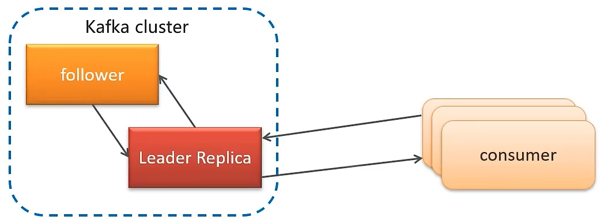

- 消费者组(`Consumer Group`): 指的就是由一个或多个消费者组成的群体
- 一个发布在`Topic`上消息被分发给此消费者组中的一个消费者
  - 所有的消费者都在一个组中, 那么这就变成了Queue模型
  - 所有的消费者都在不同的组中, 那么就完全变成了发布-订阅模型

### 消息有序性

应用场景: 

- 即时消息中的单对单聊天和群聊, 保证发送方消息发送顺序与接收方的顺序一致
- 充值转账两个渠道在同一个时间进行余额变更, 短信通知必须要有顺序

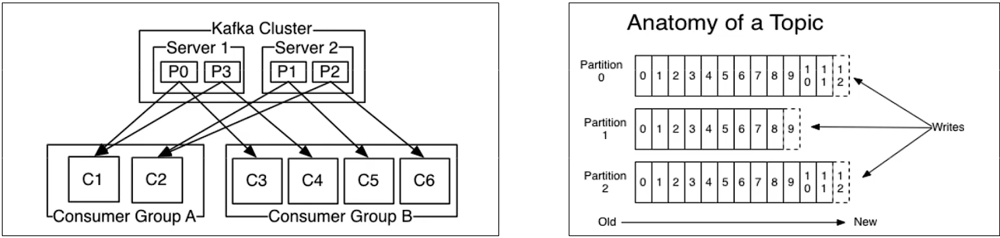

Kafka集群托管4个分区(`P0`~`P3`), 2个消费者组, 消费者组A有2个消费者, 消费者组B有4个消费者

`Topic`分区中消息只能由消费者组中的唯一一个消费者处理, 所以消息肯定是按照先后顺序进行处理的. 但是它也仅仅是保证`Topic`的一个分区顺序处理, 不能保证跨分区的消息先后处理顺序. 所以, 如果你想要顺序的处理`Topic`的所有消息, 那就只提供一个分区.

### 提交和偏移量

Kafka不会像其他JMS队列那样需要得到消费者的确认, 消费者可以使用Kafka来追踪消息在分区的位置(偏移量) 消费者会往一个叫做`_consumer_offset`的特殊主题发送消息, 消息里包含了每个分区的偏移量. 如果消费者发生崩溃或有新的消费者加入群组, 就会触发再均衡

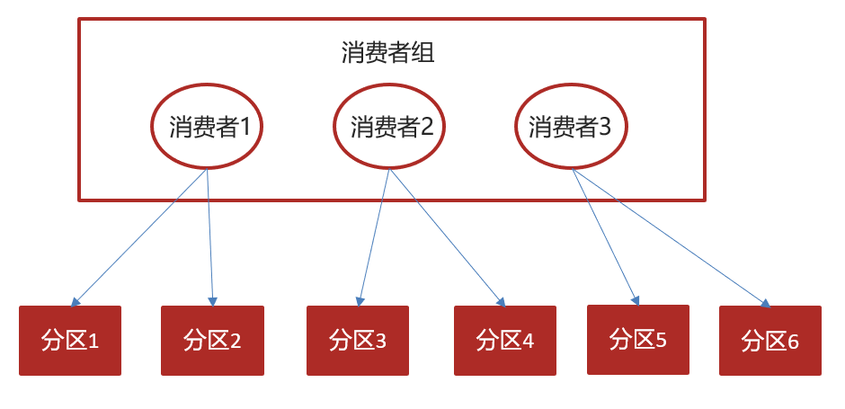

正常的情况:

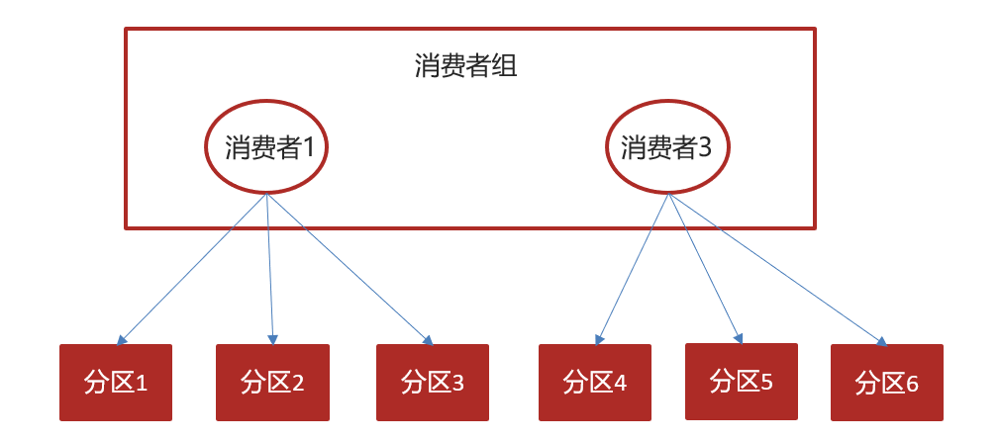

如果消费者2挂掉以后，会发生再均衡，消费者2负责的分区会被其他消费者进行消费

再均衡后不可避免会出现一些问题:

问题一：

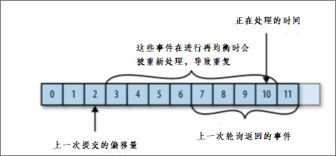

如果提交偏移量小于客户端处理的最后一个消息的偏移量，那么处于两个偏移量之间的消息就会被重复处理。


问题二：

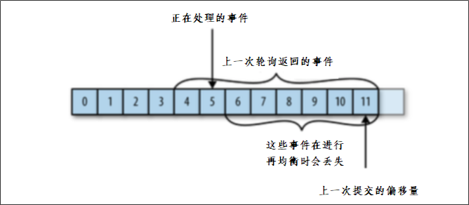

如果提交的偏移量大于客户端的最后一个消息的偏移量，那么处于两个偏移量之间的消息将会丢失。

### 偏移量提交方式

提交偏移量的方式有两种, 分别是自动提交偏移量和手动提交

- 自动提交偏移量

  当`enable.auto.commit`被设置为`true`, 提交方式就是让消费者自动提交偏移量, 每隔5秒消费者会自动把从`poll()`方法接受的最大偏移量提交上去

- 手动提交

  当`enable.auto.commit`被设置为`false`可以有以下三种提交方式

  - 提交当前偏移量(同步提交)
  - 异步提交
  - 同步和异步组合提交

#### 提交当前偏移量(同步提交)

把`enable.auto.commit`设置为false,让应用程序决定何时提交偏移量。使用commitSync()提交偏移量，commitSync()将会提交poll返回的最新的偏移量，所以在处理完所有记录后要确保调用了commitSync()方法。否则还是会有消息丢失的风险。

只要没有发生不可恢复的错误，commitSync()方法会一直尝试直至提交成功，如果提交失败也可以记录到错误日志里。

```java
while (true){
    ConsumerRecords<String, String> records = consumer.poll(Duration.ofMillis(1000));
    for (ConsumerRecord<String, String> record : records) {
        System.out.println(record.value());
        System.out.println(record.key());
        try {
            consumer.commitSync();//同步提交当前最新的偏移量
        }catch (CommitFailedException e){
            System.out.println("记录提交失败的异常："+e);
        }
    }
}
```

#### 异步提交

手动提交有一个缺点，那就是当发起提交调用时应用会阻塞。当然我们可以减少手动提交的频率，但这个会增加消息重复的概率（和自动提交一样）。另外一个解决办法是，使用异步提交的API。

```java
while (true){
    ConsumerRecords<String, String> records = consumer.poll(Duration.ofMillis(1000));
    for (ConsumerRecord<String, String> record : records) {
        System.out.println(record.value());
        System.out.println(record.key());
    }
    consumer.commitAsync(new OffsetCommitCallback() {
        @Override
        public void onComplete(Map<TopicPartition, OffsetAndMetadata> map, Exception e) {
            if(e!=null){
                System.out.println("记录错误的提交偏移量："+ map+",异常信息"+e);
            }
        }
    });
}
```

#### 同步和异步组合提交

异步提交也有个缺点，那就是如果服务器返回提交失败，异步提交不会进行重试。相比较起来，同步提交会进行重试直到成功或者最后抛出异常给应用。异步提交没有实现重试是因为，如果同时存在多个异步提交，进行重试可能会导致位移覆盖。

举个例子，假如我们发起了一个异步提交commitA，此时的提交位移为2000，随后又发起了一个异步提交commitB且位移为3000；commitA提交失败但commitB提交成功，此时commitA进行重试并成功的话，会将实际上将已经提交的位移从3000回滚到2000，导致消息重复消费。

```java
try {
    while (true){
        ConsumerRecords<String, String> records = consumer.poll(Duration.ofMillis(1000));
        for (ConsumerRecord<String, String> record : records) {
            System.out.println(record.value());
            System.out.println(record.key());
        }
        consumer.commitAsync();
    }
}catch (Exception e){+
    e.printStackTrace();
    System.out.println("记录错误信息："+e);
}finally {
    try {
        consumer.commitSync();
    }finally {
        consumer.close();
    }
}
```

## SpringBoot集成Kafka收发消息

### SpringBoot集成Kafka收发消息

1. 导入spring-kafka依赖信息

   ```xml
   <!--kafka-->
   <dependency>
       <groupId>org.springframwork.kafka</groupId>
       <artifactId>spring-kafka</artifactId>
       <exclusions>
           <exclusion>
               <groupId>org.apache.kafka</groupId>
               <artifactId>kafka-clients</artifactId>
           </exclusion>
       </exclusions>
   </dependency>
   <dependency>
       <groupId>org.apache.kafka</groupId>
       <artifactId>kafka-clients</artifactId>
   </dependency>
   <dependency>
       <groupId>com.alibaba</groupId>
       <artifactId>fastjson</artifactId>
   </dependency>
   ```

2. 在`resources`下创建文件`application.yml`

   ```yaml
   server:
     port: 9991
   spring:
     application:
       name: kafka-demo
     kafka:
       bootstrap-servers: 192.168.31.128:9092
       producer:
         retries: 10
         key-serializer: org.apache.kafka.common.serialization.StringSerializer
         value-serializer: org.apache.kafka.common.serialization.StringSerializer
       consumer:
         group-id: test-hello-group
         key-deserializer: org.apache.kafka.common.serialization.StringDeserializer
         value-deserializer: org.apache.kafka.common.serialization.StringDeserializer
   ```

3. 消息生产者

   ```java
   @Autowired
   private KafkaTemplate<String,String> kafkaTemplate;
   
   @GetMapping("/hello")
   public String hello(){
       // 第一个参数: Topics
       // 第二个参数: 消息内容
       kafkaTemplate.send("kafka-hello", "青青子衿, 悠悠我心");
       return "ok";
   }
   ```

4. 消息消费者

   ```java
   @Component
   public class HelloListener {
       @KafkaListener(topics = {"kafka-hello"})
       public void onMessage(String message) {
           if (!StringUtils.isEmpty(message)) {
               System.out.println(message);
           }
       }
   }
   ```

### 传递消息为对象

目前SpringBoot整合后的kafka, 因为序列化器是StringSerializer, 这个时候如果需要传递对象可以有两种方式

方式一: 可以自定义序列化器, 对象类型众多, 这种方式通用性不强

方式二: 可以把要传递的对象进行转json字符串, 接收消息后再转为对象即可

发送消息:

```java
// 发送消息
User user = new User();
user.setUsername("zhangsan");
user.setAge(18);
kafkaTemplate.send("kafka-hello", JSON.toJSONString(user));
return "ok";
```

接收消息:

```java
User user = JSON.parseObject((String) value, User.class);
```

# MongoDB

## 数据存储说明

用户的搜索记录, 需要给每一个用户都保存一份, 数据量较大, 要求加载速度快, 通常这样的数据存储到MongoDB更合适, 不建议直接存储到关系型数据库中

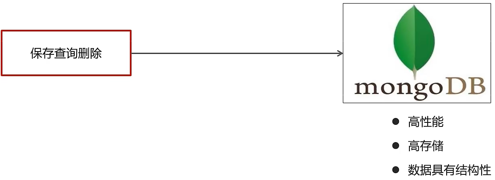

## MongoDB安装及集成

### 安装

拉取镜像

```shell
docker pull mongo
```

创建容器

```shell
docker run -di --name mongo-service --restart=always -p 27017:27017 -v /root/mongo-data:/data --network=qqzj-news mongo
```

### 集成

#### MongoDB依赖

```xml
<dependency>
    <groupId>org.springframwork.boot</groupId>
    <artifactId>spring-boot-starter-data-mongodb</artifactId>
</dependency>
```

#### mongo配置

```yaml
spring:
  data:
    mongodb:
      host: 192.168.31.128
      port: 27017
      database: leadnews-history
```

#### 映射

```java
@Document("ap_associate_words")
public class ApAssociateWords implements Serializable {
    private static final long serialVersionUID = 1L;
    private String id;
    /**
     * 联想词
     */
    private String associateWords;
    /**
     * 创建时间
     */
    private Date createdTime;
}
```

#### 核心方法

1. 保存或修改(ID存在则修改, 不存在则保存)

   ```java
   mongoTemplate.save(apAssociateWords);
   ```

2. 查询一个对象

   ```java
   ApAssociateWords apAssociateWords = mongoTemplate.findById("", ApAssociateWords.class);
   ```

3. 多条件查询

   ```java
   Query query = Query.query(Criteria.where("associateWords").is("黑马头条")).with(Sort.by(Sort.Direction.DESC, "createdTime"));
   List<ApAssociateWords> apAssociateWordsList = mongoTemplate.find(query, ApAssociateWords.class);
   ```

4. 删除

   ```java
   mongoTemplate.remove(Query.query(Criteria.where("apAssociateWords").is("黑马头条")), ApAssociateWords.class)
   ```

# 定时计算文章热度

## 定时任务框架-`xxl-job`

spring有传统的定时任务`@Scheduled`, 但是存在一些问题

- 做集群任务的重复执行问题
- `cron`表达式定义在代码之中, 修改不方便
- 定时任务失败了, 无法重试也没有统计
- 如果任务量过大, 不能有效的分片执行

## 分布式任务调度

### 什么是分布式任务调度

在分布式架构下, 一个服务往往会部署多个实例来运行我们的业务, 如果在这种分布式系统环境下运行任务调度, 我们称之为分布式任务调度

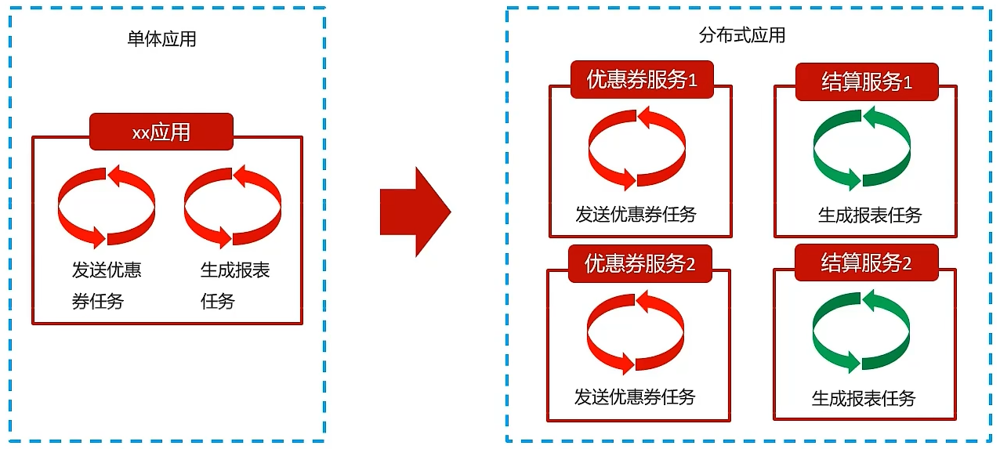

## `xxl-job`

### 简介

`XXL-JOB`是一个分布式任务调度平台, 其核心设计目标是开发迅速、学习简单、轻量级、易扩展. 现已开放源代码并接入多家公司线上产品线, 开箱即用.

源码地址: https://gitee.com/xuxueli0323/xxl-job

文档地址: https://www.xuxueli.com/xxl-job/

同类产品:

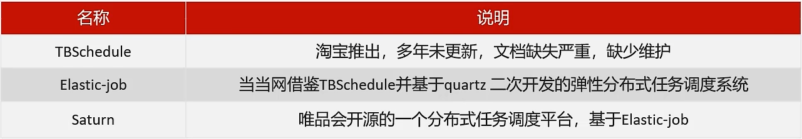

### 环境搭建

1. 调度中心环境要求

   Maven3+

   jdk1.8+

   Mysql5.7+

2. 源码仓库地址

   | 源码仓库地址                         | Release Download                              |
   | ------------------------------------ | --------------------------------------------- |
   | https://github.com/xuxueli/xxl-job   | https://github.com/xuxueli/xxl-job/releases   |
   | http://gitee.com/xuxueli0323/xxl-job | http://gitee.com/xuxueli0323/xxl-job/releases |

### (源码说明)

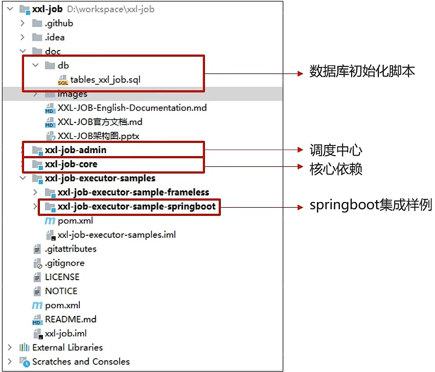

### 配置部署调度中心

作用: 统一管理任务调度平台上调度任务, 负责触发调度执行, 并且提供任务管理平台.

1. 调度数据库初始化SQL脚本执行

   位置: xxl-job/doc/db/tables_xxl_job.sql 共8张表

2. 调度中心配置

   配置文件位置: xxl-job/xxl-job-admin/src/main/resources/application.properties

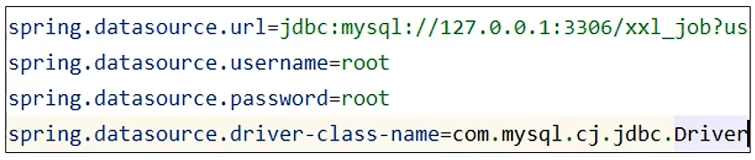

3. 启动调度中心, 默认登录账号 “admin/123456”, 登录后运行界面如图

   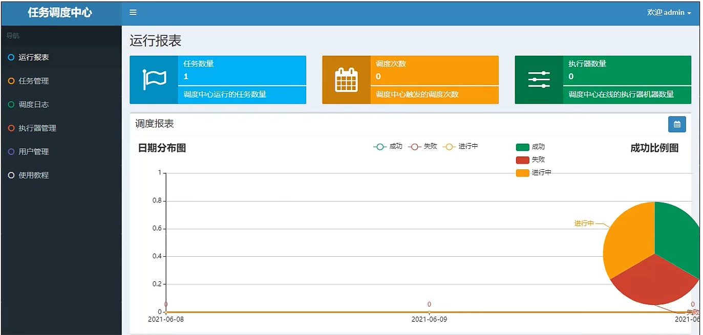

### docker安装

1. 创建Mysql容器, 初始化`xxl-job`的SQL脚本

   ```shell
   docker run -p 3306:3306 --name mysql57 \
   -v /opt/mysql/conf:/etc/mysql \
   -v /opt/mysql/logs:/var/log/mysql \
   -v /opt/mysql/data:/var/lib/mysql \
   -e MYSQL_ROOT_PASSWORD=root \
   -d mysql:5.7
   ```

2. 拉取镜像

   ```shell
   docker pull xuxueli/xxl-job-admin:2.3.0
   ```

3. 创建容器

   ```shell
   docker run \
   -e PARAMS="--spring.datasource.url=jdbc:mysql://192.168.31.128:3306/xxl_job?Unicode=true&characterEncoding=UTF-8 --spring.datasource.username=root --spring.datasource.password=" \
   -p 8888:8080 \
   -v /tmp:/data/applogs \
   --name xxl-job-admin \
   --restart=always \
   --network=qqzj-news \
   -d xuxueli/xxl-job-admin:2.4.1
   ```

### Bean模式任务(方法形式)-入门案例

1. 登录调度中心, 点击下图新建任务按钮, 新建任务

   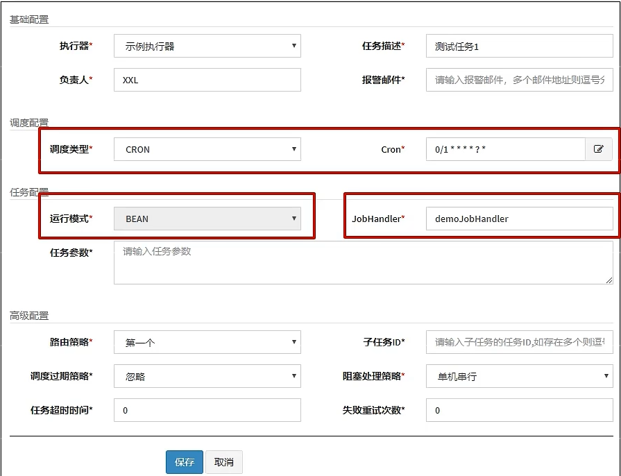

2. 创建`xxljob-demo`项目, 导入依赖

   ```xml
   <!--xxl-job-->
   <dependency>
       <groupId>com.xuxueli</groupId>
       <artifactId>xxl-job-core</artifactId>
       <version>2.4.1</version>
   </dependency>
   ```

3. application.yml配置

   ```yaml
   server:
     port: 8881
   xxl:
     job:
       admin:
         addresses: http://192.168.31.128:8888/xxl-job-admin
       executor:
         appname: xxl-job-executor-sample
         port: 9999
       accessToken: default_token
   ```

   ```java
   package com.qqzj.xxljob.config;
   
   import com.xxl.job.core.executor.impl.XxlJobSpringExecutor;
   import org.slf4j.Logger;
   import org.slf4j.LoggerFactory;
   import org.springframework.beans.factory.annotation.Value;
   import org.springframework.context.annotation.Bean;
   import org.springframework.context.annotation.Configuration;
   
   /**
    * xxl-job config
    *
    * @author xuxueli 2017-04-28
    */
   @Configuration
   public class XxlJobConfig {
       private Logger logger = LoggerFactory.getLogger(XxlJobConfig.class);
   
       @Value("${xxl.job.admin.addresses}")
       private String adminAddresses;
   
       @Value("${xxl.job.accessToken}")
       private String accessToken;
   
       @Value("${xxl.job.executor.appname}")
       private String appname;
   
       // @Value("${xxl.job.executor.address}")
       // private String address;
   
       // @Value("${xxl.job.executor.ip}")
       // private String ip;
   
       @Value("${xxl.job.executor.port}")
       private int port;
   
       // @Value("${xxl.job.executor.logpath}")
       // private String logPath;
   
       // @Value("${xxl.job.executor.logretentiondays}")
       // private int logRetentionDays;
   
   
       @Bean
       public XxlJobSpringExecutor xxlJobExecutor() {
           logger.info(">>>>>>>>>>> xxl-job config init.");
           XxlJobSpringExecutor xxlJobSpringExecutor = new XxlJobSpringExecutor();
           xxlJobSpringExecutor.setAdminAddresses(adminAddresses);
           xxlJobSpringExecutor.setAppname(appname);
           // xxlJobSpringExecutor.setAddress(address);
           // xxlJobSpringExecutor.setIp(ip);
           xxlJobSpringExecutor.setPort(port);
           xxlJobSpringExecutor.setAccessToken(accessToken);
           // xxlJobSpringExecutor.setLogPath(logPath);
           // xxlJobSpringExecutor.setLogRetentionDays(logRetentionDays);
   
           return xxlJobSpringExecutor;
       }
   
       /**
        * 针对多网卡、容器内部署等情况，可借助 "spring-cloud-commons" 提供的 "InetUtils" 组件灵活定制注册IP；
        *
        *      1、引入依赖：
        *          <dependency>
        *             <groupId>org.springframework.cloud</groupId>
        *             <artifactId>spring-cloud-commons</artifactId>
        *             <version>${version}</version>
        *         </dependency>
        *
        *      2、配置文件，或者容器启动变量
        *          spring.cloud.inetutils.preferred-networks: 'xxx.xxx.xxx.'
        *
        *      3、获取IP
        *          String ip_ = inetUtils.findFirstNonLoopbackHostInfo().getIpAddress();
        */
   
   
   }
   ```

4. 任务代码, 重要注解: `@XxlJob("JobHandler")`

   ```java
   /**
    * 1.简单任务示例(Bean模式)
    */
   @XxlJob("demoJobHandler")
   public void demoJobHandler() throws Exception {
       XxlJobHelper.log("XXL-JOB, Hello World.");
       System.out.pringln("简单任务执行了......")
   }
   ```

5. 测试-单节点
   - 启动微服务
   - 启动任务

### 任务详解

#### 执行器

- 执行器: 任务的绑定的执行器, 任务触发调度时将会i这哦的那个发现注册成功的执行器, 实现任务自动发现功能;
- 另一方面也可以方便的进行任务分组. 每个任务必须绑定一个执行器

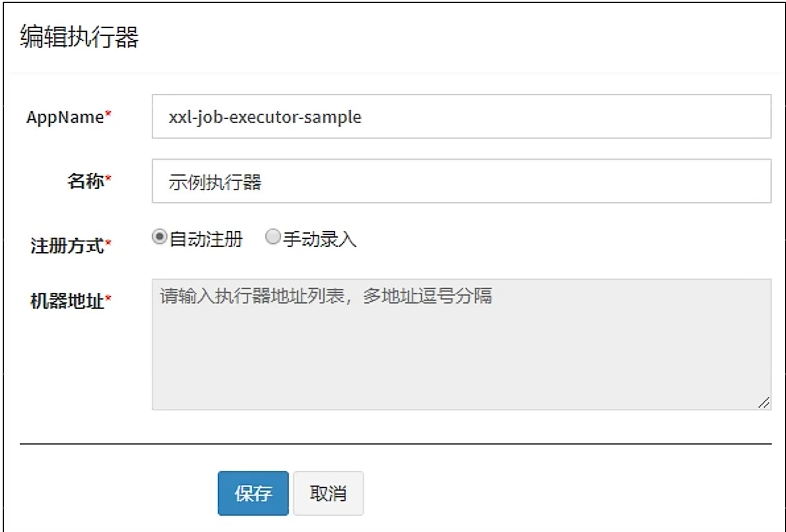

#### 基础配置

- 执行器: 每个任务必须绑定一个执行器, 方便给任务进行分组
- 任务描述: 任务的描述信息, 便于任务管理
- 负责人: 任务的负责人
- 报警邮件: 任务调度失败时邮件通知的邮箱地址, 支持配置多邮箱地址, 配置多个邮箱地址时用逗号分隔

#### 调度配置

- 调度类型:
  - 无: 该类型不会主动触发调度;
  - `CRON`: 该类型将会通过`CRON`, 触发任务调度
  - 固定速度: 该类型将会以固定速度, 触发任务调度; 按照固定的间隔时间, 周期性触发;

#### 基础配置

- 运行模式:
  - `BEAN模式`: 任务以`JobHandler`方式维护在执行器端; 需要结合“`JobHandler`”属性匹配执行器中任务;
- `JobHandler`: 运行模式为“`BEAN模式`”时生效, 对应执行器中新开发的`JobHandler`类“`@JobHandler`”注解自定义`value`值
- 执行参数: 任务执行所需的参数.

#### 阻塞处理策略

阻塞处理策略: 调度过于密集执行器来不及处理时的处理策略;

- 单级串行(默认): 调度请求进入单级执行器后, 调度请求进入`FIFO(First Input First Output)`队列并以串行方式运行;
- 丢弃后续调度: 调度请求进入单机执行器后, 发现执行器存在运行的调度任务, 本次请求将会被丢弃并标记为失败;
- 覆盖之前调度: 调度请求进入单机执行器后, 发现执行器存在执行的调度任务, 将会终止运行中的调度任务并清空队列, 然后运行本地调度任务

#### 路由策略

当执行器集群部署时, 提供丰富的路由策略, 包括:

- FIRST(第一个): 固定选择第一个机器;

- LAST(最后一个): 固定选择最后一个机器;
- <font color='red'>ROUND(轮询)</font>: 
- RANDOM(随机): 随机选择在线的机器;
- CONSISTENT_HASH(一致性HASH): 每个任务按照Hash算法固定选择某一台机器, 且所有任务均匀散列在不同机器上.
- LEAST_FREQUENTLY_USED(最不经常使用): 使用频率最低的机器优先被选举;
- LEAST_RECENTLY_USED(最近最久未使用): 最久未使用的机器优先被选举;
- FAILOVER(故障转移): 按照顺序依次进行心跳检测, 第一个心跳检测成功的机器选定为目标执行器并发起调度;
- BUSYOVER(忙碌转移): 按照顺序依次进行空闲检测, 第一个空闲检测成功的机器选定为目标执行器并发起调度;
- <font color='red'>SHARDING_BROADCAST(分片广播)</font>: 广播触发对应集群中所有机器执行一次任务, 同时系统自动传递分片参数; 可根据分片参数开发分片任务.

### 路由策略

#### 轮询

##### 案例

- 修改任务为<font color='red'>轮询</font>
- 启动多个微服务

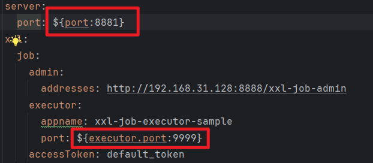

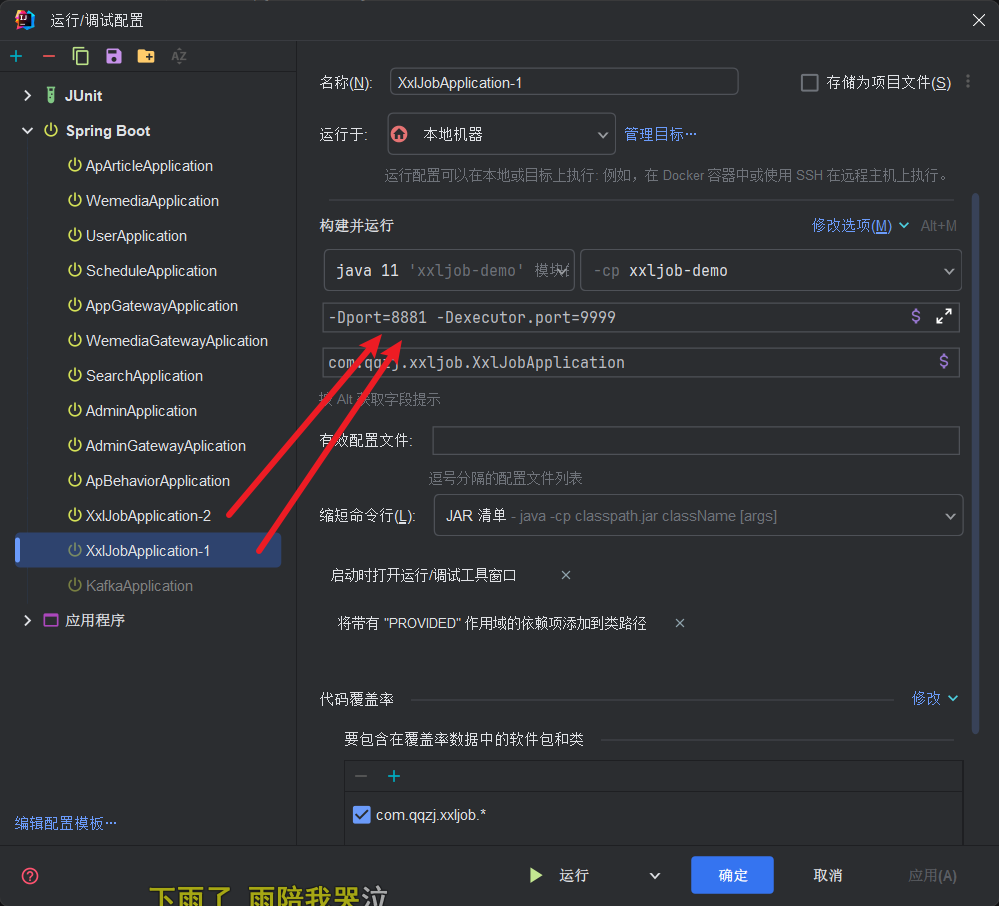

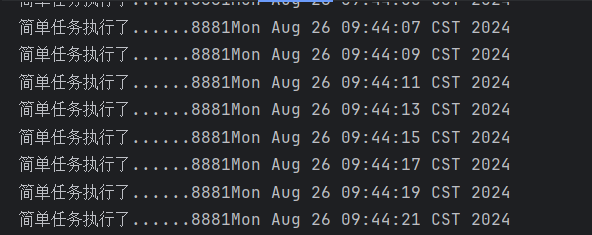

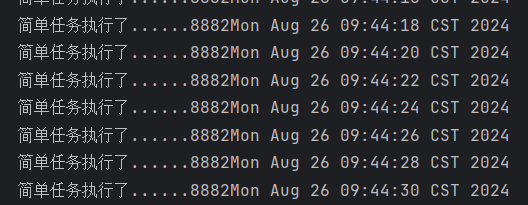

#### 分片广播

执行器集群部署时, 任务路由策略选择“分片广播”情况下, 一次任务调度将会广播触发对应集群中所有执行器执行一次任务

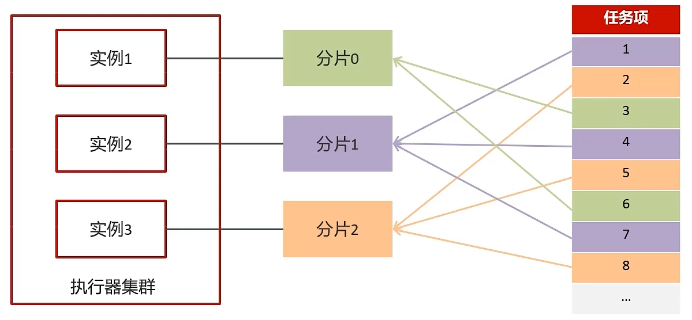

##### 案例

需求: 让两个节点同时执行10000个任务, 每个节点分别执行5000个任务

1. 创建分片执行器

   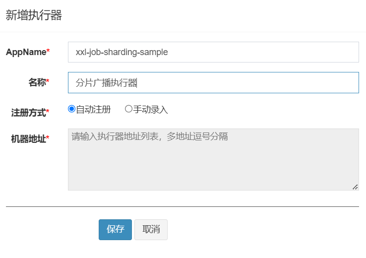

2. 创建任务, 路由策略为<font color='red'>分片广播</font>

   

3. 分片广播代码

   分片参数

     `index`: 当前分片序号(从0开始), 执行器集群列表中当前执行器的序号;

     `total`: 总分片数, 执行器集群的总机器数量

   ```java
   @XxlJob("shadingSample")
   public void shardingJobHandler() throws Exception {
       // 分片参数
       int shardIndex = XxlJobHelper.getShardIndex();
       int shardTotal = XxlJobHelper.getShardTotal();
       XxlJobHelper.log("分片参数: 当前分片序号 = {}, 总分片数 = {}", shardIndex, shardTotal);
       // 业务逻辑
       List<Integer> list = getList();
       
       for(Integer i : list){
           if(i % shardTotal == shardIndex) {
               System.out.println("第" + shardIndex + "分片执行, 执行数据为: " + i);
           }
       }
   }
   ```

   分片广播方式：在每一秒中，实例A和B同时接受了10000任务，但根据各自分片id只处理其中的5000个，另外5000个跳过了

## 定时计算热点文章

### 需求分析

需求: 为每个频道缓存热度较高的30条文章优先展示


判断文章热度较高的标准: 

文章: 阅读, 点赞, 评论, 收藏

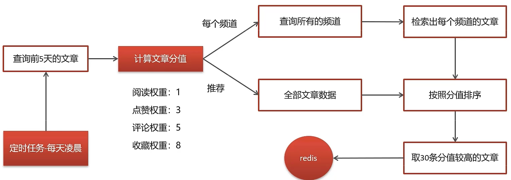

# 实时计算文章热度

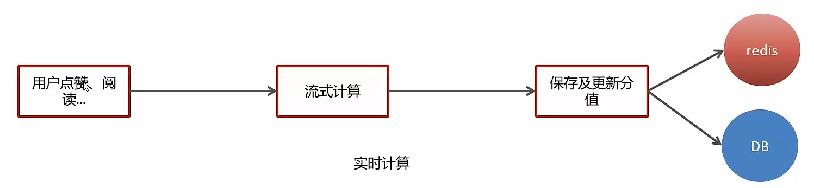

## 实时流式计算

### 概念

一般流式计算会与批量计算相比较

- 批量数据

  

- 流式数据

  

流式计算就相当于上图的扶梯, 是<font color='red'>可以源源不断的产生数据, 源源不断的接收数据, 在时间上没有边界</font>.

### 应用场景

- 日志分析

  网站的用户访问日志进行实时的分析, 计算访问量, 用户画像, 留存率等等, 实时的进行数据分析, 帮助企业进行决策

- 大屏看板统计

  可以实时的查看网站注册数量, 订单数量, 购买数量, 金额等.

- 公交实时数据

  可以随时更新公交车方位, 计算多久到达站牌等

- 实时文章分值计算

  头条类文章的分值计算, 通过用户的行为实时文章的分值, 分值越高就越被推荐

### 技术方案选型

- Hadoop

- Apache Storm

- Flink

  以上三种与大数据有关, 学习成本高

- Kafka Stream

  可以轻松地将其嵌入任何java应用程序中, 并与用户为其流应用程序所拥有的任何现有打包, 部署和操作工具集成

## Kafka Stream

### 概述

Kafka Stream: 提供了对存储于Kafka内的数据进行流失处理和分析的功能

特点:

- Kafka Stream提供了一个非常简单而且轻量的`Library`, 它可以非常方便地嵌入任意java应用中, 也可以任意方式打包和部署
- 除了Kafka外, 无任何外部依赖
- 通过可容错的`state store`实现高效的状态操作(如`windowed join`和`aggregation`)
- 支持基于事件时间的窗口操作, 并且可处理晚到的数据(`late arrival of records`)
- …

### Kafka Stream的关键概念

- 源处理器(`Source Processor`): 源处理器是一个没有任何上游处理器的特殊类型的流处理器. 它从一个或多个Kafka主题生成输入流. 通过消费这些主题的消息并将它们转发到下游处理器
- Sink处理器: sink处理器是一个没有下游流处理器的特殊类型的流处理器. 它接收上游流处理器的消息发送到一个指定的Kafka主题

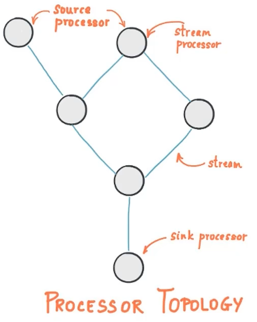

### KStream

- 数据结构类似于`map`, 如下图, `key-value`键值对

  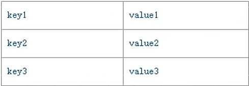

- KStream数据流(`Data Stream`), 即是一段顺序的, 可以无限长, 不断更新的数据集

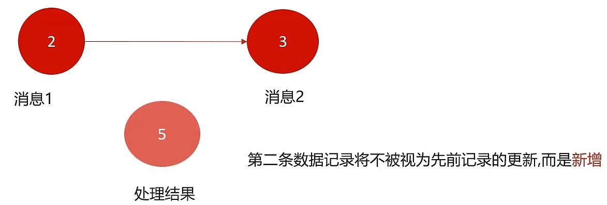

### Kafka Stream入门案例编写

1. 需求分析, 求单词个数 (`word count`)

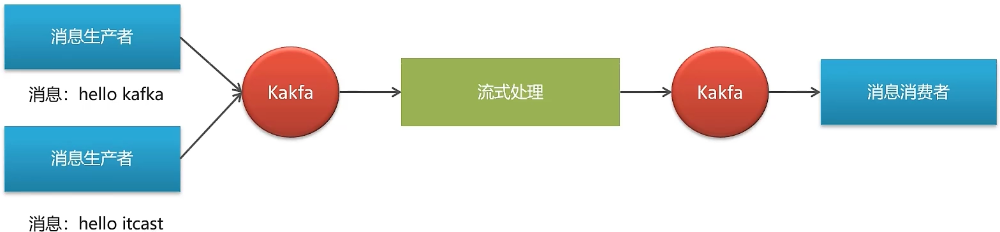

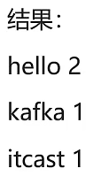

2. 创建原生的Kafka Stream入门案例

   ```java
   public static void main(String[] args) {
       // kafka配置信息
       Properties prop = new Properties();
       // Kafka链接地址
       prop.put(StreamsConfig.BOOTSTRAP_SERVERS_CONFIG, "192.168.31.128:9092");
       // 设置消息key和value的序列化方式
       prop.put(StreamsConfig.DEFAULT_KEY_SERDE_CLASS_CONFIG, Serdes.String()
                .getClass());
       prop.put(StreamsConfig.DEFAULT_VALUE_SERDE_CLASS_CONFIG, Serdes.String()
                .getClass());
       // 设置当前应用名称
       prop.put(StreamsConfig.APPLICATION_ID_CONFIG, "streams-quick-start");
   
       // stream 构建器
       StreamsBuilder streamsBuilder = new StreamsBuilder();
   
       // 流式计算
       streamProcessor(streamsBuilder);
   
       // 创建KafkaStream对象
       KafkaStreams kafkaStreams = new KafkaStreams(streamsBuilder.build(), prop);
       // 开启流式计算
       kafkaStreams.start();
   }
   ```

   ```java
   /**
   	 * 流式计算
   	 * @param streamsBuilder
   	 */
   private static void streamProcessor(StreamsBuilder streamsBuilder) {
       // 创建KStream对象, 同时指定从哪个Topic中接收消息
       KStream<String, String> stream = streamsBuilder.stream("qqzj-topic-input");
       /*
   		  处理消息的value值
   		 */
       stream.flatMapValues(new ValueMapper<String, Iterable<String>>() {
           @Override
           public Iterable<String> apply(String value) {
               Arrays.asList(value.split(" "));
               return null;
           }
       })
           // 按照value进行聚合处理
           .groupBy((key, value) -> value)
           // 时间窗口
           .windowedBy(TimeWindows.ofSizeWithNoGrace(Duration.ofSeconds(10)))
           // 统计单词的个数
           .count()
           // 转换为KStream对象
           .toStream()
           .map((key, value) -> {
               System.out.println("key:" + key);
               System.out.println("value:" + value);
               return new KeyValue<>(key.key()
                                     .toString(), value.toString());
           })
           // 发送消息
           .to("qqzj-topic-output");
   }
   ```

3. 测试准备
   - 使用生产者在`topic`为: `qqzj-topic-input`中发送多条消息
   - 使用消费者接收`topic`为: `qqzj-topic-out`
4. 结果:
   - 通过流式计算, 会把生产者的多条消息汇总成一条发送到消费者中输出

### Spring Boot集成Kafka Stream

1. 配置

```java
@Setter
@Getter
@Configuration 
@EnableKafkaStreams
@ConfigurationProperties(prefix="kafka")
public class KafkaStreamConfig {
    private static final int MAX_MESSAGE_SIZE = 16 * 1024 * 1024;
    private String hosts;
    private String group;
    @Bean(name = KafkaStreamsDefaultConfiguration.DEFAULT_STREAMS_CONFIG_BEAN_NAME)
    public KafkaStreamsConfiguration defaultKafkaStreamsConfig() {
        Map<String, Object> props = new HashMap<>();
        props.put(StreamsConfig.BOOTSTRAP_SERVERS_CONFIG, host);
        props.put(StreamsConfig.APPLICATION_ID_CONFIG, this.getGroup() + "_stream_aid");
        props.put(StreamsConfig.CLIENT_ID_CONFIG, this.getGroup() + "_stream_cid");
        props.put(StreamsConfig.RETRIES_CONFIG, 10);
        props.put(StreamsConfig.DEFAULT_KEY_SERDE_CLASS_CONFIG, Serdes.String().getClass());
        props.put(StreamsConfig.DEFAULT_VALUE_SERDE_CLASS_CONFIG, Serdes.String().getClass());
        return new KafkaStreamsConfiguration(props);
    }
}
```

> application.yml

```yaml
kafka:
  hosts: 192.168.31.128:9092
  group: ${spring.application.name}
```

2. 在配置类中定义方法

- 可注入`StreamsBuilder`
- 返回值必须是`KStream`且放入spring容器中

```java
@Bean
public KStream<String, String> KStream(StreamsBuilder streamsBuilder) {
    KStream<String, String> stream = streamsBuilder.stream("qqzj-topic-input");
    // 处理消息
    stream.flatMapValues(new ValueMapper<String, Iterable<String>>() {
        @Override
        public Iterable<String> apply(String value) {
            System.out.println("消息内容为: " + value);
            return Arrays.asList(value.split(" "));
        }
    })
        // 按照value进行聚合处理
        .groupBy((key, value) -> value)
        // 时间窗口
        .windowedBy(TimeWindows.ofSizeWithNoGrace(Duration.ofSeconds(10)))
        // 统计单词的个数
        .count()
        // 转换为KStream对象
        .toStream()
        .map((key, value) -> {
            System.out.println("key:" + key);
            System.out.println("value:" + value);
            return new KeyValue<>(key.key()
                                  .toString(), value.toString());
        })
        // 发送消息
        .to("qqzj-topic-output");
    return stream;
}
```

3. 测试

   启动SpringBoot项目即可自动监听


# 持续集成

## 什么是持续集成

持续集成(Continuous Integration, 简称 CI) 指的是, 频繁地(一天多次)将代码集成到主干

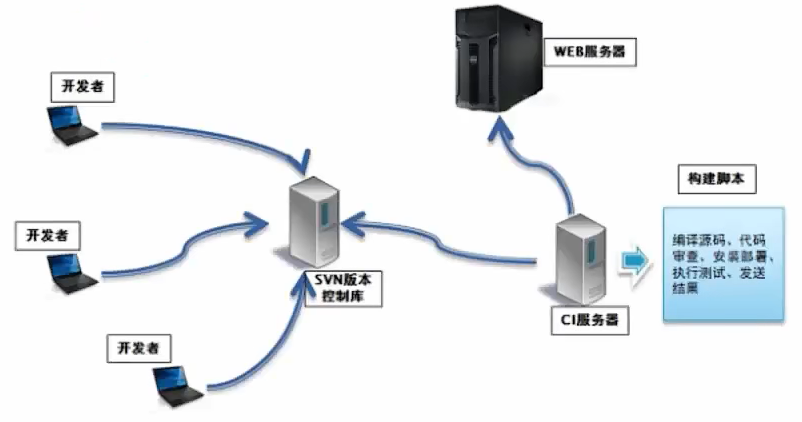


## 软件开发模式

### 软件开发生命周期

软件开发生命周期又叫做SDLC(Software Development Life Cycle), 它是集合了计划、开发、测试和部署过程的集合. 如图:

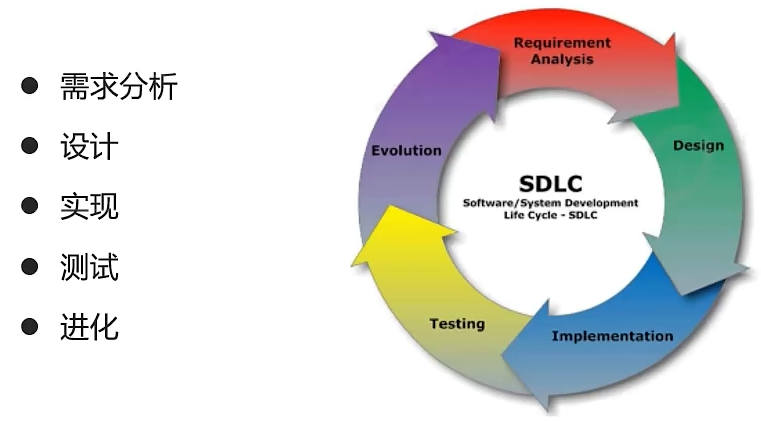

### 软件开发瀑布模型

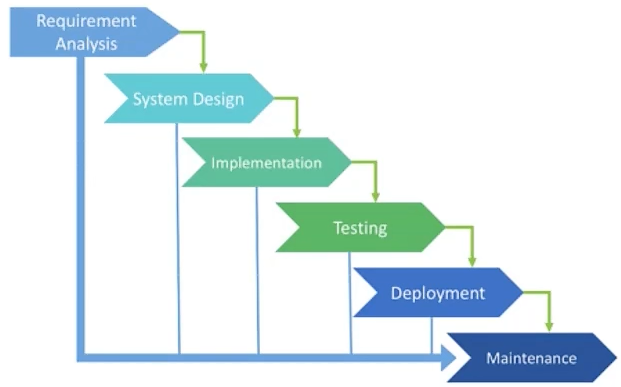

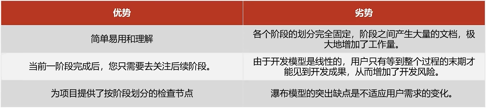

### 软件的敏捷开发

- 迭代开发
- 增量开发

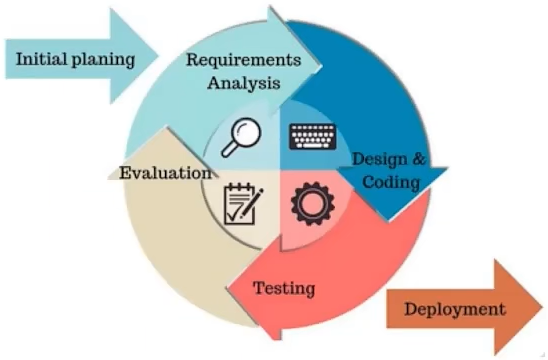

#### 迭代开发

将开发过程拆分成多个小周期, 即一次“大开发”变成多次“小开发”

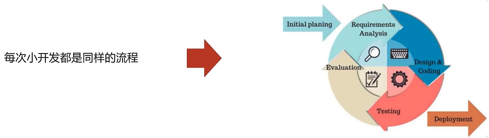

#### 增量开发

软件的每个版本, 都会新增一个用户可以感知的完整功能

房产公司开发一个十栋楼的小区. 如果采用增量开发的模式, 该公司第一个迭代就是交付一号楼, 第二个迭代交付二号楼……每个迭代都是完成一栋完整的楼. 而不是第一个迭代挖好十栋楼的地基, 第二个迭代建好每栋楼的骨架, 第三个迭代假设屋顶

#### 好处

- 早期交付
- 降低风险

## Jenkins

### 介绍

Jenkins是一款流行的开源持续集成(Continuous Integration)工具, 广泛用于项目开发, 具有自动化构建、测试和部署等功能. 官网: http://jenkins-ci.org/

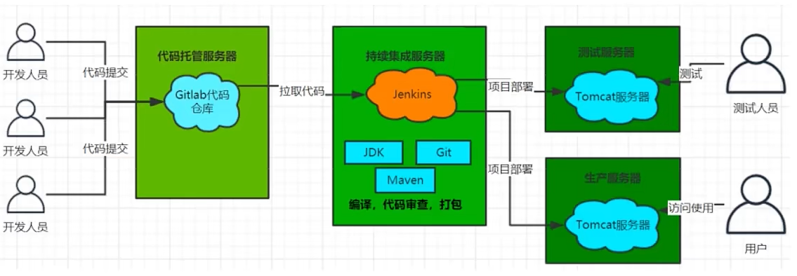

### 插件

如果想让Jenkins来实现更多的功能, 需要安装插件完成

- Maven Integration plugin: Maven集成管理插件
- Docker plugin: Docker集成插件
- GitLab Plugin: GitLab集成插件
- Publisher Over SSH: 远程文件发布插件
- SSH: 远程脚本执行插件

可以再Jenkins的管理界面中<font color='red'>查看安装</font>插件: Manage Jenkins –> Manage Plugins

### 服务器环境准备

192.168.31.129这台服务器中拉取代码、编译、打包、远程部署, 需要先准备对应的环境

- Docker安装配置

- Jdk安装配置

- Git安装配置

  1. yum安装方式

     ```shell
     yum -y install git
     ```

  2. 检查git版本

     ```shell
     git version
     ```

- Maven安装配置

  1. 上传本地的Maven和本地仓库

  2. 解压安装包

     ```shell
     cd /usr/local
     unzip -o apache-maven-3.9.7.zip
     ```

  3. 环境变量配置

     ```shell
     vi /etc/profile
     ```

     增加:

     ```shell
     export MAVEN_HOME=/usr/local/maven/apache-maven-3.9.7
     export PATH=$PATH:$MAVEN_HOME/bin
     ```

     如果权限不够, 则需要增加当前目录的权限

     ```shell
     chmod 777 /usr/local/maven/apache-maven-3.9.7/bin/mvn
     ```

  4. 修改镜像仓库配置

  5. ```shell
     vi /usr/local/maven/apache-maven-3.9.7/conf/settings.xml
     ```

     ```xml
     <localRepository>/usr/local/repository_new</localRepository>
     ```

### Jenkins工具配置

在Jenkins管理页面中集成环境, Manage Jenkins –> Tool Configuration, 需要指定环境的目录

### 多环境切换

在项目开发部署的过程中, 一般都会有三套项目环境

- `Development`: 开发环境
- `Production`: 生产环境
- `Test`: 测试环境

例如: 开发环境的Mysql连接的是本地, 生产环境需要连接线上的Mysql环境

### 微服务中多环境配置

1. 在微服务中的bootstrap.yml中新增配置

   ```yaml
   spring:
     profiles: 
       actice: dev
   ```

2. 在nacos的配置中心中新增各个环境的配置文件, 例如user微服务中新增

   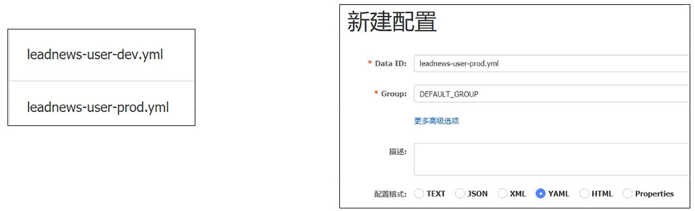

   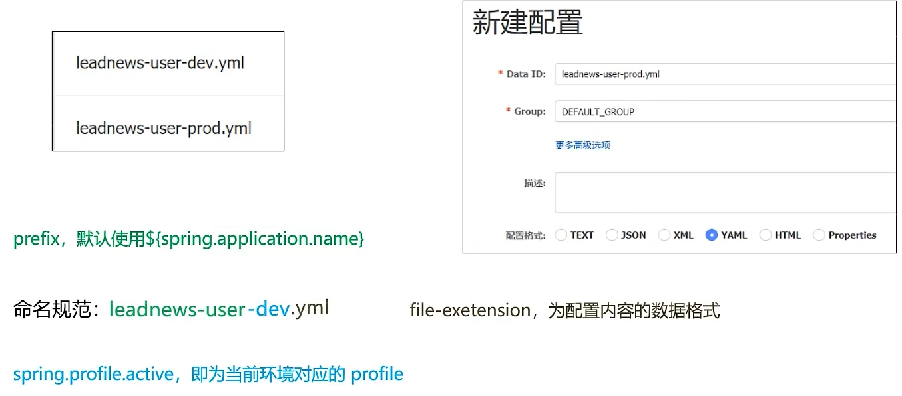

## 后端项目部署

### 整体思路

- 目标: 把头条的app端相关的微服务部署到192.168.31.129这台服务器上

  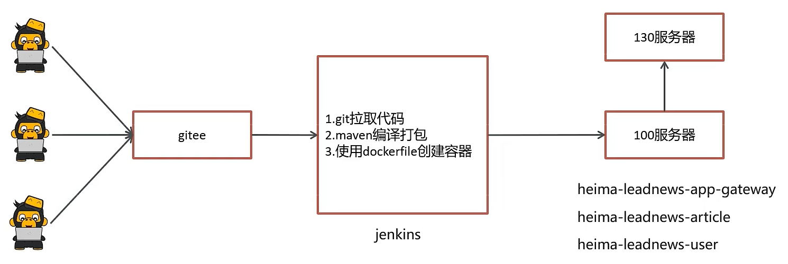

<font color='red'>注意事项</font>: 192.168.31.128和192.168.31.129必须使用<font color='red'>NAT</font>网卡, 必须在同一个网段, 是可以互相通信的, 可以使用<font color='red'>ping</font>命令来检查

### 服务集成Docker配置

目标: 部署的每一个微服务都是先创建<font color='red'>docker镜像</font>后创建对应容器启动

方式一: 本地微服务打包以后上传到服务器, 编写Dockerfile文件完成

方式二: 使用dockerfile-maven-plugin插件, 可以直接把微服务创建为镜像使用(更省事)

<font color='red'>每个微服务都引入该依赖</font>

```xml
<properties>
    <maven.compiler.source>11</maven.compiler.source>
    <maven.compiler.target>11</maven.compiler.target>
    <project.build.sourceEncoding>UTF-8</project.build.sourceEncoding>
    <docker.image>docker_storage</docker.image>
</properties>

<build>
    <finalName>qqzj-leadnews-user</finalName>
    <plugins>
        <plugin>
            <groupId>org.springframework.boot</groupId>
            <artifactId>spring-boot-maven-plugin</artifactId>
            <executions>
                <execution>
                    <goals>
                        <goal>repackage</goal>
                    </goals>
                </execution>
            </executions>
        </plugin>
        <plugin>
            <groupId>org.apache.maven.plugins</groupId>
            <artifactId>maven-compiler-plugin</artifactId>
            <version>3.7.0</version>
            <configuration>
                <source>${java.version}</source>
                <target>${java.version}</target>
            </configuration>
        </plugin>
        <plugin>
            <groupId>com.spotify</groupId>
            <artifactId>dockerfile-maven-plugin</artifactId>
            <version>1.3.6</version>
            <configuration>
                <repository>${docker.image}/${project.artifactId}</repository>
                <buildArgs>
                    <JAR_FILE>target/${project.build.finalName}.jar</JAR_FILE>
                </buildArgs>
            </configuration>
        </plugin>
    </plugins>
</build>
```

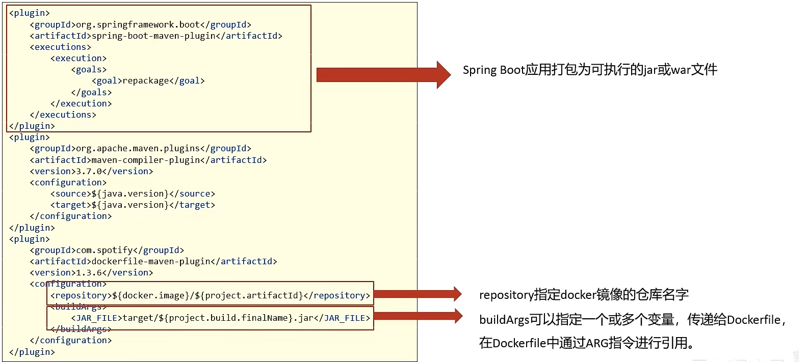


每一个微服务都相同, 存放位置为: 每个微服务的根目录

```dockerfile
# 设置JAVA版本
FROM openjdk:11
# 指定存储卷, 任何向/tmp写入的信息都不会记录到容器存储层
VOLUME /tmp
# 拷贝运行JAR包
ARG JAR_FILE
COPY ${JAR_FILE} app.jar
# 设置JVM运行参数, 这里限定下内存大小, 减少开销
ENV JAVA_OPTS="\
-server \
-Xms256m \
-Xmx512m \
XX:MetaspaceSize=256m \
-XX:MaxMetaspaceSize=512m"
# 空参数, 方便创建容器时传参
ENV PARAMS=""
# 入口点, 执行JAVA运行命令
ENTRYPOINT ["sh","-c","java -jar $JAVA_OPTS /app.jar $PARAMS"]
```

### 基础依赖打包配置

在微服务运行之前需要在本地仓库中先去`install`所依赖的jar包, 所以第一步应该是从git中拉取代码, 并且把基础的依赖部分安装到仓库中

1. 父工程`qqzj-leadnews`

   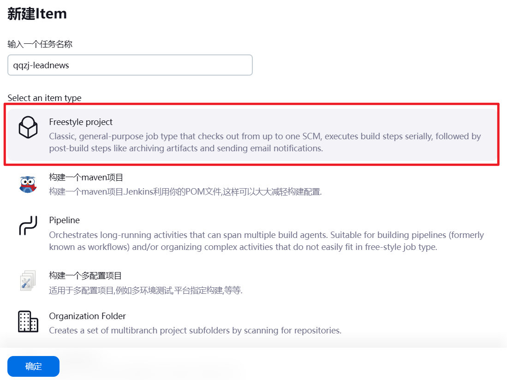

2. 找到自己指定的git仓库, 设置用户名和密码

   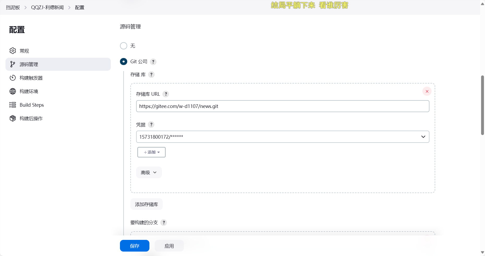

3. 把基础依赖信息安装到服务器上的本地仓库

   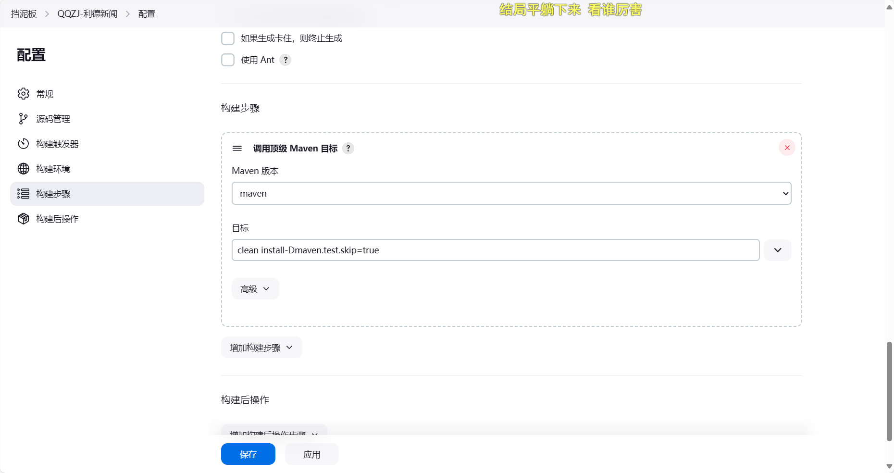

4. 执行

   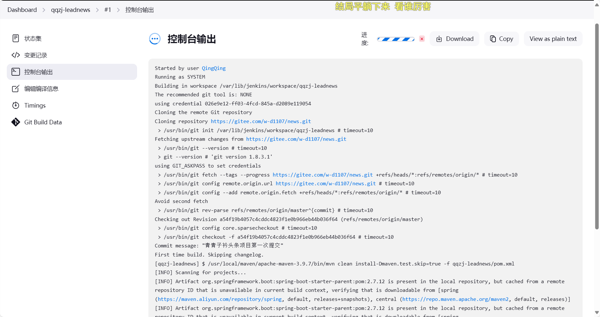


### 微服务打包配置

所有微服务打包的方式类似, 以user微服务为例

1. 新建任务

   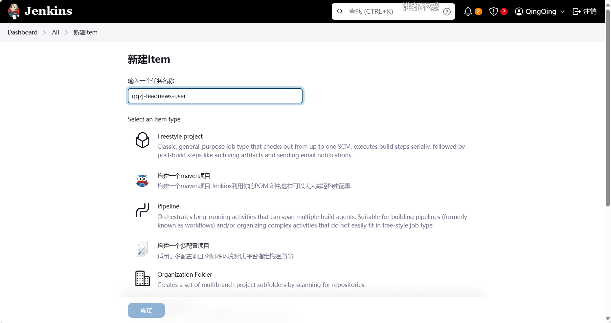

2. 找到自己指定的git仓库, 设置用户名和密码

   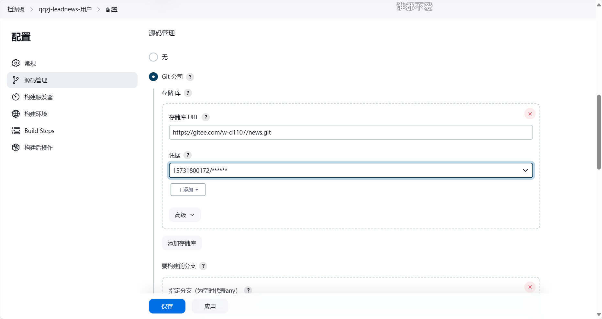

3. 执行maven命令

   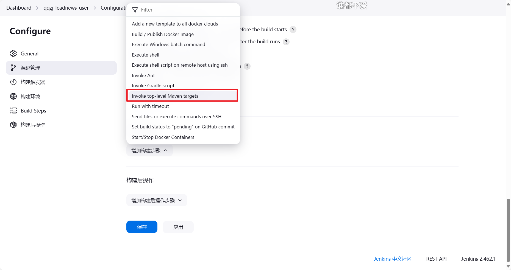

   ```shell
   clean install -Dmaven.test.skip=true dockerfile:build -f qqzj-leadnews/qqzj-leadnews-service/qqzj-leadnews-user/pom.xml
   ```

   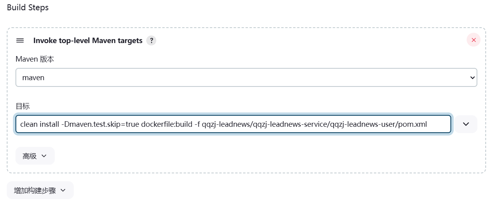

   `-Dmaven.test.skip=true` 跳过测试

   `dockerfile:build` 启动dockerfile插件构建容器

   `-f qqzj-leadnews-user/pom.xml` 指定需要构建的文件(必须是pom)

4. 并执行shell脚本

   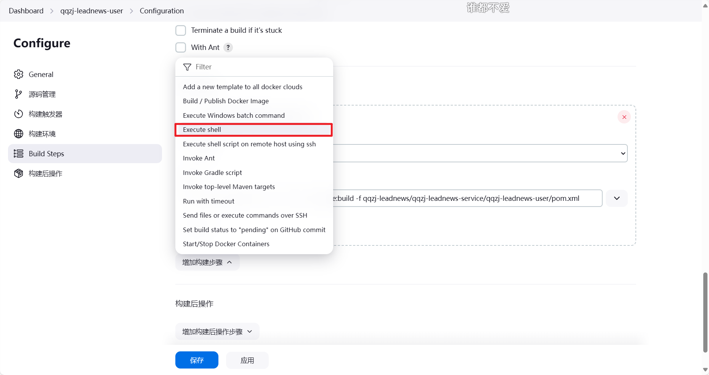

   ```sehll
   if [ -n  "$(docker ps -a -f  name=$JOB_NAME  --format '{{.ID}}' )" ]
    then
    #删除之前的容器
    docker rm -f $(docker ps -a -f  name=$JOB_NAME  --format '{{.ID}}' )
   fi
    # 清理镜像
   docker image prune -f 
    # 启动docker服务
   docker run -d --net=host -e PARAMS="--spring.profiles.active=prod"  --name $JOB_NAME docker_storage/$JOB_NAME
   ```

   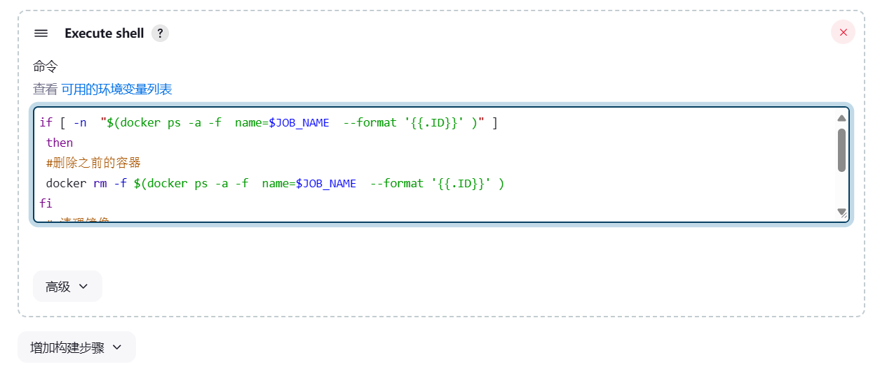

### 部署服务到远程服务器上

目标: 使用Jenkins(192.168.31.129)把微服务打包部署到192.168.31.128服务器上

整体思路

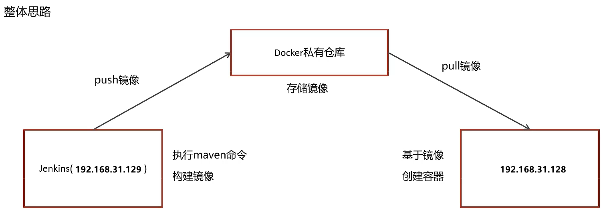

1. 安装私有仓库

   1. 下载最新的Registry镜像

      ```java
      docker pull registry
      ```

   2. 启动Registry镜像服务

      ```shell
      docker run -d -p 5000:5000 --name registry -v /usr/local/docker/registry:/var/lib/registry registry
      ```

   3. 查看仓库资源

      访问地址: http://192.168.31.129:5000/v2/_catalog

   4. 配置两台服务器的Docker客户端, 重启Docker后生效

      ```shell
      vi /lib/systemd/system/docker.service
      ```

      修改内容

      ```shell
      ExecStart=/usr/bin/dockerd --insecure-registry 192.168.31.129:5000
      ```

2. Jenkins中安装插件

   `Publish Over SSH`

   `SSH plugin`

3. Jenkins系统配置远程服务器链接

   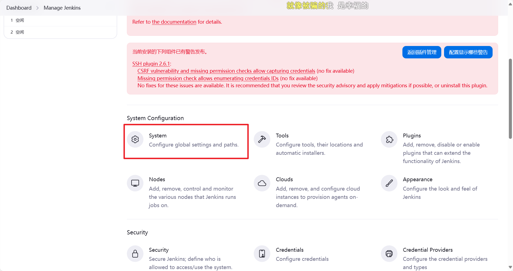

   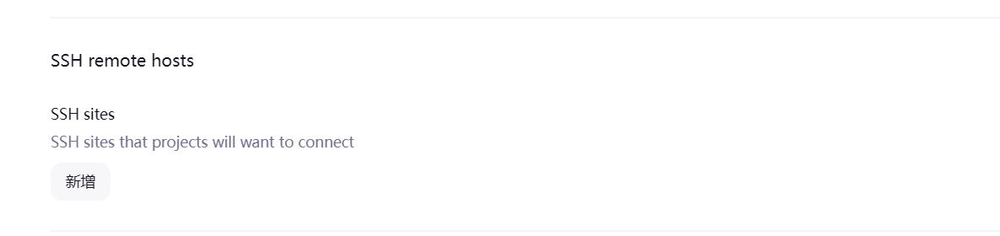

   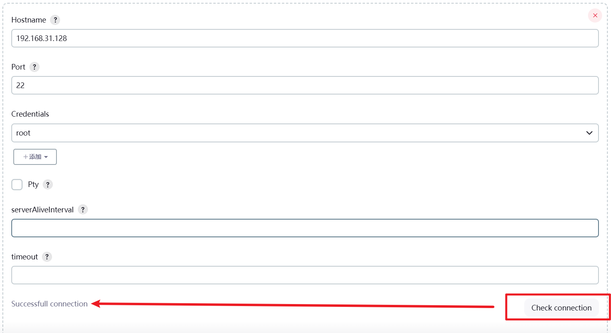

4. Jenkins项目创建与其他微服务相同

5. 设置参数

   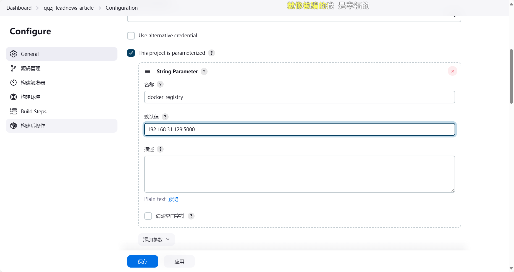

   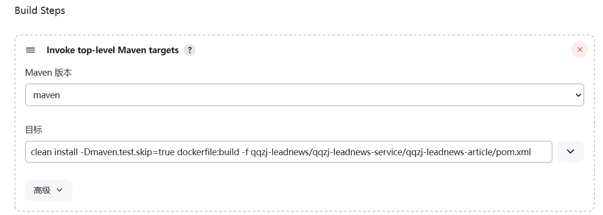

   shell脚本:

   ```shell
   image_tag=$docker_registry/docker_storage/$JOB_NAME
   echo '================docker镜像清理================'
   if [ -n  "$(docker ps -a -f  name=$JOB_NAME  --format '{{.ID}}' )" ]
    then
    #删除之前的容器
    docker rm -f $(docker ps -a -f  name=$JOB_NAME  --format '{{.ID}}' )
   fi
    # 清理镜像
   docker image prune -f 
   
   # 创建TAG
   docker tag docker_storage/$JOB_NAME $image_tag
   echo '================docker镜像推送================'
   # 推送镜像
   docker push $image_tag
   # 删除TAG
   docker rmi $image_tag
   echo '================docker tag 清理 ================'
   ```

   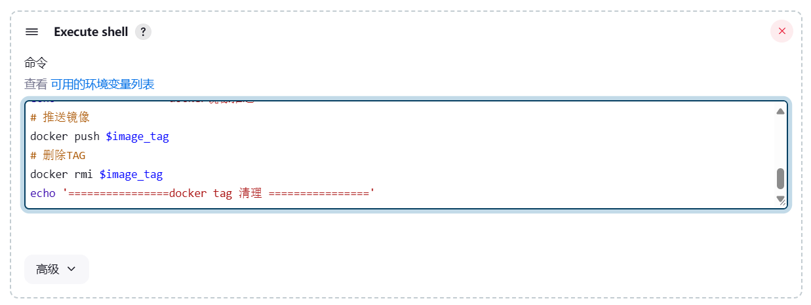

   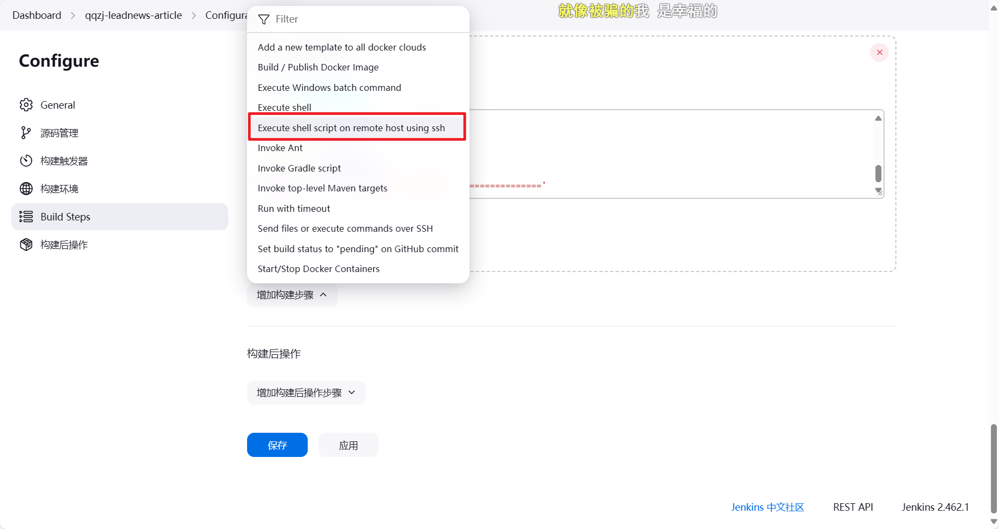

   shell脚本:

   ```shell
   echo '================拉取最新镜像================'
   docker pull $docker_registry/docker_storage/$JOB_NAME
   
   echo '================删除清理容器镜像================'
   if [ -n  "$(docker ps -a -f  name=$JOB_NAME  --format '{{.ID}}' )" ]
    then
    #删除之前的容器
    docker rm -f $(docker ps -a -f  name=$JOB_NAME  --format '{{.ID}}' )
   fi
    # 清理镜像
   docker image prune -f 
   
   echo '===============启动容器================'
   docker run -d   --net=host -e PARAMS="--spring.profiles.active=prod" --name $JOB_NAME $docker_registry/docker_storage/$JOB_NAME
   ```

   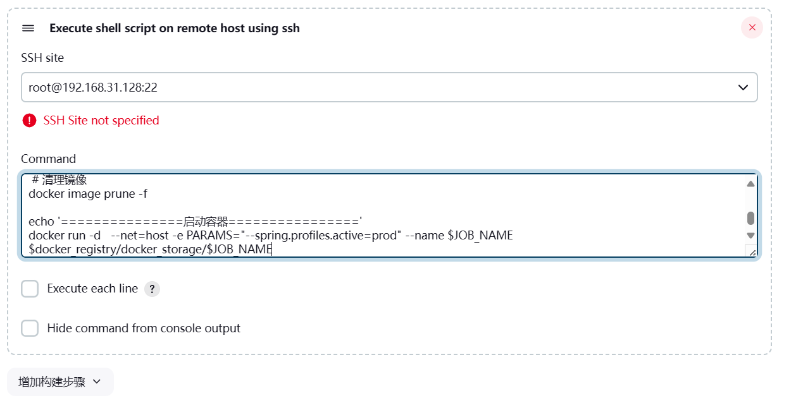

### 测试

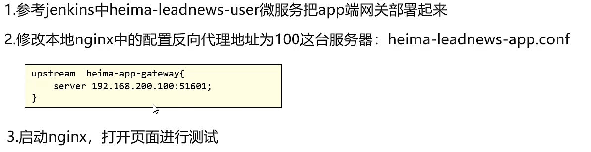


